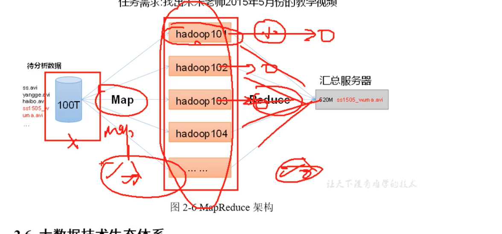

***hdfs:  分布式文件存储系统** 
`由三大块组成
hdfs存储数据会将数据按照一定大小切割为多个数据块进行存储
nameNode（nn） 存储和管理所有真实数据的元数据（文件名称 文件大小 创建时间等`

**dataNode(dn)** 
`存储真实的数据块默认的块大小是128m  
一个 200M数据存储到hdfs会分为两块 一 个 128m 一个 72m`

**secondaryNameNode(2n) ** 
`用于辅助namenode工作减轻namenode压力`

**yarn**
`负责hadoop的资源调度分配管理`

**resourceManager (rm)**  
`管理和分配集群里的所有资源（来源于每一台机器上的资源 cpu 内存）
是一台或多台机器`

**nodeManager  nm**    
`管理所在机器的资源,最终都是由rm进行分配调度`

**applicationMaster am**  
`每一个工作的任务 job 都是由applicationMaster 进行负责管理执行的`

**container** 
`对资源进行抽象和封装 ,提供一个applicationMaster运行的环境 applicationMaster里才真正的运行一个job
container 的存在是为了防资源的竞争 ，对资源的管理粒度更加明晰`

**mapreduce** 

map负责把数据分到一台或多台机器计算 reduce 将多台机器的计算结果进行汇总

