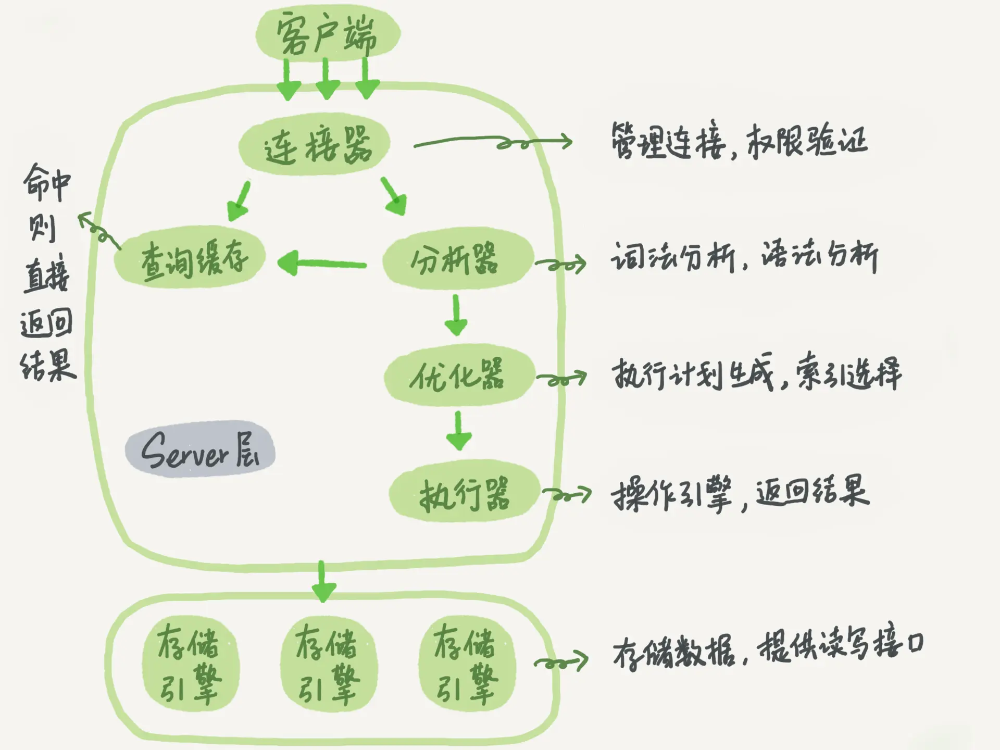
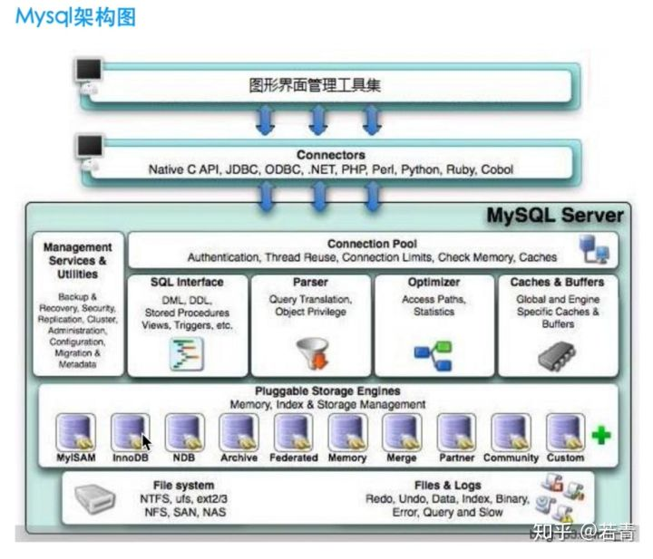

**一条SQL查询语句是如何执行的** 
`mysql> select * from T where ID=10` 
我们看到的只是输入一条语句，返回一个结果，却不知道这条语句在 MySQL 内部的执行过程 
先了解下mysql的架构结构 
 
 
**连接器** 
连接器: 当我们连接数据库时，有连接器负责对新进入的连接进行权限验证和管理, 
连接器会到权限表里面查出你拥有的权限。之后，这个连接里面的权限判断逻辑，都将依赖于此时读到的权限, 
使用 show proccesslist 可以查看建立的连接list, 
mysql 客户端和服务端的连接底层是基于tcp/ip协议，连接器负责控制客户端连接的建立和断开,如果客户端常见没有活动，连接器会将链接断开 
数据库连接池就是保持一定数量的长连接，使用的时候不需要再次连接直接使用，不过由于长连接，mysql执行中一些数据绑定在连接对象中 
因为长连接长时间不断开导致内存占用太多。可以使用定时超时断开，或通过重新初始化链接来清空mysql执行中一些数据绑定在连接对象中 
，因为长连接长时间不断开导致内存占用太多。可以使用定时超时断开，或通过重新初始化链接(在每次查询完毕后使用mysql_reset_connection)来清空 
**查询缓存** 
连接建立完毕后，就可以执行select语句,当有一个客户端连接发出一个查询请求后，mysql会先到查询缓存中查看是否有执行,但是只要查询的该表有更新操作时，
该表的查询缓存会全部失效,mysql8.0之后查询缓存功能被全部删除了，查询缓存中查不到的话就要执行该select语句了, 
**分析器**  
执行语句的第一步就是对执行语句进行词法分析,你输入的是由多个字符串和空格组成的一条 SQL 语句,MySQL 需要识别出里面的字符串分别是什么，代表什么
MySQL 从你输入的"select"这个关键字识别出来，这是一个查询语句。它也要把字符串“T”识别成“表名 T”，把字符串“ID”识别成“列 ID”。
做完了这些识别以后，就要做“语法分析”。根据词法分析的结果，语法分析器会根据语法规则，判断你输入的这个 SQL 语句是否满足 MySQL 语法。
如果你的语句不对，就会收到“You have an error in your SQL syntax”的错误提醒，比如下面这个语句 select 少打了开头的字母“s”。
`mysql> elect * from t where ID=1;
ERROR 1064 (42000): You have an error in your SQL syntax;`。 
**优化器** 
经过了分析器，MySQL 就知道你要做什么了。在开始执行之前，还要先经过优化器的处理。 
优化器是在表里面有多个索引的时候，决定使用哪个索引；或者在一个语句有多表关联（join）的时候， 
决定各个表的连接顺序。比如你执行下面这样的语句，这个语句是执行两个表的 join： 
`mysql> select * from t1 join t2 using(ID)  where t1.c=10 and t2.d=20;` 
1 既可以先从表 t1 里面取出 c=10 的记录的 ID 值，再根据 ID 值关联到表 t2，再判断 t2 里面 d 的值是否等于 20。
2 也可以先从表 t2 里面取出 d=20 的记录的 ID 值，再根据 ID 值关联到 t1，再判断 t1 里面 c 的值是否等于 10。
**执行器** 
MySQL 通过分析器知道了你要做什么，通过优化器知道了该怎么做，于是就进入了执行器阶段，开始执行语句。 
开始执行的时候，要先判断一下你对这个表 T 有没有执行查询的权限，如果没有， 就会返回没有权限的错误， 
如下所示 (在工程实现上，如果命中查询缓存，会在查询缓存返回结果的时候，做权限验证。查询也会在优化器之前调用 precheck 验证权限)。 
`mysql> select * from T where ID=10;
ERROR 1142 (42000): SELECT command denied to user 'b'@'localhost' for table 'T'`
如果有权限，就打开表继续执行。打开表的时候，执行器就会根据表的引擎定义，去使用这个引擎提供的接口 
比如我们这个例子中的表 T 中，ID 字段没有索引，那么执行器的执行流程是这样的： 
1. 调用 InnoDB 引擎接口取这个表的第一行，判断 ID 值是不是 10，如果不是则跳过，如果是则将这行存在结果集中 
2. 调用引擎接口取“下一行”，重复相同地判断逻辑，直到取到这个表的最后一行。 
3. 执行器将上述遍历过程中所有满足条件的行组成的记录集作为结果集返回给客户端。 
至此，这个语句就执行完成了。 
对于有索引的表，执行的逻辑也差不多。第一次调用的是“取满足条件的第一行”这个接口 
之后循环取“满足条件的下一行”这个接口,这些接口都是引擎中已经定义好的 
你会在数据库的慢查询日志中看到一个 rows_examined 的字段，表示这个语句执行过程中扫描了多少行。 
这个值就是在执行器每次调用引擎获取数据行的时候累加的。 
在有些场景下，执行器调用一次，在引擎内部则扫描了多行，因此引擎扫描行数跟 rows_examined 并不是完全相同的。 
   我们后面会专门有一篇文章来讲存储引擎的内部机制，里面会有详细的说明。 

