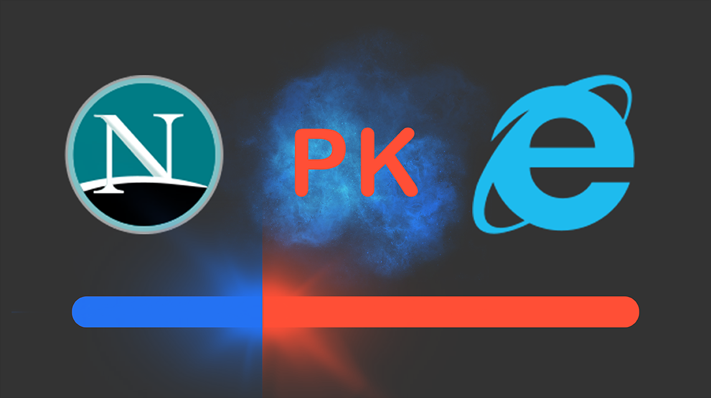

**时势与英雄：HTTP的前世今生**
**http (超文本传输协议)** 
1989 年，任职于欧洲核子研究中心（CERN）的蒂姆·伯纳斯 - 李（Tim Berners-Lee）发表了一篇论文， 
提出了在互联网上构建超链接文档系统的构想。这篇论文中他确立了三项关键技术。 
URI：即统一资源标识符，作为互联网上资源的唯一身份； 
HTML：即超文本标记语言，描述超文本文档； 
HTTP：即超文本传输协议，用来传输超文本 
**HTTP/0.9** 
20 世纪 90 年代初期的互联网世界非常简陋，计算机处理能力低，存储容量小， 
网速很慢，还是一片“信息荒漠”。网络上绝大多数的资源都是纯文本，很多通信协议也都使用纯文本， 
所以 HTTP 的设计也不可避免地受到了时代的限制。这一时期的 HTTP 被定义为 0.9 版，结构比较简单， 
为了便于服务器和客户端处理，它也采用了纯文本格式。蒂姆·伯纳斯 - 李最初设想的系统里的文档都是只读的， 
所以只允许用“GET”动作从服务器上获取 HTML 文档，并且在响应请求之后立即关闭连接，功能非常有限。 
HTTP/0.9 虽然很简单，但它作为一个“原型”，充分验证了 Web 服务的可行性，而“简单”也正是它的优点， 
蕴含了进化和扩展的可能性，因为：“把简单的系统变复杂”，要比“把复杂的系统变简单”容易得多。 
**HTTP/1.0** 
1993 年，NCSA（美国国家超级计算应用中心）开发出了 Mosaic，是第一个可以图文混排的浏览器， 
随后又在 1995 年开发出了服务器软件 Apache，简化了 HTTP 服务器的搭建工作。 
同一时期，计算机多媒体技术也有了新的发展：1992 年发明了 JPEG 图像格式， 
1995 年发明了 MP3 音乐格式。这些新软件新技术一经推出立刻就吸引了广大网民的热情， 
更的多的人开始使用互联网，研究 HTTP 并提出改进意见，甚至实验性地往协议里添加各种特性， 
从用户需求的角度促进了 HTTP 的发展。于是在这些已有实践的基础上， 
经过一系列的草案，HTTP/1.0 版本在 1996 年正式发布。它在多方面增强了 0.9 版， 
形式上已经和我们现在的 HTTP 差别不大了，例如：增加了 HEAD、POST 等新方法； 
增加了响应状态码，标记可能的错误原因；引入了协议版本号概念； 
引入了 HTTP Header（头部）的概念，让 HTTP 处理请求和响应更加灵活；
传输的数据不再仅限于文本。但 HTTP/1.0 并不是一个“标准”， 
只是记录已有实践和模式的一份参考文档，不具有实际的约束力，相当于一个“备忘录”。 
所以 HTTP/1.0 的发布对于当时正在蓬勃发展的互联网来说并没有太大的实际意义，各方势力仍然按照自己的意图继续在市场上奋力拼杀。 
**HTTP/1.1** 
1995 年，网景的 Netscape Navigator 和微软的 Internet Explorer 开始了著名的“浏览器大战”，都希望在互联网上占据主导地位。 
 
这场战争的结果你一定早就知道了，最终微软的 IE 取得了决定性的胜利，而网景则“败走麦城”（但后来却凭借 Mozilla Firefox 又扳回一局） 
“浏览器大战”的是非成败我们放在一边暂且不管，不可否认的是，它再一次极大地推动了 Web 的发展，HTTP/1.0 也在这个过程中经受了实践检验。 
于是在“浏览器大战”结束之后的 1999 年， 
HTTP/1.1 发布了 RFC 文档，编号为 2616，正式确立了延续十余年的传奇。 
从版本号我们就可以看到，HTTP/1.1 是对 HTTP/1.0 的小幅度修正。 
但一个重要的区别是：它是一个“正式的标准”，而不是一份可有可无的“参考文档”。这意味着今后互联网上所有的浏览器、服务器、网关、代理等等， 
只要用到 HTTP 协议，就必须严格遵守这个标准，相当于是互联网世界的一个“立法”。 
不过，说 HTTP/1.1 是“小幅度修正”也不太确切，它还是有很多实质性进步的。毕竟经过了多年的实战检验， 
比起 0.9/1.0 少了“学术气”，更加“接地气”，同时表述也更加严谨。HTTP/1.1  
主要的变更点有： 
1.增加了 PUT、DELETE 等新的方法； 
2.增加了缓存管理和控制； 
3.明确了连接管理，允许持久连接； 
4.允许响应数据分块（chunked），利于传输大文件； 
5.强制要求 Host 头，让互联网主机托管成为可能。 
HTTP/1.1 的推出可谓是“众望所归”，互联网在它的“保驾护航”下迈开了大步，由此走上了“康庄大道”， 
开启了后续的“Web 1.0”“Web 2.0”时代。现在许多的知名网站都是在这个时间点左右创立的 
，例如 Google、新浪、搜狐、网易、腾讯等。不过由于 HTTP/1.1 太过庞大和复杂， 
所以在 2014 年又做了一次修订，原来的一个大文档被拆分成了六份较小的文档，编号为 7230-7235，优化了一些细节，但此外没有任何实质性的改动。 
**HTTP/2** 
HTTP/1.1 发布之后，整个互联网世界呈现出了爆发式的增长，度过了十多年的“快乐时光”，更涌现出了 Facebook、Twitter、淘宝、京东等互联网新贵。 
这期间也出现了一些对 HTTP 不满的意见，主要就是连接慢，无法跟上迅猛发展的互联网，但 HTTP/1.1 标准一直“岿然不动”， 
无奈之下人们只好发明各式各样的“小花招”来缓解这些问题， 
比如以前常见的切图、JS 合并等网页优化手段。终于有一天，搜索巨头 Google 忍不住了，决定“揭竿而起”，就像马云说的“如果银行不改变， 
我们就改变银行”。那么，它是怎么“造反”的呢？Google 首先开发了自己的浏览器 Chrome，然后推出了新的 SPDY 协议， 
并在 Chrome 里应用于自家的服务器，如同十多年前的网景与微软一样，从实际的用户方来“倒逼”HTTP 协议的变革，这也开启了第二次的“浏览器大战”。 
最终在2015年互联网标准化组织以SPDY协议为基础开始制定新的HTTP协议 
HTTP/2 的制定充分考虑了现今互联网的现状：宽带、移动、不安全，在高度兼容 HTTP/1.1 的同时在性能改善方面做了很大努力， 
主要的特点有：
1.二进制协议，不再是纯文本； 
2.可发起多个请求，废弃了 1.1 里的管道； 
3.使用专用算法压缩头部，减少数据传输量； 
4.允许服务器主动向客户端推送数据； 
5.增强了安全性，“事实上”要求加密通信。 
HTTP/3
在 HTTP/2 还处于草案之时，Google 又发明了一个新的协议，叫做 QUIC，而且还是相同的“套路”， 
继续在 Chrome 和自家服务器里试验着“玩”，依托它的庞大用户量和数据量， 
持续地推动 QUIC 协议成为互联网上的“既成事实”。“功夫不负有心人”， 
当然也是因为 QUIC 确实自身素质过硬。在去年，也就是 2018 年， 
互联网标准化组织 IETF 提议将“HTTP over QUIC”更名为“HTTP/3”并获得批准， 
HTTP/3 正式进入了标准化制订阶段，也许两三年后就会正式发布，到时候我们很可能会跳过 HTTP/2 直接进入 HTTP/3。
今天我和你一起跨越了三十年的历史长河，回顾了 HTTP 协议的整个发展过程，在这里简单小结一下今天的内容 
1.HTTP 协议始于三十年前蒂姆·伯纳斯 - 李的一篇论文； 
2.HTTP/0.9 是个简单的文本协议，只能获取文本资源； 
3.HTTP/1.0 确立了大部分现在使用的技术，但它不是正式标准； 
4.HTTP/1.1 是目前互联网上使用最广泛的协议，功能也非常完善； 
5.HTTP/2 基于 Google 的 SPDY 协议，注重性能改善，但还未普及； 
6.HTTP/3 基于 Google 的 QUIC 协议，是将来的发展方向。： 
question 你是怎么理解 HTTP（超文本传输协议）的？ 

