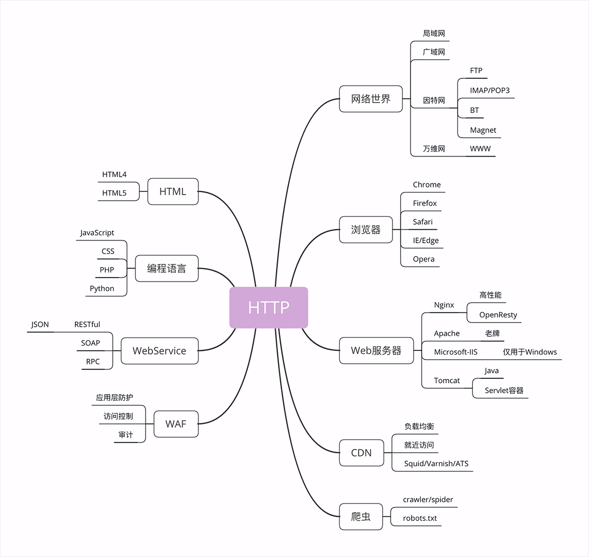
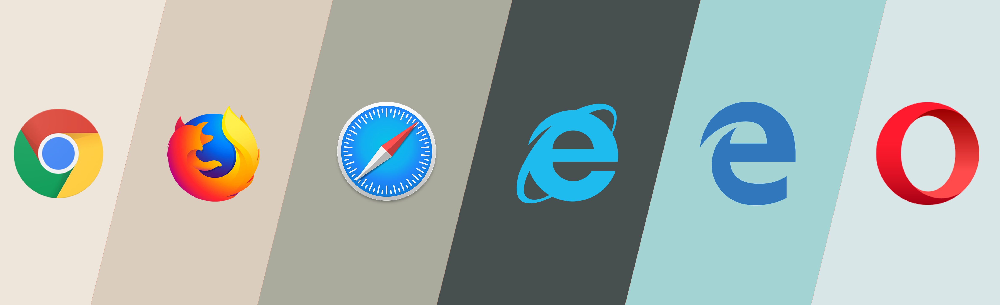

**HTTP世界全览（上）：与HTTP相关的各种概念**

**网络世界** 
你一定已经习惯了现在的网络生活，甚至可能会下意识地认为网络世界就应该是这个样子的：“一张平坦而且一望无际的巨大网络，每一台电脑就是网络上的一个节点， 
均匀地点缀在这张网上”。这样的理解既对，又不对。从抽象的、虚拟的层面来看，网络世界确实是这样的，我们可以从一个节点毫无障碍地访问到另一个节点。 
但现实世界的网络却远比这个抽象的模型要复杂得多。实际的互联网是由许许多多个规模略小的网络连接而成的， 
这些“小网络”可能是只有几百台电脑的局域网，可能是有几万、几十万台电脑的广域网， 
可能是用电缆、光纤构成的固定网络，也可能是用基站、热点构成的移动网络…… 
互联网世界更像是由数不清的大小岛屿组成的“千岛之国”。 
互联网的正式名称是 Internet，里面存储着无穷无尽的信息资源，我们通常所说的“上网”实际上访问的只是互联网的一个子集“万维网”（World Wide Web） 
它基于 HTTP 协议，传输 HTML 等超文本资源，能力也就被限制在 HTTP 协议之内。 
不过由于 HTTP 协议非常灵活、易于扩展，而且“超文本”的表述能力很强，所以很多其他原本不属于 HTTP 的资源也可以“包装”成 HTTP 来访问， 
这就是我们为什么能够总看到各种“网页应用”——例如“微信网页版”“邮箱网页版”——的原因。 
**浏览器** 
上网就要用到浏览器，常见的浏览器有 Google 的 Chrome、Mozilla 的 Firefox、Apple 的 Safari、Microsoft 的 IE 和 Edge， 
还有小众的 Opera 以及国内的各种“换壳”的“极速”“安全”浏览器。 
 
那么你想过没有，所谓的“浏览器”到底是个什么东西呢？ 
浏览器的正式名字叫“Web Browser”，顾名思义，就是检索、查看互联网上网页资源的应用程序，名字里的 Web，实际上指的就是“World Wide Web”，也就是万维网 
浏览器本质上是一个 HTTP 协议中的请求方，使用 HTTP 协议获取网络上的各种资源。当然，为了让我们更好地检索查看网页，它还集成了很多额外的功能 
例如，HTML 排版引擎用来展示页面，JavaScript 引擎用来实现动态化效果，甚至还有开发者工具用来调试网页，以及五花八门的各种插件和扩展 
在 HTTP 协议里，浏览器的角色被称为“User Agent”即“用户代理”，意思是作为访问者的“代理”来发起 HTTP 请求。不过在不引起混淆的情况下，我们通常都简单地称之为“客户端” 
**Web 服务器** 
刚才说的浏览器是 HTTP 里的请求方，那么在协议另一端的应答方（响应方）又是什么呢？ 
这个你一定也很熟悉，答案就是服务器，Web Server 
Web 服务器是一个很大也很重要的概念，它是 HTTP 协议里响应请求的主体，通常也把控着绝大多数的网络资源，在网络世界里处于强势地位 
当我们谈到“Web 服务器”时有两个层面的含义：硬件和软件 
硬件含义就是物理形式或“云”形式的机器，在大多数情况下它可能不是一台服务器， 
而是利用反向代理、负载均衡等技术组成的庞大集群。但从外界看来，它仍然表现为一台机器，但这个形象是“虚拟的”。 
软件含义的 Web 服务器可能我们更为关心，它就是提供 Web 服务的应用程序，通常会运行在硬件含义的服务器上。 
它利用强大的硬件能力响应海量的客户端 HTTP 请求，处理磁盘上的网页、图片等静态文件， 
或者把请求转发给后面的 Tomcat、Node.js 等业务应用，返回动态的信息 
比起层出不穷的各种 Web 浏览器，Web 服务器就要少很多了，一只手的手指头就可以数得过来。 
Apache 是老牌的服务器，到今天已经快 25 年了，功能相当完善，相关的资料很多，学习门槛低，是许多创业者建站的入门产品 
Nginx 是 Web 服务器里的后起之秀，特点是高性能、高稳定，且易于扩展。自 2004 年推出后就不断蚕食 Apache 的市场份额，在高流量的网站里更是不二之选。 
**CDN**
浏览器和服务器是 HTTP 协议的两个端点，那么，在这两者之间还有别的什么东西吗？ 
当然有了。浏览器通常不会直接连到服务器，中间会经过“重重关卡”，其中的一个重要角色就叫做 CDN。 
CDN，全称是“Content Delivery Network”，翻译过来就是“内容分发网络”。它应用了 HTTP 协议里的缓存和代理技术，代替源站响应客户端的请求。 
**CDN 有什么好处呢？** 
简单来说，它可以缓存源站的数据，让浏览器的请求不用“千里迢迢”地到达源站服务器，直接在“半路”就可以获取响应。 
如果 CDN 的调度算法很优秀，更可以找到离用户最近的节点，大幅度缩短响应时间。 
CDN 也是现在互联网中的一项重要基础设施，除了基本的网络加速外，还提供负载均衡、安全防护、边缘计算、跨运营商网络等功能， 
能够成倍地“放大”源站服务器的服务能力，很多云服务商都把 CDN 作为产品的一部分，我也会在后面用一讲的篇幅来专门讲解 CDN。 
**爬虫** 
前面说到过浏览器，它是一种用户代理，代替我们访问互联网。 
但 HTTP 协议并没有规定用户代理后面必须是“真正的人类”，它也完全可以是“机器人”，这些“机器人”的正式名称就叫做“爬虫”（Crawler） 
实际上是一种可以自动访问 Web 资源的应用程序。 
“爬虫”这个名字非常形象，它们就像是一只只不知疲倦的、辛勤的蚂蚁，在无边无际的网络上爬来爬去， 
不停地在网站间奔走，搜集抓取各种信息。 
据估计，互联网上至少有 50% 的流量都是由爬虫产生的，某些特定领域的比例还会更高，也就是说， 
如果你的网站今天的访问量是十万，那么里面至少有五六万是爬虫机器人，而不是真实的用户。 
**爬虫是怎么来的呢？**
绝大多数是由各大搜索引擎“放”出来的，抓取网页存入庞大的数据库，再建立关键字索引，这样我们才能够在搜索引擎中快速地搜索到互联网角落里的页面。 
爬虫也有不好的一面，它会过度消耗网络资源，占用服务器和带宽，影响网站对真实数据的分析，甚至导致敏感信息泄漏。所以，又出现了“反爬虫”技术， 
通过各种手段来限制爬虫。其中一项就是“君子协定”robots.txt，约定哪些该爬，哪些不该爬。 
无论是“爬虫”还是“反爬虫”，用到的基本技术都是两个，一个是 HTTP，另一个就是 HTML。 
**HTML/WebService/WAF** 
HTML 是 HTTP 协议传输的主要内容之一，它描述了超文本页面，用各种“标签”定义文字、图片等资源和排版布局，最终由浏览器“渲染”出可视化页面。 
HTML 目前有两个主要的标准，HTML4 和 HTML5。广义上的 HTML 通常是指 HTML、JavaScript、CSS 等前端技术的组合， 
能够实现比传统静态页面更丰富的动态页面。 
接下来是 Web  Service，它的名字与 Web Server 很像，但却是一个完全不同的东西。 
Web  Service 是一种由 W3C 定义的应用服务开发规范，使用 client-server 主从架构，通常使用 WSDL 定义服务接口， 
使用 HTTP 协议传输 XML 或 SOAP 消息，也就是说，它是一个基于 Web（HTTP）的服务架构技术，既可以运行在内网， 
也可以在适当保护后运行在外网。因为采用了 HTTP 协议传输数据，所以在 Web  Service 架构里服务器和客户端可以采用不同的操作系统或编程语言开发。 
例如服务器端用 Linux+Java，客户端用 Windows+C#，具有跨平台跨语言的优点。 
WAF 是近几年比较“火”的一个词，意思是“网络应用防火墙”。与硬件“防火墙”类似，它是应用层面的“防火墙”，专门检测 HTTP 流量， 
是防护 Web 应用的安全技术。WAF 通常位于 Web 服务器之前，可以阻止如 SQL 注入、跨站脚本等攻击， 
目前应用较多的一个开源项目是 ModSecurity，它能够完全集成进 Apache 或 Nginx。 
**小结**

1.互联网上绝大部分资源都使用 HTTP 协议传输； 
2.浏览器是 HTTP 协议里的请求方，即 User Agent； 
3.服务器是 HTTP 协议里的应答方，常用的有 Apache 和 Nginx； 
4.CDN 位于浏览器和服务器之间，主要起到缓存加速的作用； 
5.爬虫是另一类 User Agent，是自动访问网络资源的程序。 
 
你觉得 CDN 在对待浏览器和爬虫时会有差异吗？为什么？ 
你怎么理解 WebService 与 Web Server 这两个非常相似的词 

