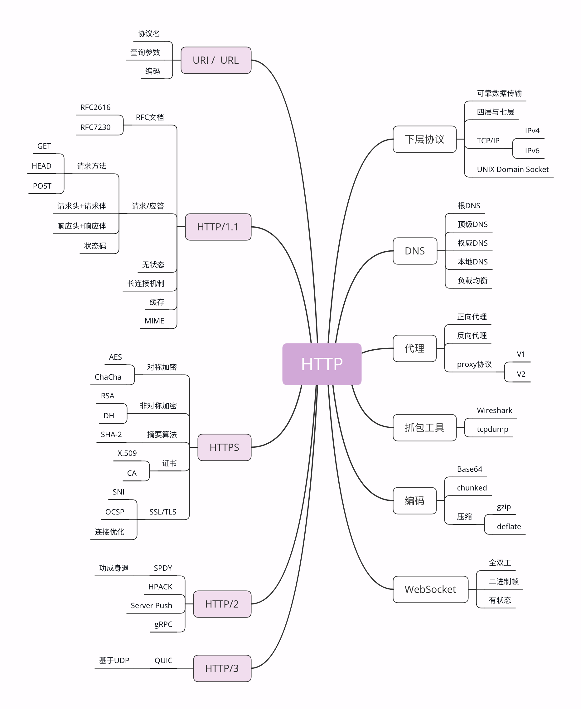

**HTTP世界全览（下）：与HTTP相关的各种协议**
今天要讲的则是比较偏向于理论的各种 HTTP 相关协议，重点是 TCP/IP、DNS、URI、HTTPS 等，希望能够帮你理清楚它们与 HTTP 的关系。 
同样的，我还是画了一张详细的思维导图，你可以点击后仔细查看 
 
**TCP/IP** 
TCP/IP 协议是目前网络世界“事实上”的标准通信协议，即使你没有用过也一定听说过，因为它太著名了。 
TCP/IP 协议实际上是一系列网络通信协议的统称，其中最核心的两个协议是 TCP 和 IP，其他的还有 UDP、ICMP、ARP 等等，共同构成了一个复杂但有层次的协议栈。 
这个协议栈有四层，最上层是“应用层”，最下层是“链接层”，TCP 和 IP 则在中间：TCP 属于“传输层”，IP 属于“网际层”。协议的层级关系模型非常重要， 
IP 协议是“Internet Protocol”的缩写，主要目的是解决寻址和路由问题，以及如何在两点间传送数据包。IP 协议使用“IP 地址”的概念来定位互联网上的每一台计算机。 
可以对比一下现实中的电话系统，你拿着的手机相当于互联网上的计算机，而要打电话就必须接入电话网，由通信公司给你分配一个号码，这个号码就相当于 IP 地址。 
现在我们使用的 IP 协议大多数是 v4 版，地址是四个用“.”分隔的数字，例如“192.168.0.1”，总共有 2^32，大约 42 亿个可以分配的地址。看上去好像很多， 
但互联网的快速发展让地址的分配管理很快就“捉襟见肘”。所以，就又出现了 v6 版，使用 8 组“:”分隔的数字作为地址，容量扩大了很多，有 2^128 个，在未来的几十年里应该是足够用了。 
TCP 协议是“Transmission Control Protocol”的缩写，意思是“传输控制协议”，它位于 IP 协议之上，基于 IP 协议提供可靠的、字节流形式的通信，是 HTTP 协议得以实现的基础。 
“可靠”是指保证数据不丢失，“字节流”是指保证数据完整，所以在 TCP 协议的两端可以如同操作文件一样访问传输的数据，就像是读写在一个密闭的管道里“流动”的字节。 
在第 2 讲时我曾经说过，HTTP 是一个"传输协议"，但它不关心寻址、路由、数据完整性等传输细节，而要求这些工作都由下层来处理。 
因为互联网上最流行的是 TCP/IP 协议，而它刚好满足 HTTP 的要求，所以互联网上的 HTTP 协议就运行在了 TCP/IP 上，HTTP 也就可以更准确地称为“HTTP over TCP/IP”。 
**DNS** 
在 TCP/IP 协议中使用 IP 地址来标识计算机，数字形式的地址对于计算机来说是方便了，但对于人类来说却既难以记忆又难以输入。 
于是“域名系统”（Domain Name System）出现了，用有意义的名字来作为 IP 地址的等价替代。设想一下，你是愿意记“95.211.80.227”这样枯燥的数字，还是“nginx.org”这样的词组呢？ 
在 DNS 中，“域名”（Domain Name）又称为“主机名”（Host），为了更好地标记不同国家或组织的主机，让名字更好记，所以被设计成了一个有层次的结构。 
域名用“.”分隔成多个单词，级别从左到右逐级升高，最右边的被称为“顶级域名”。对于顶级域名，可能你随口就能说出几个， 
例如表示商业公司的“com”、表示教育机构的“edu”，表示国家的“cn”“uk”等，买火车票时的域名还记得吗？是“www.12306.cn”。 
, 
但想要使用 TCP/IP 协议来通信仍然要使用 IP 地址，所以需要把域名做一个转换，“映射”到它的真实 IP，这就是所谓的“域名解析”。 
继续用刚才的打电话做个比喻，你想要打电话给小明，但不知道电话号码，就得在手机里的号码簿里一项一项地找，直到找到小明那一条记录， 
然后才能查到号码。这里的“小明”就相当于域名，而“电话号码”就相当于 IP 地址，这个查找的过程就是域名解析。 
域名解析的实际操作要比刚才的例子复杂很多，因为互联网上的电脑实在是太多了。目前全世界有 13 组根 DNS 服务器， 
下面再有许多的顶级 DNS、权威 DNS 和更小的本地 DNS，逐层递归地实现域名查询。 
HTTP 协议中并没有明确要求必须使用 DNS，但实际上为了方便访问互联网上的 Web 服务器， 
通常都会使用 DNS 来定位或标记主机名，间接地把 DNS 与 HTTP 绑在了一起。 
**URI/URL** 
有了 TCP/IP 和 DNS，是不是我们就可以任意访问网络上的资源了呢？ 
还不行，DNS 和 IP 地址只是标记了互联网上的主机， 
但主机上有那么多文本、图片、页面，到底要找哪一个呢？就像小明管理了一大堆文档，你怎么告诉他是哪个呢？ 
所以就出现了 URI（Uniform Resource Identifier），中文名称是 统一资源标识符，使用它就能够唯一地标记互联网上资源。 
URI 另一个更常用的表现形式是 URL（Uniform Resource Locator）， 统一资源定位符，也就是我们俗称的“网址”， 
它实际上是 URI 的一个子集，不过因为这两者几乎是相同的，差异不大，所以通常不会做严格的区分。 
我就拿 Nginx 网站来举例，看一下 URI 是什么样子的 
`http://nginx.org/en/download.html` 
你可以看到，URI 主要有三个基本的部分构成： 
1.协议名：即访问该资源应当使用的协议，在这里是“http” 
2.主机名：即互联网上主机的标记，可以是域名或 IP 地址，在这里是“nginx.org” 
3.路径：即资源在主机上的位置，使用“/”分隔多级目录，在这里是“/en/download.html”。 
还是用打电话来做比喻，你通过电话簿找到了小明，让他把昨天做好的宣传文案快递过来。</br0>
那么这个过程中你就完成了一次 URI 资源访问，“小明”就是“主机名”， 
“昨天做好的宣传文案”就是“路径”，而“快递”，就是你要访问这个资源的“协议名” 
**HTTPS** 
在 TCP/IP、DNS 和 URI 的“加持”之下，HTTP 协议终于可以自由地穿梭在互联网世界里，顺利地访问任意的网页了，真的是“好生快活”。 
但且慢，互联网上不仅有“美女”，还有很多的“野兽”。 
假设你打电话找小明要一份广告创意，很不幸，电话被商业间谍给窃听了，他立刻动用种种手段偷窃了你的快递，就在你还在等包裹的时候， 
他抢先发布了这份广告，给你的公司造成了无形或有形的损失。 
有没有什么办法能够防止这种情况的发生呢？ 
确实有。你可以使用“加密”的方法， 
比如这样打电话： 
你：“喂，小明啊，接下来我们改用火星文通话吧。 ” 
小明：“好啊好啊，就用火星文吧。” 
你：“巴拉巴拉巴拉巴拉……” 
小明：“巴拉巴拉巴拉巴拉……” 
如果你和小明说的火星文只有你们两个才懂，那么即使窃听到了这段谈话，他也不会知道你们到底在说什么，也就无从破坏你们的通话过程。 
HTTPS 就相当于这个比喻中的“火星文”，它的全称是“HTTP over SSL/TLS”，也就是运行在 SSL/TLS 协议上的 HTTP。 
注意它的名字，这里是 SSL/TLS，而不是 TCP/IP，它是一个负责加密通信的安全协议，建立在 TCP/IP 之上，所以也是个可靠的传输协议，可以被用作 HTTP 的下层。 
因为 HTTPS 相当于“HTTP+SSL/TLS+TCP/IP”，其中的“HTTP”和“TCP/IP”我们都已经明白了，只要再了解一下 SSL/TLS，HTTPS 也就能够轻松掌握。 
SSL 的全称是“Secure Socket Layer”，由网景公司发明，当发展到 3.0 时被标准化，改名为 TLS，即“Transport Layer Security”， 
但由于历史的原因还是有很多人称之为 SSL/TLS，或者直接简称为 SSL 
SSL 使用了许多密码学最先进的研究成果，综合了对称加密、非对称加密、摘要算法、数字签名、数字证书等技术， 
能够在不安全的环境中为通信的双方创建出一个秘密的、安全的传输通道，为 HTTP 套上一副坚固的盔甲。 
**代理** 
代理（Proxy）是 HTTP 协议中请求方和应答方中间的一个环节，作为“中转站”，既可以转发客户端的请求，也可以转发服务器的应答。 
代理有很多的种类，常见的有： 
1.匿名代理：完全“隐匿”了被代理的机器，外界看到的只是代理服务器； 
2.透明代理：顾名思义，它在传输过程中是“透明开放”的，外界既知道代理，也知道客户端； 
3.正向代理：靠近客户端，代表客户端向服务器发送请求； 
4.反向代理：靠近服务器端，代表服务器响应客户端的请求； 
上一讲提到的 CDN，实际上就是一种代理，它代替源站服务器响应客户端的请求，通常扮演着透明代理和反向代理的角色。 
由于代理在传输过程中插入了一个“中间层”，所以可以在这个环节做很多有意思的事情，比如： 
1.负载均衡：把访问请求均匀分散到多台机器，实现访问集群化 
2.内容缓存：暂存上下行的数据，减轻后端的压力 
3.安全防护：隐匿 IP, 使用 WAF 等工具抵御网络攻击，保护被代理的机器； 
4.数据处理：提供压缩、加密等额外的功能 
关于 HTTP 的代理还有一个特殊的“代理协议”（proxy protocol），它由知名的代理软件 HAProxy 制订， 
但并不是 RFC 标准，我也会在之后的课程里专门讲解。 
**小结** 

1.TCP/IP 是网络世界最常用的协议，HTTP 通常运行在 TCP/IP 提供的可靠传输基础上； 
2.DNS 域名是 IP 地址的等价替代，需要用域名解析实现到 IP 地址的映射； 
3.URI 是用来标记互联网上资源的一个名字，由“协议名 + 主机名 + 路径”构成，俗称 URL； 
4.HTTPS 相当于“HTTP+SSL/TLS+TCP/IP”，为 HTTP 套了一个安全的外壳 
5.代理是 HTTP 传输过程中的“中转站”，可以实现缓存加速、负载均衡等功能。 
 
DNS 与 URI 有什么关系？ 
在讲代理时我特意没有举例说明，你能够用引入一个“小强”的角色，通过打电话来比喻一下吗？ 

