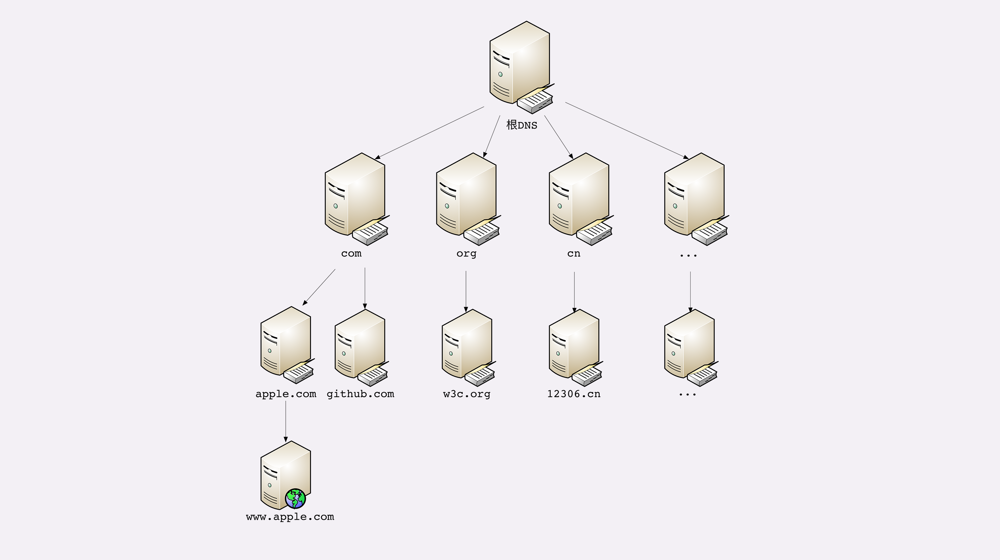
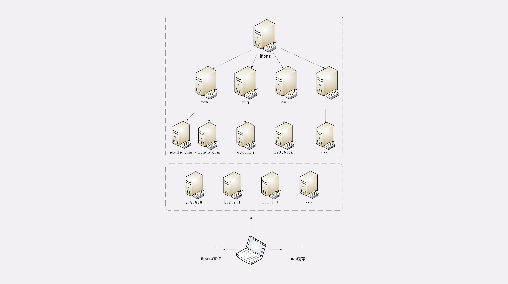

**域名里有哪些门道？** 
在上一讲里，我们学习了 HTTP 协议使用的 TCP/IP 协议栈，知道了 HTTP 协议是运行在 TCP/IP 上的。 
在第 4 讲曾经说过，域名是一个有层次的结构，是一串用“.”分隔的多个单词，最右边的被称为“顶级域名”，然后是“二级域名”，层级关系向左依次降低。 
最左边的是主机名，通常用来表明主机的用途，比如“www”表示提供万维网服务、“mail”表示提供邮件服务，不过这也不是绝对的，名字的关键是要让我们容易记忆。 
看一下极客时间的域名“time.geekbang.org”，这里的“org”就是顶级域名，“geekbang”是二级域名，“time”则是主机名。 
使用这个域名，DNS 就会把它转换成相应的 IP 地址，你就可以访问极客时间的网站了。 
域名不仅能够代替 IP 地址，还有许多其他的用途 
在 Apache、Nginx 这样的 Web 服务器里，域名可以用来标识虚拟主机，决定由哪个虚拟主机来对外提供服务，比如在 Nginx 里就会使用“server_name”指令： 
`
server {
listen 80;                       #监听80端口
server_name  time.geekbang.org;  #主机名是time.geekbang.org
...
}` 
域名本质上还是个名字空间系统，使用多级域名就可以划分出不同的国家、地区、组织、公司、部门，每个域名都是独一无二的，可以作为一种身份的标识。 
举个例子吧，假设 A 公司里有个小明，B 公司里有个小强，于是他们就可以分别说是“小明.A 公司”，“小强.B 公司”，即使 B 公司里也有个小明也不怕， 
可以标记为“小明.B 公司”，很好地解决了重名问题。 
因为这个特性，域名也被扩展到了其他应用领域，比如 Java 的包机制就采用域名作为命名空间， 
只是它使用了反序。如果极客时间要开发 Java 应用，那么它的包名可能就是“org.geekbang.time”。 
而 XML 里使用 URI 作为名字空间，也是间接使用了域名。 
**域名的解析** 
就像 IP 地址必须转换成 MAC 地址才能访问主机一样，域名也必须要转换成 IP 地址，这个过程就是“域名解析”。 
目前全世界有几亿个站点，有几十亿网民，而每天网络上发生的 HTTP 流量更是天文数字。这些请求绝大多数都是基于域名来访问网站的， 
所以 DNS 就成了互联网的重要基础设施，必须要保证域名解析稳定可靠、快速高效 
DNS 的核心系统是一个三层的树状、分布式服务，基本对应域名的结构 

1.根域名服务器（Root DNS Server）：管理顶级域名服务器，返回“com”“net”“cn”等顶级域名服务器的 IP 地址； 
2.顶级域名服务器（Top-level DNS Server）：管理各自域名下的权威域名服务器，比如 com 顶级域名服务器可以返回 apple.com 域名服务器的 IP 地址； 
3.权威域名服务器（Authoritative DNS Server）：管理自己域名下主机的 IP 地址，比如 apple.com 权威域名服务器可以返回 www.apple.com 的 IP 地址。 
 

在这里根域名服务器是关键，它必须是众所周知的，否则下面的各级服务器就无从谈起了。目前全世界共有 13 组根域名服务器，又有数百台的镜像，保证一定能够被访问到。 
有了这个系统以后，任何一个域名都可以在这个树形结构里从顶至下进行查询，就好像是把域名从右到左顺序走了一遍，最终就获得了域名对应的 IP 地址。 
例如，你要访问“www.apple.com”，就要进行下面的三次查询： 
1.访问根域名服务器，它会告诉你“com”顶级域名服务器的地址； 
2.访问“com”顶级域名服务器，它再告诉你“apple.com”域名服务器的地址； 
3.最后访问“apple.com”域名服务器，就得到了“www.apple.com”的地址。 
虽然核心的 DNS 系统遍布全球，服务能力很强也很稳定，但如果全世界的网民都往这个系统里挤，即使不挤瘫痪了，访问速度也会很慢 
这些 DNS 服务器的数量要比核心系统的服务器多很多，而且大多部署在离用户很近的地方。 
比较知名的 DNS 有 Google 的“8.8.8.8”，Microsoft 的“4.2.2.1”，还有 CloudFlare 的“1.1.1.1”等等。 
其次，操作系统里也会对 DNS 解析结果做缓存，如果你之前访问过“www.apple.com”， 
那么下一次在浏览器里再输入这个网址的时候就不会再跑到 DNS 那里去问了，直接在操作系统里就可以拿到 IP 地址。 
另外，操作系统里还有一个特殊的“主机映射”文件，通常是一个可编辑的文本，在 Linux 里是“/etc/hosts”， 
在 Windows 里是“C:\WINDOWS\system32\drivers\etc\hosts”，如果操作系统在缓存里找不到 DNS 记录，就会找这个文件。 
有了上面的“野生”DNS 服务器、操作系统缓存和 hosts 文件后，很多域名解析的工作就都不用“跋山涉水”了， 
直接在本地或本机就能解决，不仅方便了用户，也减轻了各级 DNS 服务器的压力，效率就大大提升了。 
下面的这张图比较完整地表示了现在的 DNS 架构。 
 
在 Nginx 里有这么一条配置指令“resolver”，它就是用来配置 DNS 服务器的，如果没有它，那么 Nginx 就无法查询域名对应的 IP，也就无法反向代理到外部的网站。 
`resolver 8.8.8.8 valid=30s;  #指定Google的DNS，缓存30秒` 
域名的“新玩法”有了域名，又有了可以稳定工作的解析系统，于是我们就可以实现比 IP 地址更多的“新玩法”了。 
第一种，也是最简单的，“重定向”。因为域名代替了 IP 地址，所以可以让对外服务的域名不变，而主机的 IP 地址任意变动。 
当主机有情况需要下线、迁移时，可以更改 DNS 记录，让域名指向其他的机器。比如，你有一台“buy.tv”的服务器要临时停机维护， 
那你就可以通知 DNS 服务器：“我这个 buy.tv 域名的地址变了啊，原先是 1.2.3.4，现在是 5.6.7.8，麻烦你改一下。 
”DNS 于是就修改内部的 IP 地址映射关系，之后再有访问 buy.tv 的请求就不走 1.2.3.4 这台主机，改由 5.6.7.8 来处理， 
这样就可以保证业务服务不中断。第二种，因为域名是一个名字空间，所以可以使用 bind9 等开源软件搭建一个在内部使用的 DNS， 
作为名字服务器。这样我们开发的各种内部服务就都用域名来标记，比如数据库服务都用域名“mysql.inner.app”，商品服务都用“goods.inner.app”， 
发起网络通信时也就不必再使用写死的 IP 地址了，可以直接用域名，而且这种方式也兼具了第一种“玩法”的优势。第三种“玩法”包含了前两种， 
也就是基于域名实现的负载均衡。这种“玩法”也有两种方式，两种方式可以混用。第一种方式，因为域名解析可以返回多个 IP 地址， 
所以一个域名可以对应多台主机，客户端收到多个 IP 地址后，就可以自己使用轮询算法依次向服务器发起请求，实现负载均衡。 
第二种方式，域名解析可以配置内部的策略，返回离客户端最近的主机，或者返回当前服务质量最好的主机，这样在 DNS 端把请求分发到不同的服务器， 
实现负载均衡。前面我们说的都是可信的 DNS，如果有一些不怀好意的 DNS，那么它也可以在域名这方面“做手脚”，弄一些比较“恶意”的“玩法”， 
举两个例子：“域名屏蔽”，对域名直接不解析，返回错误，让你无法拿到 IP 地址，也就无法访问网站；“域名劫持”，也叫“域名污染”，你要访问 A 网站， 
但 DNS 给了你 B 网站。好在互联网上还是好人多，而且 DNS 又是互联网的基础设施，这些“恶意 DNS”并不多见，你上网的时候不需要太过担心。 
**小结** 

1.域名使用字符串来代替 IP 地址，方便用户记忆，本质上一个名字空间系统； 
2.DNS 就像是我们现实世界里的电话本、查号台，统管着互联网世界里的所有网站，是一个“超级大管家”； 
3.DNS 是一个树状的分布式查询系统，但为了提高查询效率，外围有多级的缓存； 
4.使用 DNS 可以实现基于域名的负载均衡，既可以在内网，也可以在外网 
 
在浏览器地址栏里随便输入一个不存在的域名，比如就叫“www. 不存在.com”，试着解释一下它的 DNS 解析过程。 
如果因为某些原因，DNS 失效或者出错了，会出现什么后果？ 
第一个问题： 
1、检查本地dns缓存是否存在解析"www.不存在.com"域名的ip 
2、如果没有找到继续查找本地hosts文件内是否有对应的固定记录 
3、如果hosts中还是没有那就根据本地网卡被分配的 dns server ip 来进行解析，dns server ip 一般是“非官方”的ip， 
比如谷歌的“8.8.8.8”，本身它也会对查找的域名解析结果进行缓存，如果它没有缓存或者缓存失效， 
则先去顶级域名服务器“com”去查找“不存在.com”的域名服务器ip，结果发现不存在， 
于是直接返回告诉浏览器域名解析错误，当然这两次查找过程是基于udp协议 
 
1.本地dns缓存包括多种(浏览器缓存,操作系统缓存) 
2.hosts  hosts文件是方便用户自己添加dns解析，与操作系统的目的不同，它不是缓存，而是一个简单的dns解析器。 
3.dns server  
对于DNS解析的过程：浏览器DNS缓存->操作系统缓存->Hosts文件->非权威域名服务器->根域名服务器->顶级域名服务器->权威域名服务器。一直对浏览器/本机如何知道根服务器地址存在疑惑。
在查阅《计算机网络自顶向下方法》后发现，我们在连接某个ISP时，ISP一般会给我们提供一个IP地址，同时该地址拥有一台或多台DNS服务器地址（通过DHCP）。所以我们在Hosts文件中找不到时，会去查询这个局域网DNS服务器，如果没有查到，它会帮我们去查询根NDS服务器、顶级域名服务器和权威域名服务器，然后返回给本机，同时进行缓存。
个人认为，如果我们自己配置了非权威DNS服务器，如8.8.8.8，它应该也会帮我们去查询根NDS服务器、顶级域名服务器和权威域名服务器。
这些远程查询都是基于UDP协议，通常使用53号端口。
不知道以上理解是否正确? 
第二个问题：如果dns失效或出错，那就访问不了了呗，我现在有个域名在国外某些国家每天都有不少访问失败的http请求， 
客户端直接报“Failed host lookup”的错误 

