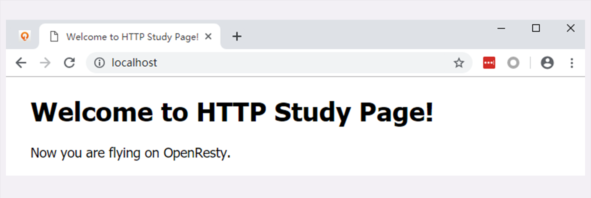

**自己动手，搭建HTTP实验环境** 
**“破冰篇”回顾 (01-06)** 
HTTP 协议诞生于 30 年前，设计之初的目的是用来传输纯文本数据。但由于形式灵活，搭配 URI、HTML 等技术能够把互联网上的资源都联系起来， 
构成一个复杂的超文本系统，让人们自由地获取信息，所以得到了迅猛发展。HTTP 有多个版本，目前应用的最广泛的是 HTTP/1.1， 
它几乎可以说是整个互联网的基石。但 HTTP/1.1 的性能难以满足如今的高流量网站，于是又出现了 HTTP/2 和 HTTP/3。 
不过这两个新版本的协议还没有完全推广开。在可预见的将来，HTTP/1.1 还会继续存在下去。HTTP 翻译成中文是“超文本传输协议”， 
是一个应用层的协议，通常基于 TCP/IP，能够在网络的任意两点之间传输文字、图片、音频、视频等数据。HTTP 协议中的两个端点称为请求方和应答方。 
请求方通常就是 Web 浏览器，也叫 user agent，应答方是 Web 服务器，存储着网络上的大部分静态或动态的资源。在浏览器和服务器之间还有一些“中间人”的角色， 
如 CDN、网关、代理等，它们也同样遵守 HTTP 协议，可以帮助用户更快速、更安全地获取资源。HTTP 协议不是一个孤立的协议，需要下层很多其他协议的配合。 
最基本的是 TCP/IP，实现寻址、路由和可靠的数据传输，还有 DNS 协议实现对互联网上主机的定位查找。对 HTTP 更准确的称呼是“HTTP over TCP/IP”， 
而另一个“HTTP over SSL/TLS”就是增加了安全功能的 HTTPS。 
**软件介绍** 
常言道“实践出真知”，又有俗语“光说不练是假把式”。要研究 HTTP 协议，最好有一个实际可操作、可验证的环境，通过实际的数据、现象来学习， 
肯定要比单纯的“动嘴皮子”效果要好的多。 
现成的环境当然有，只要能用浏览器上网，就会有 HTTP 协议，就可以进行实验。但现实的网络环境又太复杂了，有很多无关的干扰因素， 
这些“噪音”会“淹没”真正有用的信息。 
所以，我给你的建议是：搭建一个“最小化”的环境，在这个环境里仅有 HTTP 协议的两个端点：请求方和应答方，去除一切多余的环节， 
从而可以抓住重点，快速掌握 HTTP 的本质。 

简单说一下这个“最小化”环境用到的应用软件： 
Wireshark 
Chrome/Firefox 
Telnet 
OpenResty 
Telnet 是一个经典的虚拟终端，基于 TCP 协议远程登录主机，我们可以使用它来模拟浏览器的行为， 
连接服务器后手动发送 HTTP 请求，把浏览器的干扰也彻底排除，能够从最原始的层面去研究 HTTP 协议。 
OpenResty 你可能比较陌生，它是基于 Nginx 的一个“强化包”，里面除了 Nginx 还有一大堆有用的功能模块， 
不仅支持 HTTP/HTTPS，还特别集成了脚本语言 Lua 简化 Nginx 二次开发，方便快速地搭建动态网关， 
更能够当成应用容器来编写业务逻辑。选择 OpenResty 而不直接用 Nginx 的原因是它相当于 Nginx 的“超集”， 
功能更丰富，安装部署更方便。我也会用 Lua 编写一些服务端脚本，实现简单的 Web 服务器响应逻辑，方便实验。 
**安装过程**
https://github.com/chronolaw/http_study
下载安装 OpenResty 
启动 www start.bat   list.bat   运行wireshark  监听loopback 
忽略....
**测试验证**
实验环境搭建完了，但还需要把它运行起来，做一个简单的测试验证，看是否运转正常。首先我们要启动 Web 服务器， 
也就是 OpenResty。在 http_study 的“www”目录下有四个批处理文件，分别是： 
 
start：启动 OpenResty 服务器； 
stop：停止 OpenResty 服务器； 
reload：重启 OpenResty 服务器； 
list：列出已经启动的 OpenResty 服务器进程。 
使用鼠标双击“start”批处理文件，就会启动 OpenResty 服务器在后台运行， 
这个过程可能会有 Windows 防火墙的警告，选择“允许”即可。 
运行后，鼠标双击“list”可以查看 OpenResty 是否已经正常启动， 
应该会有两个 nginx.exe 的后台进程，大概是下图的样子。 
 
有了 Web 服务器后，接下来我们要运行 Wireshark，开始抓包。 
因为我们的实验环境运行在本机的 127.0.0.1 上，也就是 loopback“环回”地址。 
所以，在 Wireshark 里要选择“Npcap loopback Adapter”， 
过滤器选择“HTTP TCP port(80)”，即只抓取 HTTP 相关的数据包。 

鼠标双击开始界面里的“Npcap loopback Adapter”即可开始抓取本机上的网络数据。 
 
然后我们打开 Chrome，在地址栏输入“http://localhost”， 
访问刚才启动的 OpenResty 服务器，就会看到一个简单的欢迎界面，如下图所示。 
 
这时再回头去看 Wireshark，应该会显示已经抓到了一些数据， 
就可以用鼠标点击工具栏里的“停止捕获”按钮告诉 Wireshark“到此为止”，不再继续抓包。 
容。现实的网络环境太复杂，有很多干扰因素，搭建“最小化”的环境可以快速抓住重点， 
掌握 HTTP 的本质；我们选择 Wireshark 作为抓包工具，捕获在 TCP/IP 协议栈中传输的所有流量； 
我们选择 Chrome 或 Firefox 浏览器作为 HTTP 协议中的 user agent；我们选择 OpenResty 作为 Web 服务器 
，它是一个 Nginx 的“强化包”，功能非常丰富；Telnet 是一个命令行工具，可用来登录主机模拟浏览器操作； 
在 GitHub 上可以下载到本专栏的专用项目源码，只要把 OpenResty 解压到里面即可完成实验环境的搭建。 

