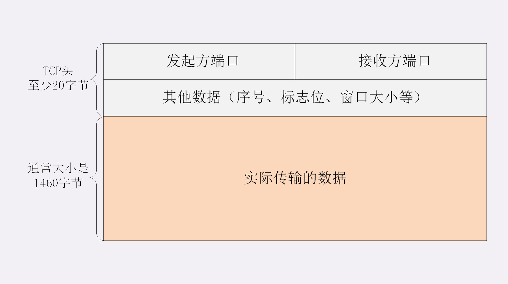
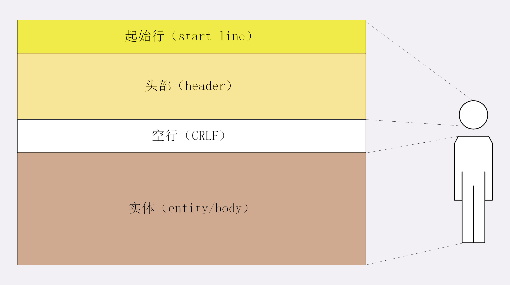
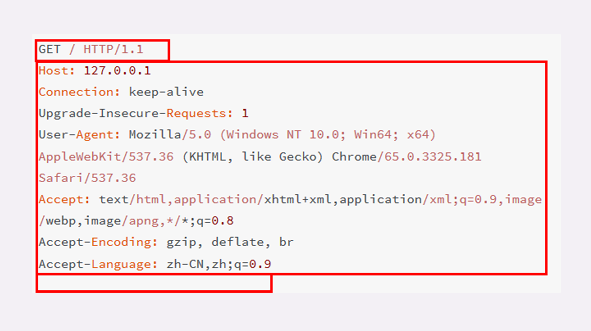
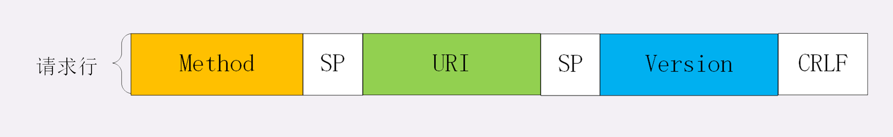
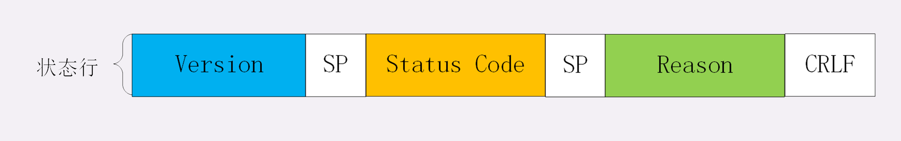
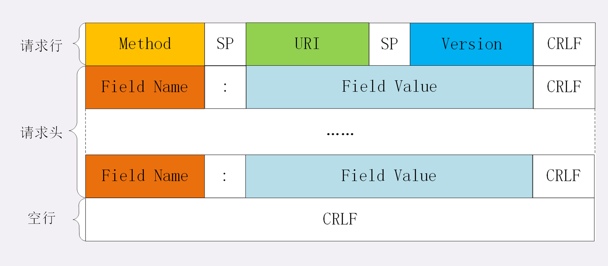
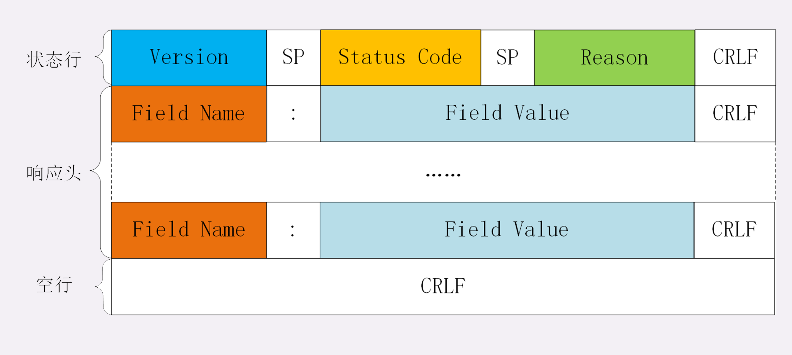

在上一讲里，我们在本机的最小化环境了做了两个 HTTP 协议的实验， 
使用 Wireshark 抓包，弄清楚了 HTTP 协议基本工作流程，也就是“请求 - 应答”“一发一收”的模式。 
可以看到，HTTP 的工作模式是非常简单的，由于 TCP/IP 协议负责底层的具体传输工作，HTTP 协议基本上不用在这方面操心太多。 
单从这一点上来看，所谓的“超文本传输协议”其实并不怎么管“传输”的事情，有点“名不副实”。 
那么 HTTP 协议的核心部分是什么呢？ 
答案就是它传输的报文内容。 
HTTP 协议在规范文档里详细定义了报文的格式，规定了组成部分， 
解析规则，还有处理策略，所以可以在 TCP/IP 层之上实现更灵活丰富的功能， 
例如连接控制，缓存管理、数据编码、内容协商等等。 
**报文结构** 
你也许对 TCP/UDP 的报文格式有所了解，拿 TCP 报文来举例，它在实际要传输的数据之前附加了一个 20 字节的头部数据， 
存储 TCP 协议必须的额外信息，例如发送方的端口号、接收方的端口号、包序号、标志位等等。 
有了这个附加的 TCP 头，数据包才能够正确传输，到了目的地后把头部去掉，就可以拿到真正的数据。 
 
HTTP协议也是与TCP/UDP类似，同样也需要在实际传输的数据前附加一些头数据，不过与 TCP/UDP 不同的是， 
它是一个“纯文本”的协议，所以头数据都是 ASCII 码的文本，可以很容易地用肉眼阅读，不用借助程序解析也能够看懂。 
HTTP 协议的请求报文和响应报文的结构基本相同，由三大部分组成 
起始行（start line）：描述请求或响应的基本信息； 
头部字段集合（header）：使用 key-value 形式更详细地说明报文 
消息正文（entity）：实际传输的数据，它不一定是纯文本，可以是图片、视频等二进制数据。 
这其中前两部分起始行和头部字段经常又合称为“请求头”或“响应头”，消息正文又称为“实体”，但与“header”对应，很多时候就直接称为“body”。 
HTTP 协议规定报文必须有 header, 但可以没有 body，而且在 header 之后必须要有一个“空行”，也就是“CRLF”，十六进制的“0D0A”。 
所以，一个完整的 HTTP 报文就像是下图的这个样子，注意在 header 和 body 之间有一个“空行”。 

说到这里，我不由得想起了一部老动画片《大头儿子和小头爸爸》，你看，HTTP 的报文结构像不像里面的“大头儿子”？报文里的 header 就是“大头儿子”的“大头” 
空行就是他的“脖子”，而后面的 body 部分就是他的身体了。看一下我们之前用 Wireshark 抓的包吧。 
 
在这个浏览器发出的请求报文里，第一行“GET / HTTP/1.1”就是请求行，而后面的“Host”“Connection”等等都属于 header， 报文的最后是一个空白行结束，没有 body。 
在很多时候，特别是浏览器发送 GET 请求的时候都是这样，HTTP 报文经常是只有 header 而没 body，相当于只发了一个超级“大头”过来， 
你可以想象的出来：每时每刻网络上都会有数不清的“大头儿子”在跑来跑去。 
不过这个“大头”也不能太大，虽然 HTTP 协议对 header 的大小没有做限制，但各个 Web 服务器都不允许过大的请求头，因为头部太大可能会占用大量的服务器资源，影响运行效率。 
**请求行** (起始行)
了解了 HTTP 报文的基本结构后，我们来看看请求报文里的起始行也就是请求行（request line），它简要地描述了客户端想要如何操作服务器端的资源。 
请求行由三部分构成： 
1.请求方法：是一个动词，如 GET/POST，表示对资源的操作； 
2.请求目标：通常是一个 URI，标记了请求方法要操作的资源 
3.版本号：表示报文使用的 HTTP 协议版本; 
这三个部分通常使用空格（space）来分隔，最后要用 CRLF 换行表示结束。 
 
还是用 Wireshark 抓包的数据来举例： 
`GET / HTTP/1.1` 
在这个请求行里，“GET”是请求方法，“/”是请求目标，“HTTP/1.1”是版本号，把这三部分连起来， 
意思就是“服务器你好，我想获取网站根目录下的默认文件，我用的协议版本号是 1.1，请不要用 1.0 或者 2.0 回复我 
别看请求行就一行，貌似很简单，其实这里面的“讲究”是非常多的，尤其是前面的请求方法和请求目标，组合起来变化多端，后面我还会详细介绍。 
**状态行** 
看完了请求行，我们再看响应报文里的起始行，在这里它不叫“响应行”，而是叫“状态行”（status line），意思是服务器响应的状态。 
比起请求行来说，状态行要简单一些，同样也是由三部分构成 
比起请求行来说，状态行要简单一些，同样也是由三部分构成： 
1.版本号：表示报文使用的 HTTP 协议版本； 
2.状态码：一个三位数，用代码的形式表示处理的结果，比如 200 是成功，500 是服务器错误 
3.原因：作为数字状态码补充，是更详细的解释文字，帮助人理解原因。 
 
看一下上一讲里 Wireshark 抓包里的响应报文，状态行是： 
`HTTP/1.1 200 OK` 
意思就是：“浏览器你好，我已经处理完了你的请求，这个报文使用的协议版本号是 1.1，状态码是 200，一切 OK。” 
而另一个“GET /favicon.ico HTTP/1.1”的响应报文状态行是： 
`HTTP/1.1 404 Not Found` 
翻译成人话就是：“抱歉啊浏览器，刚才你的请求收到了，但我没找到你要的资源，错误代码是 404，接下来的事情你就看着办吧。”
头部字段 
请求行或状态行再加上头部字段集合就构成了 HTTP 报文里完整的请求头或响应头，我画了两个示意图，你可以看一下。 
 
 
请求头和响应头的结构是基本一样的，唯一的区别是起始行，所以我把请求头和响应头里的字段放在一起介绍。 
头部字段是 key-value 的形式，key 和 value 之间用“:”分隔，最后用 CRLF 换行表示字段结束。 
比如在“Host: 127.0.0.1”这一行里 key 就是“Host”，value 就是“127.0.0.1”。 
HTTP 头字段非常灵活，不仅可以使用标准里的 Host、Connection 等已有头，也可以任意添加自定义头，这就给 HTTP 协议带来了无限的扩展可能。 
不过使用头字段需要注意下面几点： 
1.字段名不区分大小写，例如“Host”也可以写成“host”，但首字母大写的可读性更好； 
2.字段名里不允许出现空格，可以使用连字符“-”，但不能使用下划线“_”。例如，“test-name”是合法的字段名，而“test name”“test_name”是不正确的字段名； 
3.字段名后面必须紧接着“:”，不能有空格，而“:”后的字段值前可以有多个空格； 
4.字段的顺序是没有意义的，可以任意排列不影响语义； 
5.字段原则上不能重复，除非这个字段本身的语义允许，例如 Set-Cookie。 

