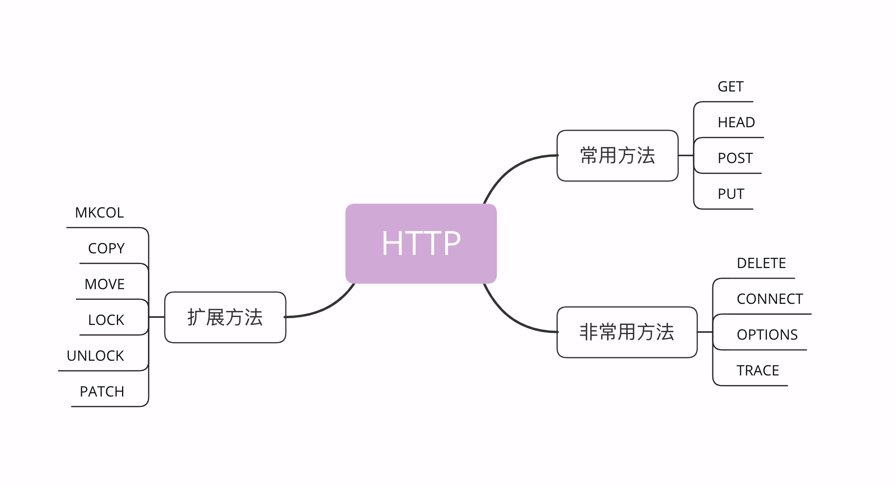

**应该如何理解请求方法？**
上一讲我介绍了 HTTP 的报文结构，它是由 header+body 构成，请求头里有请求方法和请求目标， 
响应头里有状态码和原因短语，今天要说的就是请求头里的请求方法。 
**标准请求方法** 
HTTP 协议里为什么要有“请求方法”这个东西呢？ 
这就要从 HTTP 协议设计时的定位说起了。还记得吗？蒂姆·伯纳斯 - 李最初设想的是要用 HTTP 协议构建一个超链接文档系统， 
使用 URI 来定位这些文档，也就是资源。那么，该怎么在协议里操作这些资源呢？ 
很显然，需要有某种“动作的指示”，告诉操作这些资源的方式。所以，就这么出现了“请求方法”。 
它的实际含义就是客户端发出了一个“动作指令”，要求服务器端对 URI 定位的资源执行这个动作。 
目前 HTTP/1.1 规定了八种方法，单词都必须是大写的形式，我先简单地列把它们列出来，后面再详细讲解。 
1.GET：获取资源，可以理解为读取或者下载数据； 
2.HEAD:获取资源的元信息； 
3.POST：向资源提交数据，相当于写入或上传数据； 
4.PUT：类似 POST； 
5.DELETE：删除资源； 
6.CONNECT：建立特殊的连接隧道； 
7.OPTIONS：列出可对资源实行的方法； 
8.TRACE：追踪请求 - 响应的传输路径。 
 
看看这些方法，是不是有点像对文件或数据库的“增删改查”操作，只不过这些动作操作的目标不是本地资源， 
而是远程服务器上的资源，所以只能由客户端“请求”或者“指示”服务器来完成。 
既然请求方法是一个“指示”，那么客户端自然就没有决定权，服务器掌控着所有资源，也就有绝对的决策权力。 
它收到 HTTP 请求报文后，看到里面的请求方法，可以执行也可以拒绝，或者改变动作的含义，毕竟 HTTP 是一个“协议”，两边都要“商量着来” 
比如，你发起了一个 GET 请求，想获取“/orders”这个文件，但这个文件保密级别比较高，不是谁都能看的，服务器就可以有如下的几种响应方式： 
1.假装这个文件不存在，直接返回一个 404 Not found 报文； 
2.稍微友好一点，明确告诉你有这个文件，但不允许访问，返回一个 403 Forbidden； 
3.再宽松一些，返回 405 Method Not Allowed，然后用 Allow 头告诉你可以用 HEAD 方法获取文件的元信息。 
GET/HEAD 
虽然 HTTP/1.1 里规定了八种请求方法，但只有前四个是比较常用的，所以我们先来看一下这四个方法。 
GET 方法应该是 HTTP 协议里最知名的请求方法了，也应该是用的最多的，自 0.9 版出现并一直被保留至今，是名副其实的“元老”。 
它的含义是请求从服务器获取资源，这个资源既可以是静态的文本、页面、图片、视频，也可以是由 PHP、Java 动态生成的页面或者其他格式的数据。 
GET 方法虽然基本动作比较简单，但搭配 URI 和其他头字段就能实现对资源更精细的操作。 
例如，在 URI 后使用“#”，就可以在获取页面后直接定位到某个标签所在的位置；使用 If-Modified-Since 字段就变成了“有条件的请求”， 
仅当资源被修改时才会执行获取动作；使用 Range 字段就是“范围请求”，只获取资源的一部分数据 
HEAD 方法与 GET 方法类似，也是请求从服务器获取资源，服务器的处理机制也是一样的，但服务器不会返回请求的实体数据， 
只会传回响应头，也就是资源的“元信息”。 
比如，想要检查一个文件是否存在，只要发个 HEAD 请求就可以了，没有必要用 GET 把整个文件都取下来。再比如，要检查文件是否有最新版本， 
同样也应该用 HEAD，服务器会在响应头里把文件的修改时间传回来。 
你可以在实验环境里试一下这两个方法，运行 Telnet，分别向 URI“/10-1”发送 GET 和 HEAD 请求，观察一下响应头是否一致。 
`GET /10-1 HTTP/1.1
Host: www.chrono.com
HEAD /10-1 HTTP/1.1
Host: www.chrono.com`
POST/PUT 
接下来要说的是 POST 和 PUT 方法，这两个方法也很像。 
GET 和 HEAD 方法是从服务器获取数据，而 POST 和 PUT 方法则是相反操作，向 URI 指定的资源提交数据，数据就放在报文的 body 里。 
POST 也是一个经常用到的请求方法，使用频率应该是仅次于 GET，应用的场景也非常多，只要向服务器发送数据，用的大多数都是 POST。 
PUT 的作用与 POST 类似，也可以向服务器提交数据，但与 POST 存在微妙的不同，通常 POST 表示的是“新建”“create”的含义，而 PUT 则是“修改”“update”的含义。 
在实际应用中，PUT 用到的比较少。而且，因为它与 POST 的语义、功能太过近似，有的服务器甚至就直接禁止使用 PUT 方法，只用 POST 方法上传数据。 
`POST /10-2 HTTP/1.1
Host: www.chrono.com
Content-Length: 17
POST DATA IS HERE
PUT /10-2 HTTP/1.1
Host: www.chrono.com
Content-Length: 16
PUT DATA IS HERE`
**其他方法** 
讲完了 GET/HEAD/POST/PUT，还剩下四个标准请求方法，它们属于比较“冷僻”的方法，应用的不是很多。 
DELETE 方法指示服务器删除资源，因为这个动作危险性太大，所以通常服务器不会执行真正的删除操作，而是对资源做一个删除标记。 
当然，更多的时候服务器就直接不处理 DELETE 请求。 
CONNECT 是一个比较特殊的方法，要求服务器为客户端和另一台远程服务器建立一条特殊的连接隧道， 
这时 Web 服务器在中间充当了代理的角色。 
OPTIONS 方法要求服务器列出可对资源实行的操作方法，在响应头的 Allow 字段里返回。它的功能很有限， 
用处也不大，有的服务器（例如 Nginx）干脆就没有实现对它的支持。TRACE 方法多用于对 HTTP 链路的测试或诊断， 
可以显示出请求 - 响应的传输路径。它的本意是好的，但存在漏洞，会泄漏网站的信息，所以 Web 服务器通常也是禁止使用。 
虽然 HTTP/1.1 里规定了八种请求方法，但它并没有限制我们只能用这八种方法，这也体现了 HTTP 协议良好的扩展性， 
我们可以任意添加请求动作，只要请求方和响应方都能理解就行。 
例如著名的愚人节玩笑 RFC2324，它定义了协议 HTCPCP，即“超文本咖啡壶控制协议”， 
为 HTTP 协议增加了用来煮咖啡的 BREW 方法， 要求添牛奶的 WHEN 方法。 
此外，还有一些得到了实际应用的请求方法（WebDAV），例如 MKCOL、COPY、MOVE、LOCK、UNLOCK、PATCH 等。如果有合适的场景， 
你也可以把它们应用到自己的系统里，比如用 LOCK 方法锁定资源暂时不允许修改， 
或者使用 PATCH 方法给资源打个小补丁，部分更新数据。但因为这些方法是非标准的， 
所以需要为客户端和服务器编写额外的代码才能添加支持。 
当然了，你也完全可以根据实际需求，自己发明新的方法，比如“PULL”拉取某些资源到本地，“PURGE”清理某个目录下的所有缓存数据。 
**安全与幂等** 
关于请求方法还有两个面试时有可能会问到、比较重要的概念：安全与幂等。 
在 HTTP 协议里，所谓的“安全”是指请求方法不会“破坏”服务器上的资源，即不会对服务器上的资源造成实质的修改 
按照这个定义，只有 GET 和 HEAD 方法是“安全”的，因为它们是“只读”操作，只要服务器不故意曲解请求方法的处理方式， 
无论 GET 和 HEAD 操作多少次，服务器上的数据都是“安全的”。而 POST/PUT/DELETE 操作会修改服务器上的资源， 
增加或删除数据，所以是“不安全”的。 
所谓的“幂等”实际上是一个数学用语，被借用到了 HTTP 协议里，意思是多次执行相同的操作，结果也都是相同的 
即多次“幂”后结果“相等”。 
很显然，GET 和 HEAD 既是安全的也是幂等的，DELETE 可以多次删除同一个资源，效果都是“资源不存在”，所以也是幂等的。 
POST 和 PUT 的幂等性质就略费解一点。 
按照 RFC 里的语义，POST 是“新增或提交数据”，多次提交数据会创建多个资源，所以不是幂等的；而 PUT 是“替换或更新数据”， 
多次更新一个资源，资源还是会第一次更新的状态，所以是幂等的。 
我对你的建议是，你可以对比一下 SQL 来加深理解：把 POST 理解成 INSERT，把 PUT 理解成 UPDATE， 
这样就很清楚了。多次 INSERT 会添加多条记录，而多次 UPDATE 只操作一条记录，而且效果相同。 

