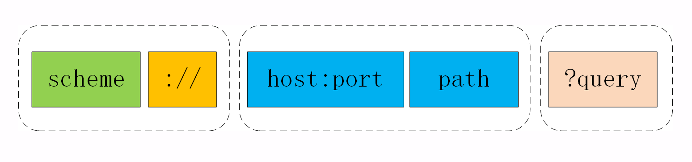
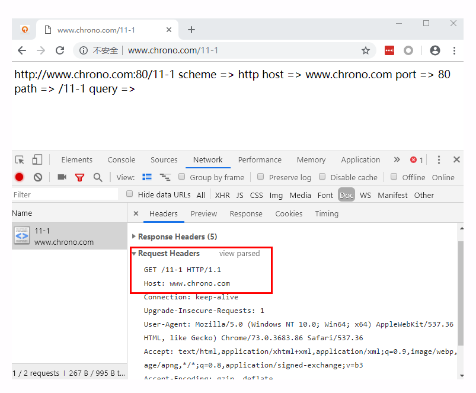

上一讲里我们一起学习了 HTTP 协议里的请求方法，其中最常用的一个是 GET，它用来从服务器上某个资源获取数据，另一个是 POST，向某个资源提交数据。 
那么，应该用什么来标记服务器上的资源呢？怎么区分“这个”资源和“那个”资源呢？ 
经过前几讲的学习，你一定已经知道了，用的是 URI，也就是统一资源标识符（Uniform Resource Identifier）。 
因为它经常出现在浏览器的地址栏里，所以俗称为“网络地址”，简称“网址” 
严格地说，URI 不完全等同于网址，它包含有 URL 和 URN 两个部分，在 HTTP 世界里用的网址实际上是 URL——统一资源定位符 
（Uniform Resource Locator）。但因为 URL 实在是太普及了，所以常常把这两者简单地视为相等。 
不仅我们生活中的上网要用到 URI，平常的开发、测试、运维的工作中也少不了它。如果你在客户端做 iOS、 
Android 或者某某小程序开发，免不了要连接远程服务，就会调用底层 API 用 URI 访问服务。 
如果你使用 Java、PHP 做后台 Web 开发，也会调用 getPath()、parse_url() 等函数来处理 URI，解析里面的各个要素。 
在测试、运维配置 Apache、Nginx 等 Web 服务器的时候也必须正确理解 URI，分离静态资源与动态资源，或者设置规则实现网页的重定向跳转。 
总之一句话，URI 非常重要，要搞懂 HTTP 甚至网络应用，就必须搞懂 URI。 
不知道你平常上网的时候有没有关注过地址栏里的那一长串字符，有的比较简短，有的则一行都显示不下，有的意思大概能看明白 
，而有的则带着各种怪字符，有如“天书”。其实只要你弄清楚了 URI 的格式，就能够轻易地“破解”这些难懂的“天书”了。URI 本质上是一个字符串 
，这个字符串的作用是唯一地标记资源的位置或者名字。 这里我要提醒你注意，它不仅能够标记万维网的资源，也可以标记其他的，如邮件系统、 
本地文件系统等任意资源。而“资源”既可以是存在磁盘上的静态文本、页面数据，也可以是由 Java、PHP 提供的动态服务。下面的这张图显示了 URI 最常用的形式 
，由 scheme、host:port、path 和 query 四个部分组成，但有的部分可以视情况省略。 
 
URI 第一个组成部分叫 scheme，翻译成中文叫“方案名”或者“协议名”，表示资源应该使用哪种协议来访问 
最常见的当然就是“http”了，表示使用 HTTP 协议。另外还有“https”，表示使用经过加密、安全的 HTTPS 协议。 
此外还有其他不是很常见的 scheme，例如 ftp、ldap、file、news 等。 
浏览器或者你的应用程序看到 URI 里的 scheme，就知道下一步该怎么走了，会调用相应的 HTTP 或者 HTTPS 下层 API。 
显然，如果一个 URI 没有提供 scheme，即使后面的地址再完善，也是无法处理的。 
在 scheme 之后，必须是三个特定的字符“://”，它把 scheme 和后面的部分分离开。实话实说，这个设计非常的怪异， 
我最早上网的时候看见地址栏里的“://”就觉得很别扭，直到现在也还是没有太适应。URI 的创造者蒂姆·伯纳斯 - 李也曾经私下承认“://”并非必要， 
当初有些“过于草率”了。不过这个设计已经有了三十年的历史，不管我们愿意不愿意，只能接受。在“://”之后，是被称为“authority”的部分，表示资源所在的主机名， 
通常的形式是“host:port”，即主机名加端口号。主机名可以是 IP 地址或者域名的形式，必须要有，否则浏览器就会找不到服务器。但端口号有时可以省略， 
浏览器等客户端会依据 scheme 使用默认的端口号，例如 HTTP 的默认端口号是 80，HTTPS 的默认端口号是 443。有了协议名和主机地址、端口号， 
再加上后面标记资源所在位置的 path，浏览器就可以连接服务器访问资源了。URI 里 path 采用了类似文件系统“目录”“路径”的表示方式， 
因为早期互联网上的计算机多是 UNIX 系统，所以采用了 UNIX 的“/”风格。其实也比较好理解，它与 scheme 后面的“://”是一致的。 
这里我也要再次提醒你注意，URI 的 path 部分必须以“/”开始，也就是必须包含“/”，不要把“/”误认为属于前面 authority。 
`http://nginx.org
http://www.chrono.com:8080/11-1
https://tools.ietf.org/html/rfc7230
file:///D:/http_study/www/`
第一个 URI 算是最简单的了，协议名是“http”，主机名是“nginx.org”，端口号省略，所以是默认的 80，而路径部分也被省略了，默认就是一个“/”，表示根目录。 
第二个 URI 是在实验环境里这次课程的专用 URI，主机名是“www.chrono.com”，端口号是 8080，后面的路径是“/11-1”。 
第三个是 HTTP 协议标准文档 RFC7230 的 URI，主机名是“tools.ietf.org”，路径是“/html/rfc7230”。 
最后一个 URI 要注意了，它的协议名不是“http”，而是“file”，表示这是本地文件，而后面居然有三个斜杠，这是怎么回事？ 
如果你刚才仔细听了 scheme 的介绍就能明白，这三个斜杠里的前两个属于 URI 特殊分隔符“://”，然后后面的“/D:/http_study/www/”是路径，而中间的主机名被“省略”了。 
这实际上是 file 类型 URI 的“特例”，它允许省略主机名，默认是本机 localhost。但对于 HTTP 或 HTTPS 这样的网络通信协议，主机名是绝对不能省略的。 
原因之前也说了，会导致浏览器无法找到服务器。我们可以在实验环境里用 Chrome 浏览器再仔细观察一下 HTTP 报文里的 URI。运行 Chrome，用 F12 打开开发者工具， 
然后在地址栏里输入“http://www.chrono.com/11-1”，得到的结果如下图。 

在开发者工具里依次选“Network”“Doc”，就可以找到请求的 URI。然后在 Headers 页里看 Request Headers，用“view source”就可以看到浏览器发的原始请求头了。 

**URI 的编码** 
刚才我们看到了，在 URI 里只能使用 ASCII 码，但如果要在 URI 里使用英语以外的汉语、日语等其他语言该怎么办呢？ 
还有，某些特殊的 URI，会在 path、query 里出现“@&?"等起界定符作用的字符，会导致 URI 解析错误，这时又该怎么办呢？ 
所以，URI 引入了编码机制，对于 ASCII 码以外的字符集和特殊字符做一个特殊的操作，把它们转换成与 URI 语义不冲突的形式。 
这在 RFC 规范里称为“escape”和“unescape”，俗称“转义”。URI 转义的规则有点“简单粗暴”``，直接把非 ASCII 码或特殊字符转换成十六进制字节值， 
然后前面再加上一个“%”。例如， 空格被转义成“%20”，“?”被转义成“%3F”。而中文、日文等则通常使用 UTF-8 编码后再转义， 
例如“银河”会被转义成“%E9%93%B6%E6%B2%B3”。有了这个编码规则后，URI 就更加完美了，可以支持任意的字符集用任何语言来标记资源。 
不过我们在浏览器的地址栏里通常是不会看到这些转义后的“乱码”的，这实际上是浏览器一种“友好”表现，隐藏了 URI 编码后的“丑陋一面”，不信你可以试试下面的这个 URI。 
`http://www.chrono.com:8080/11-1?夸父逐日`
先在 Chrome 的地址栏里输入这个 query 里含有中文的 URI，然后点击地址栏，把它再拷贝到其他的编辑器里，它就会“现出原形”：
`http://www.chrono.com:8080/11-1?%E5%A4%B8%E7%88%B6%E9%80%90%E6%97%A5`;

1.URI 是用来唯一标记服务器上资源的一个字符串，通常也称为 URL； 
2.URI 通常由 scheme、host:port、path 和 query 四个部分组成，有的可以省略 
3.scheme 叫“方案名”或者“协议名”，表示资源应该使用哪种协议来访问； 
4.“host:port”表示资源所在的主机名和端口号； 
5.path 标记资源所在的位置； 
6.query 表示对资源附加的额外要求；0 
7.在 URI 里对“@&/”等特殊字符和汉字必须要做编码，否则服务器收到 HTTP 报文后会无法正确处理。 
 
**课下作业** 
HTTP 协议允许在在请求行里使用完整的 URI，但为什么浏览器没有这么做呢？
URI 的查询参数和头字段很相似，都是 key-value 形式，都可以任意自定义，那么它们在使用时该如何区别呢？
（具体分析可以在“答疑篇”第 41 讲中的 URI 查询参数和头字段部分查看）

