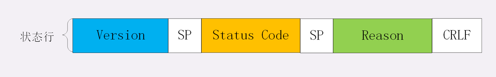
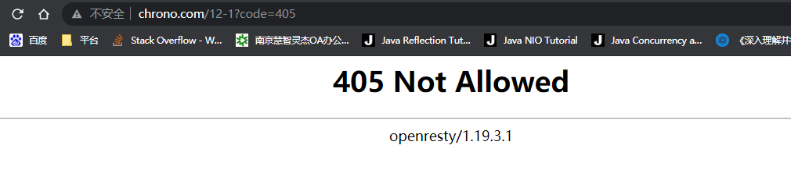

**响应状态码该怎么用？** 
前两讲中，我们学习了 HTTP 报文里请求行的组成部分，包括请求方法和 URI。有了请求行，加上后面的头字段就形成了请求头，可以通过 TCP/IP 协议发送给服务器。 
服务器收到请求报文，解析后需要进行处理，具体的业务逻辑多种多样，但最后必定是拼出一个响应报文发回客户端。 
响应报文由响应头加响应体数据组成，响应头又由状态行和头字段构成。 
我们先来复习一下状态行的结构，有三部分 
 
开头的 Version 部分是 HTTP 协议的版本号，通常是 HTTP/1.1，用处不是很大。 
后面的 Reason 部分是原因短语，是状态码的简短文字描述，例如“OK”“Not Found”等等，也可以自定义。 
但它只是为了兼容早期的文本客户端而存在，提供的信息很有限，目前的大多数客户端都会忽略它。 
所以，状态行里有用的就只剩下中间的状态码（Status Code）了。它是一个十进制数字， 
以代码的形式表示服务器对请求的处理结果， 就像我们通常编写程序时函数返回的错误码一样。 

不过你要注意，它的名字是“状态码”而不是“错误码”。也就是说，它的含义不仅是错误，更重要的意义在于表达 HTTP 数据处理的“状态”， 
客户端可以依据代码适时转换处理状态，例如继续发送请求、切换协议，重定向跳转等，有那么点 TCP 状态转换的意思 
**状态码** 
目前 RFC 标准里规定的状态码是三位数，所以取值范围就是从 000 到 999。但如果把代码简单地从 000 开始顺序编下去就显得有点太“low”，  
不灵活、不利于扩展，所以状态码也被设计成有一定的格式。 
这五类的具体含义是： 
1××：提示信息，表示目前是协议处理的中间状态，还需要后续的操作； 
2××：成功，报文已经收到并被正确处理； 
3××：重定向，资源位置发生变动，需要客户端重新发送请求； 
4××：客户端错误，请求报文有误，服务器无法处理； 
5××：服务器错误，服务器在处理请求时内部发生了错误。 
在 HTTP 协议中，正确地理解并应用这些状态码不是客户端或服务器单方的责任，而是双方共同的责任。 
客户端作为请求的发起方，获取响应报文后，需要通过状态码知道请求是否被正确处理，是否要再次发送请求，如果出错了原因又是什么。 
这样才能进行下一步的动作，要么发送新请求，要么改正错误重发请求。 
在我们的实验环境里也可以对这些状态码做测试验证，访问 URI“/12-1”，用查询参数“code=xxx”来检查这些状态码的效果， 
服务器不仅会在状态行里显示状态码，还会在响应头里用自定义的“Expect-Code”字段输出这个代码。 
例如，在 Chrome 里访问“http://www.chrono.com/12-1?code=405”的结果如下图。 
 
接下来我就挑一些实际开发中比较有价值的状态码逐个详细介绍。 
**1××** 
1××类状态码属于提示信息，是协议处理的中间状态，实际能够用到的时候很少。 
我们偶尔能够见到的是“101 Switching Protocols”。它的意思是客户端使用 Upgrade 头字段， 
要求在 HTTP 协议的基础上改成其他的协议继续通信，比如 WebSocket。而如果服务器也同意变更协议， 
就会发送状态码 101，但这之后的数据传输就不会再使用 HTTP 了。 
**2××** 
2××类状态码表示服务器收到并成功处理了客户端的请求，这也是客户端最愿意看到的状态码。 
“200 OK”是最常见的成功状态码，表示一切正常，服务器如客户端所期望的那样返回了处理结果，如果是非 HEAD 请求，通常在响应头后都会有 body 数据。 
“204 No Content”是另一个很常见的成功状态码，它的含义与“200 OK”基本相同，但响应头后没有 body 数据。 
所以对于 Web 服务器来说，正确地区分 200 和 204 是很必要的。 
“206 Partial Content”是 HTTP 分块下载或断点续传的基础，在客户端发送“范围请求”、要求获取资源的部分数据时出现， 
它与 200 一样，也是服务器成功处理了请求，但 body 里的数据不是资源的全部，而是其中的一部分。 
状态码 206 通常还会伴随着头字段“Content-Range”，表示响应报文里 body 数据的具体范围， 
供客户端确认，例如“Content-Range: bytes 0-99/2000”，意思是此次获取的是总计 2000 个字节的前 100 个字节。 
**3××** 
3××类状态码表示客户端请求的资源发生了变动，客户端必须用新的 URI 重新发送请求获取资源，也就是通常所说的“重定向”， 
包括著名的 301、302 跳转。“301 Moved Permanently”俗称“永久重定向”，含义是此次请求的资源已经不存在了，需要改用新的 URI 再次访问。 
与它类似的是“302 Found”，曾经的描述短语是“Moved Temporarily”，俗称“临时重定向”，意思是请求的资源还在，但需要暂时用另一个 URI 来访问。 
301 和 302 都会在响应头里使用字段 Location 指明后续要跳转的 URI，最终的效果很相似，浏览器都会重定向到新的 URI。两者的根本区别在于语义， 
一个是“永久”，一个是“临时”，所以在场景、用法上差距很大。比如，你的网站升级到了 HTTPS，原来的 HTTP 不打算用了，这就是“永久”的，所以要配置 301 跳转 
把所有的 HTTP 流量都切换到 HTTPS。再比如，今天夜里网站后台要系统维护，服务暂时不可用，这就属于“临时”的，可以配置成 302 跳转， 
把流量临时切换到一个静态通知页面，浏览器看到这个 302 就知道这只是暂时的情况，不会做缓存优化，第二天还会访问原来的地址。“304 Not Modified”  
是一个比较有意思的状态码，它用于 If-Modified-Since 等条件请求，表示资源未修改，用于缓存控制。它不具有通常的跳转含义， 
但可以理解成“重定向已到缓存的文件”（即“缓存重定向”）。301、302 和 304 分别涉及了 HTTP 协议里重要的“重定向跳转”和“缓存控制”，在之后的课程中我还会细讲。 

