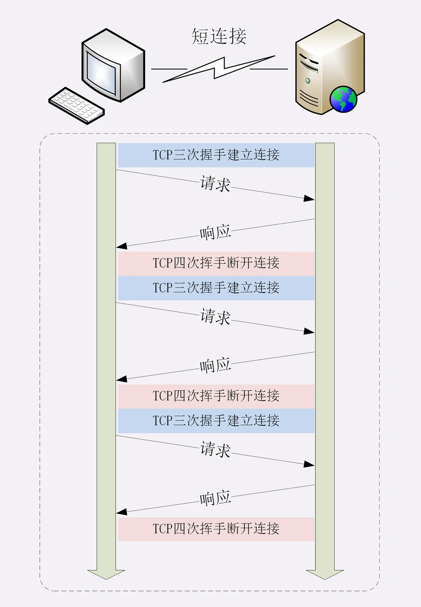
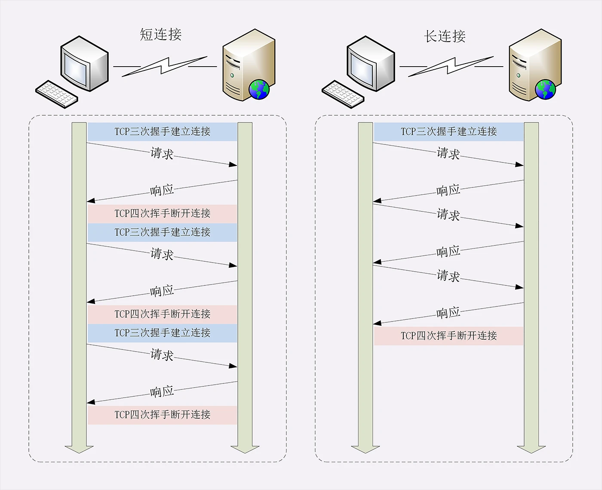
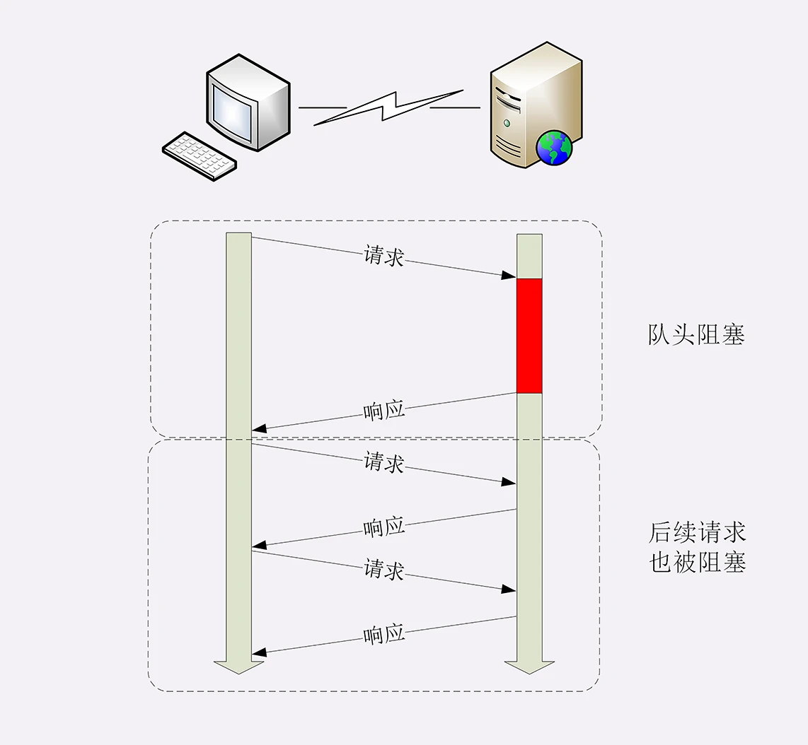

在第14讲中我曾经提到过 HTTP 的性能问题，用了六个字来概括：“不算差，不够好”。同时，我也谈到了“队头阻塞”， 
但由于时间的限制没有展开来细讲，这次就来好好地看看 HTTP 在连接这方面的表现。HTTP 的连接管理也算得上是个“老生常谈”的话题了， 
你一定曾经听说过“短连接”“长连接”之类的名词，今天让我们一起来把它们弄清楚 
**短连接** 
HTTP 协议最初（0.9/1.0）是个非常简单的协议，通信过程也采用了简单的“请求 - 应答”方式。 
它底层的数据传输基于 TCP/IP，每次发送请求前需要先与服务器建立连接，收到响应报文后会立即关闭连接。 
因为客户端与服务器的整个连接过程很短暂，不会与服务器保持长时间的连接状态，所以就被称为“短连接” 
（short-lived connections）。 早期的 HTTP 协议也被称为是“无连接”的协议。 
短连接的缺点相当严重，因为在 TCP 协议里，建立连接和关闭连接都是非常“昂贵”的操作。TCP 建立连接要有“三次握手” 
发送 3 个数据包，需要 1 个 RTT,关闭连接是“四次挥手”,4个数据包需要2个RTT 
而 HTTP 的一次简单“请求-响应”通常只需要4个包，如果不算服务器内部的处理时间最多是 2 个 RTT 
这么算下来，浪费的时间就是“3÷5=60%”，有三分之二的时间被浪费掉了,传输效率低得惊人 
 
单纯地从理论上讲，TCP 协议你可能还不太好理解，我就拿打卡考勤机来做个形象的比喻吧 
假设你的公司买了一台打卡机，放在前台，因为这台机器比较贵，所以专门做了一个保护罩盖着它 
公司要求每次上下班打卡时都要先打开盖子，打卡后再盖上盖子。可是偏偏这个盖子非常牢固 
打开关闭要费很大力气，打卡可能只要 1 秒钟，而开关盖子却需要四五秒钟，大部分时间都浪费在了毫无意义的开关盖子操作上了 
可想而知，平常还好说，一到上下班的点在打卡机前就会排起长队，每个人都要重复“开盖 - 打卡 - 关盖”的三个步骤 
你说着急不着急。在这个比喻里，打卡机就相当于服务器，盖子的开关就是 TCP 的连接与关闭，而每个打卡的人就是 HTTP 请求 
很显然，短连接的缺点严重制约了服务器的服务能力，导致它无法处理更多的请求 
针对短连接暴露出的缺点，HTTP 协议就提出了“长连接”的通信方式，也叫“持久连接” 
（persistent connections）、“连接保活”（keep alive）、“连接复用”（connection reuse） 
其实解决办法也很简单，用的就是“成本均摊”的思路，既然 TCP 的连接和关闭非常耗时间， 
那么就把这个时间成本由原来的一个“请求 - 应答”均摊到多个“请求 - 应答”上。 
这样虽然不能改善 TCP 的连接效率，但基于“分母效应”，每个“请求 - 应答”的无效时间就会降低不少， 
整体传输效率也就提高了。 这里我画了一个短连接与长连接的对比示意图。 
 
在短连接里发送了三次 HTTP“请求 - 应答”，每次都会浪费 60% 的 RTT 时间。而在长连接的情况下， 
同样发送三次请求，因为只在第一次时建立连接，在最后一次时关闭连接，所以浪费率就是“3÷9≈33%”， 
降低了差不多一半的时间损耗。显然，如果在这个长连接上发送的请求越多，分母就越大，利用率也就越高。 
继续用刚才的打卡机的比喻，公司也觉得这种反复“开盖 - 打卡 - 关盖”的操作太“反人类”了， 
于是颁布了新规定，早上打开盖子后就不用关上了，可以自由打卡，到下班后再关上盖子。 
这样打卡的效率（即服务能力）就大幅度提升了，原来一次打卡需要五六秒钟，现在只要一秒就可以了， 
上下班时排长队的景象一去不返，大家都开心。 
**连接相关的头字段** 

由于长连接对性能的改善效果非常显著，所以在 HTTP/1.1 中的连接都会默认启用长连接。不需要用什么特殊的头字段指定 
只要向服务器发送了第一次请求，后续的请求都会重复利用第一次打开的 TCP 连接，也就是长连接，在这个连接上收发数据 
当然，我们也可以在请求头里明确地要求使用长连接机制，使用的字段是 Connection，值是“keep-alive”。 
不过不管客户端是否显式要求长连接，如果服务器支持长连接，它总会在响应报文里放一个“Connection: keep-alive”字段， 
告诉客户端：“我是支持长连接的，接下来就用这个 TCP 一直收发数据吧”。 
你可以在实验环境里访问 URI“/17-1”，用 Chrome 看一下服务器返回的响应头： 
![img_37.png](img_37.png             
不过长连接也有一些小缺点，问题就出在它的“长”字上 
因为 TCP 连接长时间不关闭，服务器必须在内存里保存它的状态，这就占用了服务器的资源。 
如果有大量的空闲长连接只连不发，就会很快耗尽服务器的资源，导致服务器无法为真正有需要的用户提供服务 
**队头阻塞** 
看完了短连接和长连接,接下来就要说到著名的“队头阻塞”（Head-of-line blocking，也叫“队首阻塞”）了. 
“队头阻塞”与短连接和长连接无关，而是由 HTTP 基本的“请求 - 应答”模型所导致的。 
因为 HTTP 规定报文必须是“一发一收”，这就形成了一个先进先出的“串行”队列。 
队列里的请求没有轻重缓急的优先级，只有入队的先后顺序，排在最前面的请求被最优先处理。 
如果队首的请求因为处理的太慢耽误了时间，那么队列里后面的所有请求也不得不跟着一起等待， 
结果就是其他的请求承担了不应有的时间成本 

**性能优化**
因为“请求 - 应答”模型不能变，所以“队头阻塞”问题在 HTTP/1.1 里无法解决，只能缓解，有什么办法呢？ 
这在 HTTP 里就是“并发连接”（concurrent connections），也就是同时对一个域名发起多个长连接， 
用数量来解决质量的问题。但这种方式也存在缺陷。如果每个客户端都想自己快，建立很多个连接， 
用户数×并发数就会是个天文数字。服务器的资源根本就扛不住，或者被服务器认为是恶意攻击，反而会造成“拒绝服务”。 
**限制客户端并发连接数据，浏览器中针对域名相同的请求进行并发限制**
所以，HTTP 协议建议客户端使用并发，但不能“滥用”并发。RFC2616 里明确限制每个客户端最多并发 2 个连接。 
不过实践证明这个数字实在是太小了，众多浏览器都“无视”标准，把这个上限提高到了 6~8。 
后来修订的 RFC7230 也就“顺水推舟”，取消了这个“2”的限制。 
这个就是“域名分片”（domain sharding）技术，还是用数量来解决质量的思路。HTTP 协议和浏览器不是限制并发连接数量吗？好，那我就多开几个域名， 
比如 shard1.chrono.com、shard2.chrono.com，而这些域名都指向同一台服务器 www.chrono.com，这样实际长连接的数量就又上去了，真是“美滋滋”。
不过实在是有点“上有政策，下有对策”的味道。 

