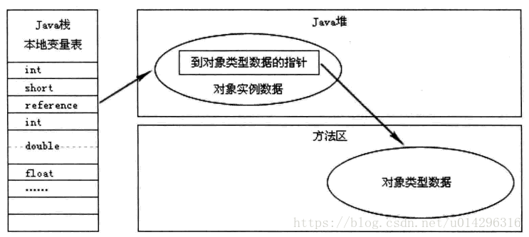

`深入理解jvm第三版`

**2.2.1** 

### 程序计数器(线程私有)

>程序计数器（Program Counter Register）
- 是一块较小的内存空间， 它可以看作是当前线程所执行的
字节码的行号指示器。 在Java虚拟机的概念模型里， 字节码解释器工作时就是通过改变这个计数器
的值来选取下一条需要执行的字节码指令， 它是程序控制流的指示器， 分支、 循环、 跳转、 异常处
理、 线程恢复等基础功能都需要依赖这个计数器来完成。

>为啥是线程私有 

- 由于 java虚拟机的多线程是 通过线程轮流切换 分配处理器执行时间的方式来实现的
因此在任何一个确定的时刻 一个处理器(在多核处理器 对应的是一个内核) 只会处理一个线程某一条指令
因此 为了线程切换后能够恢复到正确的执行位置 每个线程都需要有自己独立的程序计数器  各个线程之间的程序计数器独立存储 互不影响

### java虚拟机栈(线程私有)

- 与程序计数器一样,java 虚拟机栈也是线程私有的 他的生命周期是伴随着线程的创建和销毁的 
虚拟机栈描述的是 java方法执行的 线程内存模型 每个方法在执行的时候 java虚拟机都会同步创建一个栈桢 (stack frame) 
用于 存储局部变量表、 操作数栈、 动态链接、方法出口等信息, 每一个方法被调用直至执行完毕的过程 就对应着一个栈桢在虚拟机栈中从入栈到出栈的过程

- 虚拟机栈中的 
- 局部变量表存放里编译期间可知的各种 java的基本数据类型(boolean 、byte、char、short、int、float、long、double)、
对象引用(reference 类型 、 它并不等同于对象本身, 可能是一个指向对象起始地址的引用指针, 也可能是指向一个代表对象的句柄 或者其他 与该对象相关的位置)、
以及 returnAddress类型 (指向一条字节码指令的地址)

>reference类型如何定位到对象实例及类型
> > - 句柄式 
> > > 
> > - 直接引用
> > > 

- 这些数据类型在局部变量表中的存储空间 以局部变量槽(slot)表示  其中64位长度的 long 和 double类型的数据会占用两个变量槽,
局部变量槽所需的内存空间在编译期间完成分配 ,当进入一个方法时这个方法需要在栈桢中分配多大的内存空间是完全确定的, 
在方法运行期间不会改变局部变量表的大小(这里的大小指的是 变量槽的数量 , 至于虚拟机真正使用多大内存空间 比如 32比特 、64比特 或更多内存空间实现一个变量(HOTSPOT 一个slot是32bit) 这都是由具体的虚拟机实现自行决定的)
(上面说方法需要在栈桢中分配多大的内存空间是完全确定的, 泛型方法的栈桢是怎么确定大小的呢？ java的泛型是伪泛型,他的泛型在编译阶段就会擦除 譬如方法参数为 `List<Integer>` 就变成了`List` 局部变量表里就是存的reference类型的变量 指向一个内存地址 可能是直接引用也可能是一个句柄地址 )

>在《java虚拟机规范》 中对虚拟机栈的这个内存区域规定了两种异常情况 
> > - 栈溢出  
> > > 线程请求的栈深度超出虚拟机所允许的栈深度,这个和线程内分配的虚拟机栈的大小以及方法栈桢的大小有关系,在虚拟机栈同样的大小情况下方法的栈桢越小自然深度越大,jvm提供参数来调整虚拟机栈的大小
-Xss：规定了每个线程虚拟机栈的大小，一般情况下，256k是足够的，此配置将会影响此进程中并发线程数的大小。
> > - 内存溢出 
> > > JVM规范表明JVM堆栈可以是固定大小的，也可以是动态扩展的。 jvm并没有提供这样一个参数允许动态扩容  这个能不能动态扩展要看具体实现(譬如classic) hotspot没有动态扩展都是固定分配的大小

### 本地方法栈(线程私有)
- 本地方法栈的功能和特点类似于虚拟机栈，均具有线程隔离的特点以及都能抛出StackOverflowError和OutOfMemoryError异常。
  他们之间的区别不过是虚拟机栈为虚拟机执行Java方法（也就是字节码），而本地方法栈为虚拟机使用到的Native方法服务。

### java堆(线程共享)

> 对于java应用  堆是jvm虚拟机中所管理的内存中最大的一块,他被所有线程共享,在虚拟机启动时创建,此内存区域的唯一目的就是存放所有的对象实例,
java实际里 "几乎" 所有的对象实例都在这里分配内存, jvm《虚拟机规范》中对java堆的描述是"几乎所有的对象实例以及数组都应当在堆上分配",但是实际上伴随如今java的不断发展
支持 值类型(直接在栈上分配内存)也是可能的 ,即使只考虑当下 由于即时编译技术的进步 尤其是逃逸分析技术的日渐强大, 栈上分配 标量替换 ([参考](https://www.cnblogs.com/BlueStarWei/p/9358757.html)) 这些优化手段都说明了java对象实例并不一定是在堆上分配内存

>java 堆是垃圾收集器管理的内存区域,因此一些资料中它也被叫做GC堆(Garbage Collected Heap) ,从内存回收的角度来看，由于现代垃圾收集器大部分是基本与分代收集理论设计的, 所以java堆中经常会出现,
"新生代" 、"老年代"、"永久代" "Eden区"、 "From Survivor区" 、 "To Survivor区"等名词，但是实际上这些都是垃圾收集器在具体的实现上的一些共同特性或设计风格,更不是《java虚拟机规范》对堆的内存的进一步的细致划分
在G1收集器出现之前 作为最主流的HotSpot 内部的垃圾收集器实现采用的经典分代设计实现,但是 随着垃圾收集技术的发展进步 HotSpot 里也出现了不采用分代设计的垃圾收集器,
因此对于堆内存的进一步划分就不能一概而论了 

> 如果从分配内存的角度看 所有线程共享的java堆 可以划分出多个线程私有的分配缓冲区，无论怎么划分都无法改变存储内容的共性
无论那个区域都只能存对象的实例 , 将java堆进一步细致划分是为了更好的回收内存,或更快的分配内存。
根据《java虚拟机规范》 的规定 java堆可以处于物理上不连续的内存空间 ,但在逻辑上应当视为连续,但是多数虚拟机处于实现简单,存储高效的考虑很可能要求连续的内存空间
, java堆既可以被实现为固定大小,也可以是可扩展的,不过当前主流的java虚拟机都是按照可扩展来实现的 (通过 -Xmx  、-Xms 修改), 如果堆内存没有足够的内存完成实例分配,并且堆再也无法扩展时,
java虚拟机将会抛出OutOfMemoryError异常

### 方法区(线程共享)

>方法区与java堆一样,是各个线程共享的内存区域,它用于存储已经被虚拟机加载的类型信息、常量、静态变量、即时编译器编译后的代码缓存等数据. 虽然《java虚拟机规范》 中把方法区描述为一个堆的一个逻辑部分,但是他却有一个别名叫作"非堆"(Non-Heap),目的就是与Java堆区分开来。
说到方法区,不得不提一下"永久代"这个概念,尤其是在jdk8之前,许多Java程序员都习惯在HotSpot虚拟机上开发,部署程序,很多人都习惯于把方法区称呼为"永久代"(Premanent Generation) 将这两者混为一谈,但是本质上这两者并不等价,仅仅是因为当时的HotSpot虚拟机设计团队选择把收集器的分带设计设计扩展至方法区,
或者说使用永久代来实现方法区而已,这样使得HotSpot的垃圾收集器能够像管理java堆一样管理这部分区域(从内存角度来看: jdk8之前永久代在物理内存上是堆的一部分和 新生代 、老年代、的地址是连续对的 8之后移除永久代并将部分原本永久代存放的内容移到位于本地内存的元空间上存放,
从存储内容来看：在原来的永久代划分中，永久代用来存放类的元数据信息、静态变量以及常量池等。现在类的元信息存储在元空间中，静态变量和常量池等并入堆中，相当于原来的永久代中的数据，被元空间和堆内存给瓜分了
),省去专门为方法区编写内存管理代码的工作。但是对于其他虚拟机实现,譬如BEA JRockit、IBM J9等来说,是不存在永久代的概念的,原则上如何实现方法区属于虚拟机实现细节,不受《java虚拟机规范》管束,并不要求统一. 但是现在回过头来看,当年使用永久代来实现方法区的决定并不是一个好主意,这种设计导致1.8之前Java应用更容易遇到内存溢出的问题,
(永久代有 -XX:MaxPermSize的上限,即使不设置也有默认大小,而J9和JRockit只要没有触碰到进程可用内存的上限,譬如32位系统中的4GB限制就不会出现问题),而且有极少数方法(eg:String::intern() )会因为永久代的原因导致不同虚拟机下有不同的表现。

>《Java虚拟机规范》对方法区的约束是非常宽松的,除了和Java堆一样不需要连续的内存以及可选择固定大小或可扩展外,甚至还可以选择不实现垃圾收集,相对而言,垃圾收集行为在这个区域确实比较少出现,
但是并非数据进入了方法区就永久存在了,这个区域的内存回收目标主要是针对常量池的回收和对类型的卸载,一般来说这个区域的回收效果很难令人满意,尤其是类型的卸载,条件相当苛刻,但是这部分区域的回收有时又是确实必要的,在以前的Sun公司的Bug列表中,曾出现的若干个严重Bug就是由于低版本HotSpot虚拟机对该区域未完全回收而导致的内存泄露问题,
根据《Java虚拟机规范》的规定,如果方法区无法满足新的内存分配需求时,将抛出OutOfMemoryError异常。

> 运行时常量池是方法区的一部分, Class 文件中除了有类的版本、字段、方法、接口等描述信息外,还有一项信息是常量池表(Constant Pool Table) ,用于存放编译期间生成的各种字面量与符号引用,
这部分内容将在类加载后存放到方法区的运行时常量池中。

>Java虚拟机对于Class文件每一部分(自然也包括常量池)的格式都有严格规定,如每一个字节用于存储那种数据都必须符合规范上的要求才会被虚拟机认可、加载和执行,但是对于运行时常量池,《Java虚拟机规范》并没有做任何细节上的要求,
不同提供商实现的虚拟机可以按照自己的需要来实现这个内存区域。不过一般来说,除了保存Class文件中描述的符合引用外,还会把由符号引用翻译出来的直接引用也存储在运行时常量池中。

> 运行时常量池相对于Class文件常量池的另外一个重要特征是具备动态性,Java语言并不要求常量一定只在编译期间才能产生,也就是说并非预置入Class文件中常量池的内容才能进入方法区的运行时常量池,运行期间也可以将新的常量放入池中,这种特性被开发人员利用的比较多的就是String类的intern()方法。
既然运行时常量池是方法区的一部分,自然会受到方法区内存的限制,当常量池无法再申请到内存时会抛出OutOfMemoryError异常。

###直接内存 

> 直接内存(Direct Memory) 并不是虚拟机虚拟机运行时数据区的一部分,也不是《Java虚拟机规范》中定义的内存区域,但是这部分内存也被频繁使用,而且也可能导致OOM异常。
在JDK 1.4里新增了NIO(New Input/Output) 类,引入了一种基于通道(Channel) 与缓冲区(Buffer) 的I/O方式它可以使用Native函数库直接分配堆外内存,然后通过一个存储在Java堆里的DirectBuffer对象作为这块内存的引用来进行操作,
这样能在某些场景下显著提高性能,因为它避免了在Java 堆内存和Native 堆内存来回复制数据。

> 显然,本机直接内存的分配是不会受到Java对大小的限制,但是既然是内存则肯定还是会受到本机总内存的限制和处理器寻址空间的限制,一般虚拟机的管理员在配置虚拟机参数时会根据实际内存大小
>设置—Xmx等参数,但是忽略掉了直接内存,使得各个区域的内存总和大于物理内存的限制导致OOM。

