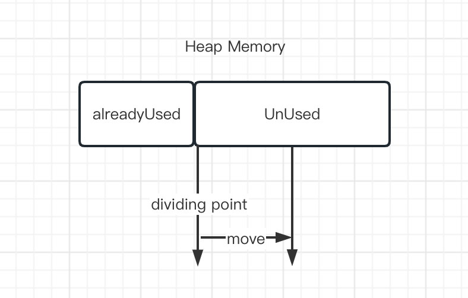
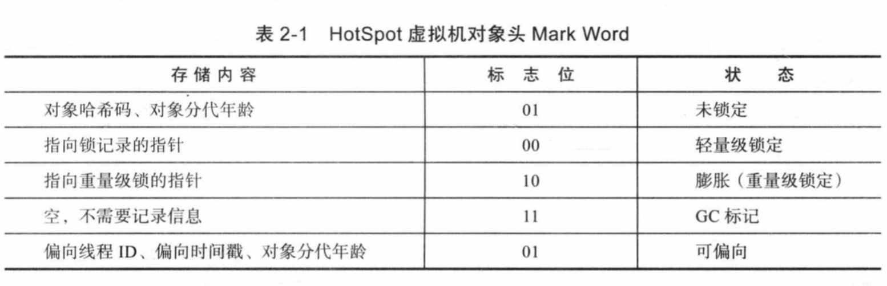
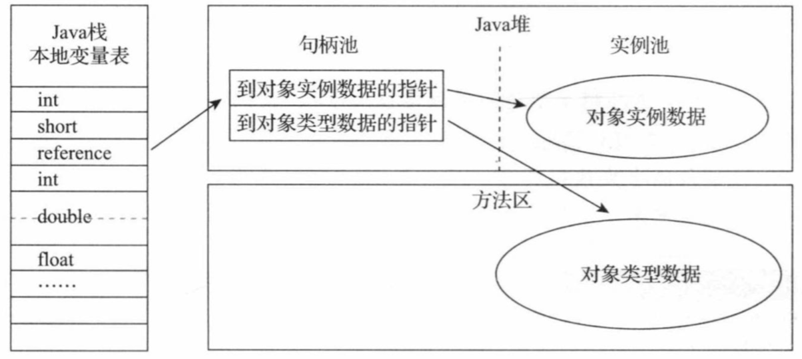
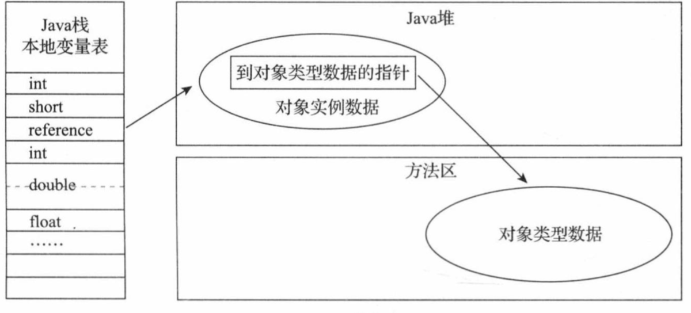

### 2.3.1 对象的创建

> Java是一门面向对象的编程语言,Java程序运行过程中无时无刻都有对象创建出来。在语言层面上,创建对象通常(eg: 复制、反序列化) 仅仅只需要一个new 关键字就能创建,
而在虚拟机中,对象(仅讨论普通的Java对象,不包含数组和Class对象)的创建远比语言层面的复杂。

> 当虚拟机遇到一条字节码new指令时,首先将去检查这个指令的参数是否能在常量池中定义到一个类的符号引用,并且检查这个符号引用所代表的类是否已经被加载、解析和初始化过。
如果没有则必须先执行相应的类加载过程,类的加载过程将在第七章讲解

> 在类加载检查通过后,接下来虚拟机将为新生对象分配内存。对象所需内存的大小在类加载完成后便可以完全确定,为对象分配空间的任务实际上就是从堆内存中寻找一块确定大小的内存块划分出来给对象使用,
假设Java堆中内存是绝对规整的,所有使用中的内存在一边,未使用的在另一边,中间放着一个指针作为分界点的指示器,那所分配内存就仅仅只需要把指针向空闲空间方向移动一段与对象所需内存大小相等的距离,
这种分配称为"指针碰撞"(Bump The Pointer) 
> 

> 但是如果Java堆中的内存并不是规整的而是已使用内存和未使用内存相互交织在一起,那就没有办法进行简单的指针碰撞,虚拟机就必须维护一个列表记录来记录那些内存块是可以用的,
这种分配方式称为"空闲列表"。 选择那种分配方式取决于Java堆是否规整决定,而Java堆是否规整是由所采用的垃圾收集器是否带空间压缩能力决定的(即在进行完垃圾收集后通过将所有使用的内存合并到一块连续的内存从而将交错不连续的的内存变为一整块连续的内存),
因此当使用Serial、ParNew等带压缩整理过程的收集器时,系统采用的分配算法是指针碰撞,即简单又高效。而当使用CMS这种基于原地清除算法的收集器时理论上就只能采用较为复杂的空闲列表来 分配内存。

>除了如何划分可用空间外,还有另外一个需要考虑的问题。在虚拟机中创建对象是非常频繁的行为,即使仅仅修改一个指针所指向的位置,在并发情况下也并不是线程安全的。
可能出现正在给对象A分配内存时,指针还没有来得及修改,线程B就有同时使用原来未移动过内存位置得指针来进行分配内存。解决分配内存的同步问题有两种方案,实际上虚拟机是采用CAS配上失败重试的方式保证更新操作的原子性；
另外一种是把内存分配的动作按照线程划分在不同的空间之中进行,即每个线程在Java堆中预先分配一小块内存,称为本地线程缓冲区(Thread Local Allocation Buffer ,TLAB),在线程进行分配内存时优先使用分配好的线程缓冲区,
只有当本地缓冲区用完了,分配新的缓冲区时才需要同步锁定。 虚拟机是否使用TLAB,可以使用-XX:+/-UserTLAB 参数设置。

>内存分配完成之后,虚拟机必须将分配的内存空间(但不包含对象头)都初始化为零值,如果使用TLAB这项工作也可以提前至TLAB分配时顺便进行。这步操作保证了对象的实例字段在Java代码中可以不赋初始值就可以直接使用,使程序能访问这些字段的对应的数据类型所对应的零值。

>接下来Java 虚拟机还要对对象进行必要的设置,例如这个对象是哪个类的实例、如何才能找到类的元数据信息、对象的哈希码(实际上对象的哈希码会延后到真正调用Object::hashCode()这个方法时才真正计算)、
对象的GC分代年龄等信息。这些信息都放在对象的对象头上(Object Header)之中。 根据虚拟机当前运行状态的不同,如是否启用偏向锁等,对象头会有不同的设置方式。

> 在上面工作都完成之后,从虚拟机视角来看,一个新的对象已经产生了。但是从Java程序的视角来看,1不一定如此对象创建才刚刚开始—————构造函数,即Class文件中的<init>() 方法还没有执行,所有的字段都默认的零值,
> 对象需要的其他资源和状态信息也还没有按照预定的意图构造好。 一般来说(由字节码流new指令后面是否跟随invokespecial 指令所决定,Java编译器会在遇到new 关键字的地方同时生成这两条字节码指令,但如果直接通过其他方式生产的则不一定)
> new指令之后会接着执行<init>() 方法,按照程序员的意愿对象进行初始化,这样一个真正可用的对象才是完全被构造出来.

### 对象的内存布局

>在HotSpot虚拟机里,对象在堆内存中的存储布局可以划分为三个部分:对象头(Header)、实例数据(Instance Data) 和对齐填充(Padding)。HotSpot 虚拟机对象的对象头部分包括两类信息。第一类用于存储对象自身的运行时数据,
如哈希码(HashCode) 、Gc分代年龄、锁状态标志、线程持有的锁、偏向线程ID、偏向时间戳、这部分数据的长度在32位和64位的虚拟机(未开启压缩指针)中分别为32个比特和64个比特,官方称它为"Mark Word"。
对象需要存储的运行时数据很多,其实已经超出32、64位BitMap结构所能记录的最大限度,但对象头里的信息是与对象自身定义的数据无关的额外存储成本,考虑到虚拟机的空间效率,Mark Word 被设计成一个有着动态定义的数据结构,
以便在极小的空间内存储尽可能多的数据,根据对象的状态复用自己的存储空间。例如在32位的HotSpot虚拟机中,如对象未被同步锁锁定的状态下Mark Word的32个比特存储空间 里 其中25个bit用于存储对象哈希码,4个比特用于存储对象分代年龄,
2个比特用于存储锁标志位,1个比特固定为0,在其他状态(轻量级锁定、重量级锁定、GC标记、可偏向)下对象的存储内容如下图
> 
>对象头的另外一部分是类型指针,即对象指向它的类型元数据的指针,Java虚拟机通过这个指针来确定该对象是哪个类的实例。并不是所有的虚拟机实现都必须在对象数据上保留类型指针,换句话说,查找对象的元数据信息并不一定要经过对象本身,
此外,如果对象是一个Java数组,那在对象头中还必须有一块用于记录数组长度的数据,因为虚拟机可以通过普通Java对象的元数据确定Java对象的大小,但是如果数组的长度是不确定的,将无法通过元数据中的信息推断出数组的大小。

> 接下来实例数据部分是对象真正存储的有效信息,即我们在程序代码里面所定义的各种类型的字段内容,无论是从父类继承下来的,还是在子类中定义的字段都必须记录起来。这部分的存储顺序会受到虚拟机分配策略参数(-XX:FiledAllocationStyle参数)和字段在Java源码中定义顺序的影响。
> HotSpot虚拟机默认的分配顺序为long/doubles、ints、shorts/、chars、bytes/booleans、oops(Ordinary Object Pointers, OOPs),从以上默认的分配策略可以看到,相同宽度的字段总是被分配到一起存放,在满足这个前提的情况下,
> 在父类中定义的变量会出现在子类之前。如果HotSpot虚拟机的+XX:CompactFields参数值为true(默认就是True),那子类之中较窄的变量也允许插入父类变量的空隙之中,以节省出一点点空间。

> 对象的第三部分是对齐填充,这并不是必然存在的,也没有特别的含义,它仅仅起着占位符的作用。由于HotSpot虚拟机的自动内存管理系统要求对象起始地址必须是8字节的整数倍,换句话说就是任何对象的大小都必须是8字节的整数倍。对象头部分已经被精心设计为正好8字节的倍数(1倍和2倍),因此，如果对象实例数据部分没有对齐的话,就需要通过对齐填充来补全。

###对象的访问定位

> 创建对象自然是为了后续使用该对象,Java程序会通过栈上的reference数据来操作堆上的具体对象。由于reference类型在《Java虚拟机规范》里面只规定它是一个指向对象引用，并没有定义这个引用应该通过什么方式去定位、访问到堆中对象的具体位置，使用对象访问方式也是由具体的虚拟机实现自行决定的,主流的服务方式主要有使用句柄和直接指针两种。
> > - 如果使用句柄访问的话，Java堆种将可能会划分出一块内存来作为句柄池,reference中存的就是对象的句柄地址,而句柄中包含了对象实例数据与类型数据各自具体的地址信息,结构如下
> > > 句柄访问 
> > - 如果使用直接指针访问的话, Java堆中对象的内存布局就必须考虑如何放置访问类型数据的相关信息, reference中存储的就是对象地址。如果只是访问对象本身的话,就不需要多一次间接访问的开销
> > > 直接指针 
> > - 这两种对象访问方式各有优势,使用句柄的访问方式 reference里存的就是稳定的句柄值,在移动对象时(垃圾收集时移动对象是非常常见的行为)时只会改变句柄中的实例数据指针而reference本身不需要更改
而使用直接指针访问的最大优点就是速度快不需要二次定位,它节省了一次指针定位的时间开销,由于对象访问在Java中非常频繁,因此这类开销积少成多也是一项极为可观的执行成本,
就作为Java主流虚拟机的HotSpot而言,它主要使用第二种方式进行对象访问(有例外情况,如果使用了Shenandoah收集器的话也会有一次额外的转发),但是从整个软件开发的范围来看,在各种语言、框架中使用句柄来访问的情况也十分常见。

### 实战：OutOfMemoryError 异常

>在《Java 虚拟机规范》的规定里,除了程序计数器外,虚拟机内存的其他运行时区域都有发生OutOfMemoryError(下文称OOM) 异常的可能,

>  java堆溢出
>  > Java堆用于储存对象实例,我们只需要不断的创建对象,并且保证GC Root到对象之间有可达路径来避免垃圾回收机制清除这些对象,那么随着对象的不断增加直到触达设置的最大堆内存上限就会触发内存溢出异常。
>  > 在idea debug 模式下添加启动参数 -verbose:gc -Xms20M -Xmx20M -Xmn10m -XX:+PrintGCDetails -XX:SurvivorRatio=8 限制最大堆内存20MB
> > 如果不是内存泄露,换句话说就是内存中的对象都是必须存活的,那就应当检查java虚拟机的堆参数(-Xmx与-Xms) 设置,与机器的内存对比,看看是否还有向上调整的空间。再从代码上检查是否存在某些对象生命周期过长、持有状态时间过长、
> > 存储结构设计不合理等情况,尽量减少程序运行期的内存消耗。

### 虚拟机栈和本地方法栈
> 由于HotSpot 虚拟机中并不区分虚拟机栈和本地方法栈,因此对于HotSpot来说-Xoss参数(设置本地方法栈的大小虽然存在),但是实际上是没有任何效果,栈容量只能有-Xss参数来设定。
关于虚拟机栈和本地方法栈,《Java虚拟机规范》中描述了两种异常。
> >  - 如果线程请求的栈深度大于虚拟机所允许的最大深度,将抛出StackOverflowError异常
> >  - 如果虚拟机栈的栈内存运行动态扩展,当扩展栈容量无法申请到足够的内存时,将抛出OutOfMemoryError异常。

> 《Java 虚拟机规范》 明确允许Java虚拟机实现自行选择是否支持栈的动态扩展,而HotSpot虚拟机的选择是不支持扩展,所以除非在创建线程申请内存时就因为无法获得足够内存而抛出OutOfMemoryError异常,否则在线程运行时是不会因为扩展而导致内存溢出的,
> 只会因为栈容量无法容纳新的栈帧而导致抛出 StackOverflowError异常。
> 要验证这点很简单 只需要写一个无终止条件的递归方法 随着方法不断的递归调用就会抛出StackOverflowError异常。

>对于不同版本的Java虚拟机和不同的操作系统,栈容量最小值可能会有所限制,这主要取决于操作系统内存分页大小,譬如上述方法中的参数-Xss128K可以正常用于32位Windows系统下的Jdk6,但是如果用于64位Windows系统下的Jdk11,则会提示栈容量最小不能低于180K,
> 而在Liunx 下这个值可能是228K 如果小于这个最小限制,HotSpot虚拟机启动时会给出提示
> `The Java thread stack size specified is too small. Specify at least  228k`

> 测试代码 readBookTest/read2test/JvmStackSOF   
> 对于HotSpot虚拟机实现来说 无论是栈帧太大还是虚拟机栈容量太小,当栈内存无法进行分配的时候HotSpot 抛出的都是StackOverflowError 可是如果在允许动态扩展栈容量的虚拟机实现上
> 相同的代码会导致不同的情况,譬如远古时代的Classic虚拟机,这款虚拟机实现支持动态调整扩展栈内存的容量,在Windows 上jdk1.0.2上运行上述代码(这个时候使用-Oss 调整栈容量大小)
> 这个时候就会爆出OutOfMemoryError异常 (代码略过)
> 如果测试时不限于单线程,通过不断建立线程的方式,在HotSpot 上也是可以产生内存溢出(OOM)异常, 但是这样产生的异常和栈空间是否足够并不存在任何直接的关系,主要取决于操作系统本身的内存使用状态。
> 甚至可以说,在这种情况下,给每个线程分配的栈内存越大,则越看越产生内存溢出异常.

>原因其实不难理解,操作系统分配给每个进程的内存是有限的,譬如32位Windows的单个进程最大内存限制为2GB。HotSpot虚拟机提供了参数可以控制Java堆和方法区这两部分的内存的最大值,那剩余的内存即为2GB(操作系统限制)减去最大堆容量,再减最大方法区容量
> 由于程序计数器消耗内存很小,可以忽略掉,如果把直接内存和虚拟机进程本身耗费的内存也去掉的话,剩下的内存就由虚拟机栈和本地方法栈来分配.因此为每个线程分配到的栈内存越大,可以建立的线程数自然越少,建立线程时就越容易把剩下的内存耗尽。

### 方法区和运行时常量区溢出

> 由于运行时常量区是方法区的一部分,这两部分的测试可以放到一起,前面曾提到过HotSpot从JDK7开始逐步"去永久代"的计划,并在JDK8中完全使用元空间替代"永久代",在此就可以测试下
> 使用"元空间"和"永久代" 来实现方法区 的区别

> String::intern()是一个本地方法,他的作用是如果字符串常量池里如果已经包含一个等于此String对象的字符串,则返回代表池中这个String 字符串对象的引用,
> 否则会将此String对象包含的字符串添加到常量池, 并返回此String对象的引用,在JDK6 或更早的之前的HotSpot虚拟机中,常量池都是分配在永久代中,我们可以通过 -XX: PermSize 和 -XX: MaxPermSize 来限制永久代的大小,即可间接限制常量池的容量大小,

> 测试代码  RuntimeConstantPoolOOM 
> 测试结果  jdk6 下运行抛出 `Exception in thread "main" java.lang.OutOfMemoryError: PermGen space` 从运行结果中可以看到,运行时常量池溢出时,在OutOfMemoryError异常后面跟随的提示信息是
> "PermGen Space",说明运行时常量池的确是属于方法区(即 JDK 6下HotSpot虚拟机中的永久代) 的一部分。
> 而使用JDK7 或者更高版本的JDK 运行同一程序并不会得到相同的结果,无论是在JDK7中继续使用-XX:MaxPermSize参数还是在JDK1.8及以上版本使用-XX:MaxMetaspaceSize参数把方法区容量同样限制在6mb ,也不会重现JDk 6的溢出异常,
> 循环将一直进行下去,永不停歇。出现这种情况是因为自JDK7 开始原本存放在永久代的字符串常量池被移至Java堆中,所以自JDK7 起限制方法区的容量对测试用例来说是毫无意义的.
> 这个时候使用-Xmx参数限制堆最大容量6m就可能看到 OOM 的异常抛出。

###2.4.4 直接内存溢出

> 直接内存(Direct Memory) 的容量大小可通过-XX:MaxDirectMemorySize 参数指定,如果不指定则默认与Java堆最大值(由-Xmx指定)一致,实验代码越过了DirectByteBuffer类直接通过反射获取Unsafe实例进行内存分配
> (Unsafe类的getUnsafe()方法指定只有引导类加载器才会返回实例 显然作者只希望只有虚拟机标准类库里面的类才可以使用它,在JDK10 时才将Unsafe的部分功能通过VarHandle 开放给外部使用 ),因为虽然使用DirectByteBuffer分配内存也会抛出内存异常,
> 但是它抛出异常时并没有真正向操作系统申请分配内存,而是通过计算得知内存无法分配就会在代码里手动抛出异常,真正申请分配内存的方法是Unsafe::allocateMemory();
> 由于Unsafe 类是对os::malloc 的包装并没有关注jvm 参数内存限制 测试使用unsafe最后是本机的卡死 使用ByteBuffer 分配会受到vm相关参数的限制
>
> 

