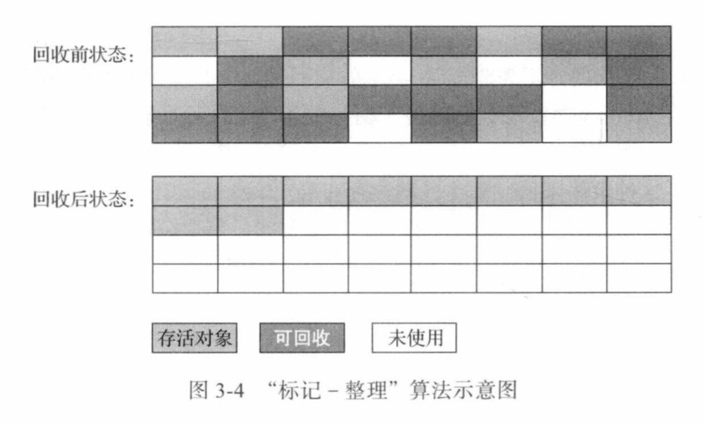
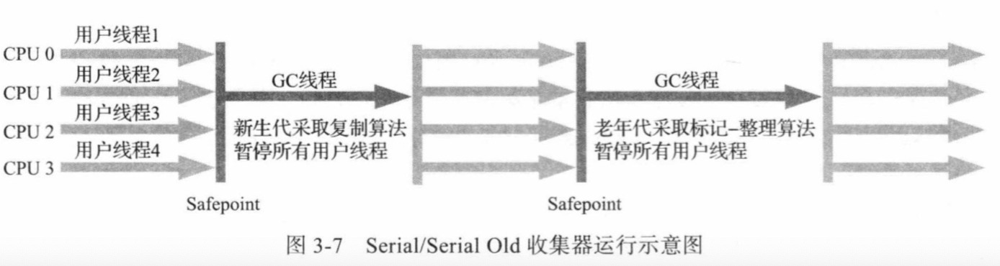

### 垃圾收集器与内存分配策略

> 经过半多世纪的发展,今天的内存动态分配与内存回收技术 已经相当成熟,一切看起来都进入了自动化时代,那么我们为什么还要了解垃圾收集和内存分配呢。
> 答案很简单 当需要排查各种内存溢出、内存泄露问题时,当垃圾收集成为系统达到更高并发量的瓶颈时 我们就必须对这些"自动化"的技术实施必要的监控和调节。
> 在第二章中介绍了Java内存运行时区域的各个部分,其中程序计数器、虚拟机栈、本地方法栈3个区域随线程而生,随线程而灭,栈中的栈帧随着方法的进入和退出而有条不紊的执行
> 出栈和入栈操作。 每一个栈帧分配多少内存基本上是在类结构确定下来时就已知的(尽管在运行时会有即时编译器进行一些优化,但是基于概念模型里大致可以认为是已知的)因此这几个区域的内存分配和回收都具备确定性,在这几个区域内就不需要过多考虑如何回收的问题,当方法结束或线程结束时,内存自然就跟随回收了。
>

> 而Java堆和方法区这个两个区域则有着很明显的不确定性,一个接口的多个实现类需要的内存可能会不一样,一个方法所执行的不同分支所需要的内存条件也可能不一样,只有处于运行期间,我们才知道程序究竟会创建那些对象,创建多少对象,这部分内存的分配和回收是动态的。

### 对象已死？

> 在堆里面存放着Java世界中几乎所有的对象实例,垃圾收集器在对堆回收之前,第一件事情就是要确定这些对象那些还"存活"着,哪些是已经死亡的对象(死去即不可能再被任何途径使用的对象)了。

### 判断对象死亡的方法

>3.2.1  引用计数算法\
>  很多教科书判断对象是否存活的算法是这样的: 在对象中添加一个引用计数器, 每当一个地方引用它时,计数器值就加一;当引用失效时,计数器值就减一; 任何时刻计数器为零的对象就是不可能再被使用的。
> 客观的说 引用计数(Reference Counting )算法 虽然占用了一些额外的空间来进行计数,但它的原理简单,判定效率也比较高,在大多数情况下它都是一个不错算法。也有一些比较著名的应用案例
> 例如微软COM(Component Object Model) 技术、 使用ActionScript 3的FlashPlayer、Python 语言 以及在游戏脚本领域得到许多应用的Squirrel中都使用了引用技术算法来进行管理内存,
> 但是在Java领域,至少在主流的Java虚拟机里都没有选用引用计数法来作为判断对象是否存活的算法,主要是因为这个看似简单的算法有很多例外的情况需要考虑,
> 必须配合大量额外处理才能保证正确工作,譬如单纯的引用计数就很难处理对象之间相互循环引用的问题。
> 请看代码 testGc  ObjA ObjB之间互相引用

> 3.2.2 可达性分析算法\
> 当前主流的商用程序语言(Java c# 乃至 古老的Lisp) 的内存管理子系统, 都是通过可达性分析(Reachability Analysis)算法来判断对象是否存活的,这个算法的基本思路就是通过一系列被称为"GC Root"的根对象作为起始节点集,
> 从这些节点开始,根据引用关系向下搜索,搜索过程所走过的路径称为"引用链"(Referene Chain), 如果某个对象到GC Roots 间没有任何引用链路径相连, 或者用图论的话来说就是从GC Roots 到这个对象不可达
> 则证明此对象是不可能再被使用的。
> 如下图所示,对象 Object5 、object6 、object7 虽然互相关联,但是他们到GC Roots 是不可达的,因此他们将会被判定为可回收的对象。

> 

在 Java技术体系里面 ,固定作为GC Roots的对象包括以下几种
>  - 在虚拟机栈(栈帧中的本地变量表 ) 中引用得对象,譬如各个线程中被调用的方法堆栈中使用到的参数,局部变量,临时变量。
>  - 在方法区中类静态属性引用得对象,譬如java类里的引用类型的静态变量 ( priavte  final static Object obj = new Object() )
>  - 在方法区中常量引用得对象,譬如字符串常量池(String Table )的引用
>  - 在本地方法栈中JNI(即通常所说的Native Method)  引用的对象
>  - Java虚拟机内部的引用,如基本数据类型 对应的Class对象,一些常驻的异常对象 (比如 NullPointException 、 OutOfMemoryError)等,还有系统类加载器
>  - 所有被同步锁(synchronized 关键字) 持有的对象。
>  - 反映Java虚拟机内部情况的JMXBean、 JVMTI 中注册的回调、本地代码缓存等。

>  除了这些固定的GC Roots集合以外,根据用户所选用的垃圾收集器以及当前回收的内存区域不同,还可以有其他对象"临时性"地加入,共同构成完整GC Roots 集合。 譬如后文将会提到的分代收集和局部回收(Partial GC), 如果只针对Java堆中某一块区域发起的垃圾收集时(如最典型的只针对新生代的垃圾收集),必须考虑到内存区域是虚拟机自己的实现细节
> (在用户视角里任何内存区域都是不可见的),更不是孤立封闭的,所以某个区域里的对象完全有可能被位于堆中其他区域的对象所引用,这个时候就需要将这些关联区域的对象也一并加入GC Roots集合中去,才能保证可达性分析的正确性。

> 目前最新的几款垃圾收集器无一例外都具备了局部回收的特征,为了避免GC Roots包含过多对象而过度膨胀,他们在实现上也做出了各种优化处理。 
> 关于这些概念、优化技巧以及各种不同收集器实现等都将在后续文中讲解

### 3.2.3 再谈引用

>    无论是`通过引用计数法判断对象的引用数量,还是通过可达性分析算法判断对象是否引用链可达,判断对象是否存活都和 "引用" 离不开关系。 在JDK 1.2 版之前, Java里面的引用是很传统的定义:
>    如果Reference 类型的数据中存储的数值代表的是另外一块内存的起始地址,就称该 Reference数据是代表某块内存,某个对象的引用。 这种定义并没有什么不对,只是现在看来有些过于狭隘了,一个对象在这种定义下只有"被引用"或者"未被引用"两种状态,对于描述一些"食之无味,弃之可惜"的对象就显得无能为了,
>    譬如我们希望能描述一类对象: 当内存空间还足够时,能保留在内存之中,如果内存空间再进行垃圾收集后仍然非常紧张,那么就可以抛弃这些对象----很多系统的缓存功能都符合这样的应用场景。
 

>  在 JDK 1.2版之后, Java对引用的概念进行了扩充, 将引用分为强引用(Strongly Reference)、软引用(Soft Reference)、弱引用(Weak Reference) 和虚引用(Phantom Reference)
>  这四种引用强度依次逐渐减弱 
> >  - 强引用是最传统的 "引用"的定义,是指在程序代码之中普遍存在的引用赋值, 即类似 "Object obj = new Object()" 这种引用关系。 无论任何情况下,只要强引用关系还存在,垃圾收集器就永远不会回收掉被引用的对象。

> >  - 软引用是用来描述一些还有用,但非必须的对象,只被软引用关联着的对象,在系统即将发生内存溢出异常之前,会将这些对象列进回收范围之内进行第二次回收,如果这次回收还没有足够的内存,才会抛出内存溢出异常,在JDK 1.2之后提供了SoftReference 类来实现软引用

> >  - 弱引用也是用来描述那些非必须对象,但是他的强度比软引用更弱些被弱引用关联的对象只能生存到下一次垃圾收集发生为止。当垃圾收集器开始工作,无论当前内存是否足够,都会回收掉只被弱引用关联的对象。在JDK 1.2 之后提供了 WeakReference 类来实现弱引用。

> >  - 虚引用也称为 "幽灵引用" 或者"幻影引用", 它是最弱的一种引用关系。 一个对象是否有虚引用的存在,完全不会对其生存时间构成影响,也无法通过虚引用来取得一个对象实例。为一个对象设置虚引用关联的唯一目的只是为了能在这个对象被收集器回收时受到一个系统通知。在JDK 1.2版之后提供了PhantomReference类来实现虚引用。(虚引用主要用来跟踪对象被垃圾回收器回收的活动。虚引用与软引用和弱引用的一个区别在于：虚引用必须和引用队列 （ReferenceQueue）联合使用。当垃圾回收器准备回收一个对象时，如果发现它还有虚引用，就会在回收对象的内存之前，把这个虚引用加入到与之 关联的引用队列中。你声明虚引用的时候是要传入一个queue的。当你的虚引用所引用的对象已经执行完finalize函数的时候，就会把对象加到queue里面。你可以通过判断queue里面是不是有对象来判断你的对象是不是要被回收了【这是重点，让你知道你的对象什么时候会被回收。因为对普通的对象，gc要回收它的，你是知道它什么时候会被回收】)

### 3.2.4 生存还是死亡?

>   即使在可达性分析算法中判定为不可达对象,也不是 "非死不可"的,这时候他们暂时还处于 "缓刑"阶段,要真正宣告一个对象死亡,至少要经历两次标记过程: 如果对象在进行可达性分析后发现没有与GC Roots 相连接的引用链,那么它将会被第一次标记,
>   随后进行一次筛选,筛选的条件是此对象是否有必要执行finalize()方法。假如对象没有覆盖finalize()方法或者 finalize()方法已经被虚拟机调用过,那么虚拟机将这两种情况都视为 "没有必要执行"。

>   如果这个对象被判定为确有必要执行finalize()方法,那么该对象将会被放置在一个名为F-Queue的队列之中,并在稍后由一条虚拟机自动建立的、低调度优先级的Finalizer线程去执行他们的finalize() 方法。这里所说的"执行" 是虚拟机会触发这个方法开始运行,但并不承诺一定会等待它运行结束。
>   这样做的原因是,如果某个对象的finalize()方法执行缓慢,或者更极端地发生了死循环,将很可能导致F-Queue队列中的其他对象永久处于等待,甚至导致整个内存回收子系统的崩溃。finalize()方法是对象逃脱死亡命运的最后一次机会,稍后收集器将对F-Queue中的对象进行第二次小规模的标记,如果对象要在finalize()中成功拯救自己——————只需要重新与引用链上的任何一个对象建立关联即可,譬如把自己(this 关键字)赋值给某个类变量或者对象的成员变量。
>   那在第二次标记时它将被移出"即将回收"的集合;如果这个时候对象还没有逃脱,那基本上他就真的要被回收了。 从代码清单3-2中我们可以看到一个对象的finalize()被执行,但是它仍然可以存活。

>   3-2  FinalizeEscapeGC
>  `1. finalize method executed! 
    2. yes i am still  alive
    3. i am dead`

>   从代码 3-2 的运行结果 可以看到,SAVE_HOOK 对象的 finalize() 方法确实被垃圾收集器触发过,并且在被收集前成功逃脱了,另外一个值得注意的是,代码中有两段完全一样的代码片段\
>   执行结果却是 一次逃脱成功,一次逃脱失败。 这是因为任何一个对象的 finalize()方法都只会被系统自动调用一次,如果对象面临下一次回收,它的finalize() 方法不会被再次执行,因此第二段代码的自救行为失败了。

### 3.2.5 回收方法区

>    有些人认为方法区(如 HotSpot虚拟机中的元空间或者永久代 ) 是没有垃圾收集行为的,《 Java 虚拟机规范》 中提到过可以不要求虚拟机在方法区中实现垃圾收集,事实上也确实有
>    未实现或未能完整实现方法区类型卸载的收集器存在(如 JDK 11时期的ZGC 收集器就不支持类卸载 ),方法区垃圾收集的"性价比" 通常也是比较低的: 在Java 堆中,尤其是在新生代中,对常规应用进行一次垃圾收集通常可以回收 70% 至99% 的内存空间,
>    相比之下,方法区回收碍于苛刻的判定条件,其区域垃圾收集的回收成果往往远低于此。

>  方法区的垃圾收集主要回收两部分内容: 废弃的常量和不再使用的类型。 回收废弃常量与回收Java堆中的对象非常相似。举个常量池中字面量回收的例子,假如一个字符串 "Java" 曾经进入常量池中,但是当前系统又没有任何一个字符串对象的值是"Java",换句话说,
>  已经没有任何字符串对象引用常量池中的 "Java" 常量, 且虚拟机中也没有其他地方引用这个字面量。 如果在这时发生内存回收,而且垃圾收集器判断确有必要的话,这个 "java" 常量就将会被系统清理出常量池。
>  常量池中其他类(接口)、 方法、字段的符合引用也与此类似。

>  判断一个常量是否被"废弃"还是相对简单,而要判定一个类型是否属于 "不再被使用的类"的条件就比较苛刻了。 需要同时满足下面三个条件
> >   - 该类所有的实例都已经被回收了,也就是Java堆中不存在该类及其任何派生子类的实例。
> >   - 加载该类的类加载器已经被回收,这个条件除非是经过精心设计的可替换类加载器的场景, 如OSGi、JSP的重加载等否则通常很难达成的。
> >   - 该类对应的java.lang.Class 对象没有 在任何地方被引用,无法在任何地方通过反射访问该类的方法。

> Java 虚拟机被允许对满足上述三个条件的 "无用类" 进行回收,这里说的仅仅是被"允许",而不是和对象一样,没有引用了就必然会回收,关于是否要对类型进行回收,
> HotSpot虚拟机提供了-Xnoclassgc 参数进行控制,还可以使用 -verbose:class 以及 -XX:+TraceClassLoading 、-XX:+TraceClassUnLoading  查看类加载信息和卸载信息, 其中 -verbose:class 和 -XX:+TraceClassLoading 可以在 product版的虚拟机中使用,
> -XX:+TraceClassUnLoading 参数需要FastDebug 版的虚拟机支持。

 
> 在大量使用反射、动态代理、CGLib 等字节码框架,动态生成JSP 以及OSGi 这类频繁自定义类加载器的场景中,通常都需要Java 虚拟机具备类型卸载的能力,以保证不会对方法区造成过大的内存压力。

### 3.3 垃圾收集算法

>  垃圾收集算法的实现设计大量的的程序细节,且各个平台的虚拟机操作内存的方法都有差异,在本节中我们暂不过多讨论算法的实现,只重点介绍分代收集理论和几种算法思想及其发展过程。 如果读者对其中的理论细节感兴趣,推荐阅读 Richard Jones 撰写的《垃圾回收算法手册》的第2~4章相关内容。
>  从如何判断对象消亡的角度出发,垃圾回收算法可以划分为 "引用计数式垃圾收集" (Reference Counting GC) 和 "追踪式垃圾收集" (Tracing GC) 两大类,这两类也常被称作 "直接垃圾收集" 和"间接垃圾收集" 由于引用计数式垃圾收集算法在本书讨论到的主流Java虚拟机中均为涉及,所以暂时不作为正文内容讲解,本节介绍的所有算法均属于追踪式垃圾收集的范畴。

###被分代收集理论
    
>  当前商业虚拟机的垃圾收集器, 大多数都遵循了 "分代收集"(Generational Collection) 的理论进行设计，分代收集名为理论,实质上是一套符合大多数程序运行实际情况的经验法则
>   它建立在两个分代假说之上:
> > - 1) 弱分代假说 : 绝大多数对象都是朝生夕灭的。
> > - 2) 强分代假说: 熬过越多次垃圾收集过程的对象就越难以消亡

 
>   这两个分代假说共同奠定了多款常用垃圾收集器的一致的设计原则:收集器应该将Java堆划分出不同的区域,然后将回收对象依据其年龄(年龄即对象熬过垃圾收集过程的次数)分配到不同的区域之中储存。显而易见,如果一个区域之中大多数对象都是朝生夕灭难以熬过垃圾收集过程的话,那么把它们集中放在一起,每次回收时只关注如何保留少量存活的对象,而不是去标记那些大量的将被回收的对象,\
>   就能以较低代价回收到大量的空间; 如果剩下的都是难以消亡的对象,那把他们集中放在一起,虚拟机便可以使用较低的频率来回收这个区域, 这就同时兼顾了垃圾收集时间开销和内存的空间有效利用

>   在Java 堆划分出不同的区域之后,垃圾收集器每次只回收其中某一个或者某些部分的区域——————因此才有 "Minor GC"、"Major GC"、"Full GC",这样的回收类型的划分。
>   也才能够针对不同的区域安排与该区域储存对象存亡特征相匹配的垃圾收集算法——————因而发展出 "标记-复制算法"、"标记-清除算法"、"标记-整理算法" 等针对性的垃圾收集算法。
  
>   把分代设计理论具体到现在的商业Java虚拟机里,设计者一般至少会把Java堆划分为新手代(Young  Generation) 和 老年代(Old Generation) 两个区域 顾名思义,在新生代中 
>   每次垃圾收集时都发现有大批对象死去,而每次回收后存活的少量对象,将会逐步晋升到老年代中存放。 如果读者有兴趣阅读HotSpot 虚拟机源码的话,会发现里面存在着一些名为"*Generation" 的实现,
>   如"DefNewGeneration" 和 "ParNewGeneration"等, 这些就是HotSpot的 "分代式垃圾收集框架" 原本HotSpot 鼓励开发者尽量在这个框架内开发新的垃圾收集器,但是除了最早期的两组四款收集器之外,后来的开发者并没有继续遵循
>   导致此事的原因有很多,最根本的是分代收集理论仍在不断发展之中,如何实现也有很多细节改进,被既定的代码框架约束反而不便。 其实我们只要仔细思考一下,也很容易发现分代收集并非只是简单划分一下内存区域那么容易,它至少存在一个明显的困难: 对象不是孤立的,对象之间会存在跨代引用。
>   假如要现在进行一次只局限于新生代区域内的收集(Minor GC) 但是新生代的对象是完全有可能被老年代所引用的,为了找出该区域可存活的对象,不得不在固定的GC Roots之外,再额外遍历整个老年代所有对象来确保可达性分析结果的正确性,反过来也是一样
>   遍历整个老年代中所有对象来确保可达性分析结果的正确性,反过来也是一样。 遍历整个老年代所有对象的方案虽然理论上可行,但无疑会为内存回收带来很大的性能负担。为了解决这个问题,就需要对分代收集理论添加第三条经验法则。
>   3) 跨代引用假说 :跨带引用相对于同代引用来说仅占极少数。

>   这其实可根据前两条假说逻辑推理得出的隐含推论:存在互相引用关系的两个对象,是应该倾向于同时生存或者同时消亡的。 举个例子 如果某个新生代对象存在跨代引用,由于老年代对象难以消亡,该引用会使得新生代对象在收集时同样得以存活,
>   进而在年龄增长后晋升到老年代中,这时跨代引用也随即被消除了。

> 依据这条假说,我们就不应再为了少量的跨代引用去扫描整个老年代,也不必浪费空间专门记录每一个对象是否存在以及存在那些跨代引用,只需要在新生代上建立一个全局的数据结构(该结构被称为"记忆集", Remembered Set),这个结构把老年代划分为若干小块,
> 标识出老年代的那一块内存会存在跨代引用。 此后当发生Minor GC 时,只有包含了跨代引用的小块内存里的对象才会被加入到GC Roots 进行扫描。 虽然这种方法需要在对象改变引用关系(如将自己或者某个属性赋值)时维护记录数据的正确性,会增加一些运行时的开销,但比起收集时扫描整个老年代来说仍然是划算的。

### 3.3.2 标记-清除算法

>  最早出现也是最基础的垃圾收集算法是 "标记 - 清除" (Mark - Sweep) 算法,在1960 年由Lisp 之父John McCarthy 提出。正如它的名字一样,算法分为 "标记" 和"清除" 两个阶段；
>  首先标记所有需要回收的对象,在标记完成后, 统一回收掉所有被标记的对象, 也可以反过来, 标记存活的对象, 统一回收未被标记的对象。 标记过程就是对象是否属于垃圾的判定过程。
>  之所以说它是最基础的收集算法,是因为后续的收集算法大多都是以 标记 - 清除算法为基础,对其缺点进行改进而得到的。它的主要缺点有两个: 第一个是执行效率不稳定,如果Java 堆中包含大量对象,而且其中大部分是需要被回收的,这时必须进行大量标记和清除的动作,导致标记和清除两个过程的执行效率都随对象数量增长而降低
>  第二个是内存空间的碎片化问题,标记、清除之后会产生大量不连续的内存碎片,空间碎片太多可能会导致当以后再程序运行过程中需要分配较大对象是无法找到足够的连续内存空间而提前触发另一次垃圾收集动作。 
>  标记-清除 算法执行流程如下\
>  

### 3.3.3 标记-复制算法

>  标记 - 复制 算法常被简称为复制算法。为了解决 标记 - 清除 算法面对大量可回收对象时执行效率低的问题, 1969 年Fenichel 提出了一种被称为 "半区复制"的垃圾收集算法,它将可用内存按容量划分为大小相等的两块,每次只使用其中一块。当这一块的内存用完了,就将还活着的对象复制到另外一块上面,然后再把已使用过的内存空间一次清理掉。如果内存中多数对象都是存活的,这种算法将会产生大量的内存间复制的开销,但是对于多数对象都是可回收的情况,算法需要复制的就是占少数的存活对象,
>  而且每次都是针对整个半区进行内存回收,分配内存时也就不用考虑有空间碎片的复杂情况,只要移动堆顶指针,按顺序分配即可,这样实现简单,运行高效,不过其缺陷也显而易见,这种复制回收算法的代价是将可用内存缩小为原来的一半,空间浪费未免有点太多了\
>  

>  一项专门研究对新生代 "朝生夕灭"的特点做了更量化的诠释————————新生代中的对象有98%熬不过第一轮收集。因此并不需要按照 1:1 的比例来分配新生代的内存空间
>  在 1989年 Andrew Appel 针对具备"朝生夕灭"特点的对象,提出一种更优化的半区复制分代策略,现在称为 "Apple式挥手" 。 HotSpot 虚拟机的Serial、ParNew 等新生代收集器均采用这种策略来设计新生代的内存布局。 
>  Apple式回收的具体做法是把新生代分为一块较大的Eden空间和两块较小的Survivor空间,每次分配只使用Eden和其中一块Survivor。 发生垃圾收集时,将Eden和Survivor 仍然存活的对象一次性复制到另外一块Survivor空间上
>  然后直接清理掉Eden和已用过的那块Survivor空间。 HotSpot虚拟机默认Eden和Survivor的大小比例是8:1,也即每次新生代中可用内存空间为整个新生代容量的90%(Eden的80%加上一个Survivor的10%),只有一个Survivor空间,即10%的
>  新生代是会被"浪费"的,当然,98%的对象可被回收仅仅是"普通场景" 下测得的数据,任何人都没有办法百分百保证每次回收都只有不多于10%的对象存活,因此Appel式回收还有一个充当罕见情况的"逃生门"的安全设计,当Survivor空间不足以容纳一次Minor GC 之后存活的对象
> 时,就需要依赖其他内存区域(实际上大多就是老年代)进行分配担保(Handle Promotion).

> 内存的分配担保好比我们去银行借款,如果我们信誉很好,在98%的情况下都能按时偿还,于是银行默认我们下一次也能按时按量偿还贷款,只需要有一个担保人能保证不能还款时由担保人兜底，从担保人账户扣钱那么银行就认为没有什么风险。
> 内存的分配担保也一样,如果另外一块Survivor空间没有足够空间存放上一次新生代收集下来的存活对象,这些对象便将通过分配担保机制直接进入老年代,这对虚拟机来说就是安全的。
> 关于对新生代进行分配担保的内容,在3.8.5介绍垃圾收集器执行规则时会进一步讲解。

### 3.3.4 标记 - 整理算法

>   标记 - 复制算法在对象存活率较高时就要进行较多的复制操作，效率将会降低。更关键的是,如果不想浪费50%的空间,就需要有额外的空间进行分配担保,以应对被使用的内存中所有对象都100%存活的极端情况,所以老年代一般不能直接选用这种算法。
>   针对老年代对象的存亡特征,1974 年 Edward Lueders 提出了另外一种有针对性的 "标记 - 整理"(Mark- Compact)算法,其中的标记过程仍然与"标记 - 清除"算法一样,但后续步骤
>   不是直接对可回收对象进行清理,而是让所有存活的对象都向内存空间一端移动,然后直接清理掉边界以外的内存,"标记 - 整理"算法的示意图如3-4所示\
>   
>   标记-清除 算法 与 标记-整理 算法的本质差异在于前者是一种非移动式的回收算法,而后者是移动式的。 是否移动回收后的存活对象是一项优缺点并存的风险决策。

>  如果移动存活对象,尤其是在老年代这种每次回收都有大量对象存活区域,移动存活对象并更新所有引用这些对象的地方将会是一种极为负重的操作,而且这种对象移动操作必须全程暂停用户应用程序才能进行,
>  这就更加让使用者不得不小心翼翼地权衡其弊端了,像这样的停顿被最初的虚拟机设计者形象地描述为"Stop The World"。

>  但是如果跟 标记 - 清除算法那样完全不考虑移动和整理存活对象的话,弥散于堆中的存活对象 导出内存空间碎片化的问题就只能依赖于更复杂的内存分配器和内存访问器来解决。譬如通过
>  "分区空闲分配链表" 来解决内存分配问题(计算机硬盘存储大文件就不要求物理连续的磁盘空间,能够在碎片化的硬盘上存储和访问数据就是通过硬盘分区表实现的)。内存的访问是用户程序最频繁的操作
>  甚至都没有之一,假如在这个环节上增加了额外的负担,势必会直接影响应用程序的吞吐量。

>   基于以上两点,是否移动对象都存在弊端,移动则内存回收时会更加复杂,不移动则内存分配时会更加复杂。从垃圾收集的停顿时间来看,不移动对象停顿时间会更短,甚至可以不需要停顿,但是从整个程序的吞吐量来看
>   ,移动对象会更划算。此语境中,吞吐量的实现是赋值器(Mutator 可以理解为使用垃圾收集的用户程序,多数地方使用"用户程序"或"用户线程"代替)与收集器的效率总和。
>   即使不移动对象会使得收集器的效率提升一些,但因为 内存分配和访问 相比于垃圾收集的频率要高得多,这部分的耗时增加,总吞吐量仍然是下降的。HotSpot 虚拟机里面关注吞吐量的parallel Scavenge收集器是基于
>   标记整理算法的,而关注延迟的CMS收集器则是基于标记-清除算法的,这也从侧面验证这点

>   另外，还有一种 "和稀泥式"的解决方案可以不在内存分配和访问上增加太大额外负担,做法就是让虚拟机平时多数时间都采用 标记-清除 算法,暂时容忍内存碎片的存在
>   ,直到内存空间的碎片化程度已经大到影响对象的分配时,在采用 标记-整理算法收集一次, 以获得规整的内存空间。 前面提到的基于标记-清除算法的CMS收集器面临空间碎片过多时采用的就是这种处理办法。

### 3.4 HotSpot 的算法细节实现

> #### 3.4.1 根节点枚举
> > 以可达性分析算法中从GC Roots集合中找引用链这个操作作为介绍虚拟机高效实现的第一个例子。
> > 固定可作为GC Roots的节点主要在全局性的引用(例如常量或类静态属性)与执行上下文(例如栈帧中的本地变量表)中,尽管目标明确,但查找过程要做到高效并非一件容易得事,现在Java应用越做越大,光是方法区的大小就常有数百上千兆,里面的类、常量等更是恒河沙数,
> > 若要逐个检查以这里为起源的引用肯定得消耗不少时间。\
> > 迄今为止,所有收集器在根节点枚举这一步骤时都是必须暂停用户线程的,因此毫无疑问根节点枚举与之前提及的整理内存碎片一样会面临相似的"Stop The World" 的困扰。
> > 现在可达性分析算法耗时最长的查找引用链的过程已经可以做到与用户线程一起并发(具体见 3.4.6节),但根节点枚举始终还是必须在一个能保障一致性的快照中才得以进行————————这里"一致性"的意思是整个枚举期间执行子系统看起来就像被冻结在某个时间点上,
> > 不会出现分析过程中,根节点集合的对象引用关系还在不断变化的情况,若这点不能满足的话,分析结果准确性也就无法保证。这是导致垃圾收集过程中必须停顿所有用户线程的其中一个重要原因。
> > 即使号称停顿时间可控,或者(几乎不会发生停顿的CMS、G1、ZGC)等收集器,枚举根节点时也是必须要停顿的。

>   由于目前主流Java虚拟机使用的都是准确式垃圾收集(这个概念在第一章介绍Exact VM 相对于Classic VM的改进时介绍过), 所以当用户线程停顿下来之后,其实并不需要一个不漏地检查完所有执行上下文和全局的引用位置,
>   虚拟机应当是有办法直接得到那些地方存放着对象引用的。在HotSpot的解决方案里,是使用一组称为OopMap的数据结构来达到这个目的。一旦类加载动作完成的时候,HotSpot就会把对象内什么偏移量上是什么类型的数据计算出来
>   在即时编译(见 11章)过程中,也会在特定位置记录下栈里和寄存器里那些位置是引用。这样收集器在扫描时就可以直接得知这些信息,并不需要真正一个不漏地从方法区等GC Roots开始查找。

### 3.4.2 安全点

>  在OopMap的协助下,HotSpot 可以快速准确的完成GC Roots 枚举,但一个很现实的问题随之而来: 可能导致引用关系变化,或者说导致OopMap内容变化的指令非常多,如果为每一条指令都生成对应的OopMap
>  那么将会需要大量的额外存储空间,这样垃圾收集伴随而来的空间成本就会变得无法忍受的高昂。

>  实际上HotSpot也的确没有为每条指令都生成OopMap,前面已经提到,只是在 "特定的位置" 记录这些信息,这些位置被称为安全点(SafePoint) 有了安全点的设定,也就决定了用户程序执行时并非在代码指令流的任意位置都能停顿下来开始垃圾收集,
>  而是强制要求必须执行到达安全点后才能够暂停。 因此,安全点的选定既不能太少以至于让收集器等待时间过长,也不能太过频繁以至于过分增大运行时的内存负荷。安全点位置的选取基本上是以 "是否具有让程序长时间执行的特征" 为标准进行选定的
>  因为每条指令执行的时间都是非常短暂的,程序不太可能因为指令流长度太长这样的原因而长时间执行, "长时间执行"的最明显特征就是指令序列的复用,例如方法调用、循环调转、异常跳转等都属于指令序列复用,所以只有具备这些功能的指令才会产生安全点。
>  对于安全点,另外一个需要考虑的问题是,如何在垃圾收集发生时让所有的线程(这里其实不包括执行JNI调用的线程)都跑到最近的安全点,然后停顿下来。这里有两种方案可供选择: 抢先式中断和主动式中断
>  抢先式中断不需要线程的执行代码去主动配合,在垃圾收集发生时,系统首先把所有用户线程全部中断,如果发现有用户线程中断的地方不在安全点上,就恢复这条线程执行,让它等一会再重新中断,直到跑到安全点上。
>  现在几乎没有虚拟机实现采用抢先式中断来暂停线程响应GC 事件。\

 
> 而主动式中断的思想是当垃圾收集需要中断线程的时候,不直接对线程操作,仅仅简单地设置一个标志位,各个线程执行过程时会不停地主动去轮询这个标志位,一旦发现中断标志为真时就自己在最近的安全点上主动中断挂起。轮询标志的地方和安全点是重合的,另外还要加上所有创建对象和其他需要在Java
> 堆上分配内存的地方,这是为了检查是否即将要发生垃圾收集,避免没有足够内存分配新对象。

>由于轮询操作在代码中会频繁出现,这要求它必须足够高效。HotSpot 使用内存保护陷阱的方式,把轮询操作精简至只有一条汇编指令的程度。 下面代码清单 3-4 中的test 指令就是HotSpot 生成的轮询指令,
> 
>当需要暂停用户线程时,虚拟机把0x160100的内存页设置为不可读
>那线程执行到test指令时就会产生一个自陷异常信号,然后再预先注册的异常处理器中挂起线程实现等待,这样仅通过一条汇编指令便完成安全点轮询和触发线程中断。

### 3.4.3 安全区域
> 使用安全点的设计似乎已经完美解决如何停顿用户线程,让虚拟机进入垃圾回收状态的问题,但实际情况却并不一定。 安全点机制保证了程序执行时,在不太长的时间内就会遇到可进入垃圾收集过程的安全点。但是, 程序"不执行"的时候呢? 所谓的程序不执行就是没有分配处理器时间,典型的场景便是用户线程处于Sleep状态或者Blocked状态,
> 这个时候线程无法响应虚拟机的中断请求,不能再走到安全的地方去中断自己,虚拟机也显然不可能持续等待线程重新被激活分配处理器时间。对于这种情况,就必须引入安全区域来解决(Safe Region)来解决。

> 安全区域是指能够确保在某一段代码片段之中,引用关系不会发生变化,因此,在这个区域中任意地方开始垃圾收集都是安全的。 我们也可以把安全区域看作被扩展拉伸的安全点。
> 当用户线程执行到安全区域里面的代码时,首先会标识自己已经进入了安全区域,那样当这段时间里虚拟机要发起垃圾收集时就不必去管这些已经申明自己在安全区域内的线程。
> 当线程要离开安全区域时,他要检查虚拟机是否已经完成了根节点枚举(或者垃圾收集过程中其他需要暂停用户线程的阶段),如果完成了,那线程就当做没事发生过,继续执行；
> 否则它就必须一直等待,直到收到可以离开安全区域的信号为止。

### 3.4.4 记忆卡与卡表
> 讲解分代收集理论的时候,提到了为了解决对象跨代引用所带来的问题,垃圾收集器在新生代中建立了名为记忆集(Remembered Set)的数据结构,用以避免把整个老年代加进GC Roots扫描范围
> 实际上并不是只有新生代、老年代之间才有跨代引用的问题,所有涉及部分区域收集(Partial GC) 行为的垃圾收集器,典型的如 G1、ZGC、和Shenandoah 收集器,都会面临相同的问题
> 因此我们有必要进一步理清记忆集的原理和实现方式,以便在后续章节里介绍几款最新的收集器相关知识时能更好地理解。

> 记忆集是一种用于记录从非收集区域指向收集区域的指针集合的抽象数据结构,如果我们不考虑效率和成本的话,最简单的实现可以用非收集区域中所有含跨代引用的对象数组来实现这个数据结构

> `  Class RememberedSet {
>    Object[] set[Object_INTERGENERATIONAL_REFERENCE_SIZE] 
>  }`

> 这种记录全部含跨代引用对象的实现方案,无论是空间占用还是维护成本都相当高昂。而在垃圾收集的场景中,收集器只需要通过记忆集判断出某一块非收集区域是否存在有指向了收集区域的指针就可以了，
> 并不需要了解这些跨代指针的全部细节。 那设计者在实现记忆集的时候，便可以选择更为粗犷的记录粒度来节省记忆集的存储和维护成本,下面列举了一些可供选择(当然也可以选择这个范围以外的)的记录精度:
>  >  - 字长精度: 每个记录精确到一个机器字长(就是处理器的寻址位数,如常见的32位或64位，这个精度决定了机器访问物理内存地址的指针长度),该字包含跨代指针。
>  >  - 对象精度: 每个记录精确到一个对象,该对象里有字段含有跨代指针。
>  >  - 卡精度: 每个记录精确到一块内存区域,该区域内有对象含有跨代指针。

> 其中,第三种"卡精度"所指的是用一种称为"卡表"(Card Tables)的方式去实现记忆集,这个也是目前最常用的一种记忆集实现形式,一些资料中甚至直接把他和记忆集混为一谈。前面定义中提到记忆集其实是一种"抽象"的数据结构，
> 抽象的意思就是只定义了记忆集的行为意图,并没有定义其行为的具体实现。卡表就是记忆集的一种具体实现,它定义了记忆集的记录精度、与堆内存的映射关系等。关于卡表与记忆集的关系,读者不妨按照Java里HashMap与Map的关系来理解。
> 卡表最简单的形式可以只是一个字节数组,而HotSpot虚拟机确实也是这样做的。以下这行代码是HotSpot默认的卡表标记逻辑；\
> `CARD_TABLE [this address >>9] =0`\
> 字节数组CARD_TABLE 的每一个元素都对应着其标识的内存区域中一块特定大小的内存块,这个内存块被称作"卡页"(CARD_PAGE). 一般来说,卡页大小都是以2的N次幂的字节数,通过上面代码可以看出
> HotSpot中使用的卡页是2的9次幂,即512字节(地址右移9位，相当于用地址除以512)。 那如果卡表标识内存区域的起始地址是0x0000 的话,数组CARD_TABLE的第 0、1、2号元素,分别对应了地址范围为0x0000~0x01FF 、0x0200~0x3FF、0x0400~0x05FF 得卡页内存块 如图3-5\
> 

> 一个卡页的内存中通常包含不止一个对象,只要卡页内有一个(或更多)对象的字段存在着跨代指针,那就将对应卡表的数组元素的值标识为1\ 
> `CARD_TABLE [this address >>9] =Dirty`\ 
> 称这个元素变脏(Dirty)没有则标识为0。在垃圾收集发生时,只要筛选出卡表中变脏的元素,就能轻易得出那些卡页内存块中包含跨代指针,把它们加入GC Roots中一并扫描。

### 3.4.5 写屏障

> 我们已经解决了如何使用记忆集来缩减GC Roots扫描范围的问题,但还没有解决卡表元素如何维护的问题,例如他们何时变脏、谁来把它们变脏等。
> 卡表元素何时变脏的答案是很明确的——————有其他分代区域中的对象引用了本区域对象时,其对应的卡表元素就应该变脏,变脏时间点原则上应该发生在引用类型字段赋值的那一刻。
> 但是问题是如何变脏,即如何在对象赋值的那一刻去更新维护卡表呢? 假如是解释执行的字节码,那相对好处理,虚拟机负责每条字节码指令的执行,有充分的介入空间; 但在编译执行的场景中呢? 经过即时编译后的代码已经是纯粹的机器指令流了,这就必须找到一个在机器码层面的手段,把维护卡表的动作放到每一个赋值操作之中。
> 在HotSpot 虚拟机里是通过写屏障(Write Barrier)技术维护卡表状态的。先请读者注意将这里提到的"写屏障",以及后面再低延迟收集器中会提到的"读屏障"与解决并发乱序执行问题中的"内存屏障"区分开来,
> 避免混淆。写屏障可以看作在虚拟机层面对"引用类型字段赋值"这个动作的AOP切面,在引用对象赋值时会产生一个环形(Around) 通知,供程序执行额外的动作,也就是说赋值前后都在写屏障的覆盖范畴内。在赋值前的
> 部分的屏障叫作写前屏障(Pre-Write Barrier)，在赋值后的则叫作写后屏障(Post-Write Barrier)。 HotSpot虚拟机的许多收集器中都有使用到写屏障，但直至G1收集器之前,其它收集器都只用到了写后屏障。
> 下面这段代码清单 3-6 是一段更新卡表状态的简化逻辑\
> `void oop_field_store(oop* field, oop new_value){
>  // 引用字段赋值操作
>  *field = new_value;
>  // 写后屏障
> post_write_barrier(field,new_value);
>}`

> 应用写屏障后,虚拟机就会为所有赋值操作生成相应的指令,一旦收集器在写屏障中增加了更新卡表操作,无论更新的是不是老年代对新生代对象的引用,每次只要对引用进行更新,就会产生额外的开销,
> 不过这个开销与Minor GC时扫描整个老年代的代价相比还是低得多。

> 除了写屏障的开销外,卡表在高并发场景下还面临着 "伪共享" (False Sharing) 问题。伪共享是处理并发底层细节时一种经常需要考虑的问题,现代中央处理器的缓存系统中是以缓存行(Cache Line)为单位存储的,当多线程修改互相独立的变量时
> 如果这些变量恰好共享同一个缓存行,就会彼此影响(写回、无效化、或者同步)而导致性能降低,这就是伪共享问题。
> 假设处理器的缓存行大小为64字节,由于一个卡表元素占1个字节,64个卡表元素将共享同一个缓存行。 这64个卡表元素对应的卡页总的内存为32KB(64X512字节),也就是说如果不同线程更新的对象
> 正好处于这32KB的内存区域内,就会导致更新卡表时正好写入同一个缓存行而影响性能。为了避免伪共享问题,一种简单的解决方案是不采用无条件的写屏障,而是先检查卡表标记,只有当该卡表元素未被标记过时
> 才将其标记为变脏,即将卡表变脏的逻辑改为如下:
> ` if(CARD_TABLE [this address >>9] !=Dirty){ 
>      CARD_TABLE [this address >>9] =Dirty }`

>在JDK 7 之后,HotSpot虚拟机增加了一个新的参数 -XX:+UserCondCardMark ,用来解决是否开启卡表更新的条件判断。开启会增加一次额外判断的开销,但能够避免伪共享问题,两种各有性能损耗,是否打开需根据应用实际运行情况进行测试衡量

### 3.4.6 并发的可达性分析

> 在3.2节中曾提到了当前主流编程语言的垃圾收集器基本上都是依靠可达性分析算法来判断对象是否存活的,可达性分析算法理论上要求全过程都基于一个能保障一致性的快照中才能够进行分析,这意味着必须全程冻结用户线程的运行
> 在根节点枚举(见 3.4.1 节) 这个步骤中,由于GC Roots相比起整个Java堆中全部的对象毕竟还算是极少数,且在各中优化技巧(如OopMap)的加持下,它带来的停顿已经是非常短暂且相对固定(不随堆容量而增长)的了
> 可从GC Roots再继续往下遍历对象图,这一步骤的停顿时间就必定会与Java堆容量直接成正比例关系: 堆越大,存储的对象越多,对象图结构越复杂,要标记更多对象而产生的停顿时间自然就更长,这听起来是理所当然的事情。

> 要知道包含"标记"阶段是所有追踪式垃圾收集算法的共同特征,如果这个阶段会随着堆变大而 等比例 增加停顿时间,其影响就会波及几乎所有的垃圾收集器,同理可知,如果能够削减这部分停顿时间的话,那收益也将是全局系统性的；
> 想解决或者降低用户线程的停顿,就要先搞清楚为什么必须在一个能保障一致性的快照上才能进行对象图的遍历? 为了能解释清楚这个问题,我们引入三色标记(Tri-colorMarking) 作为工具来辅住推导,把遍历对象图过程中遇到的对象,按照"是否访问过"这个条件标记成一下三种颜色
> > - 白色: 表示对象尚未被垃圾收集器访问过。显然在可达性分析刚刚开始的阶段,所有的对象都是白色的,若在分析结束的阶段,仍然是白色的对象,即代表不可达。
> > - 黑色: 表示对象已经被垃圾收集器访问过,且这个对象的所有引用都已经扫描过。它是安全存活的,如果有其他对象引用指向了黑色对象无须重新扫描一遍。黑色对象不可能直接(不经过灰色对象)指向某个白色对象。
> > - 灰色: 表示对象已经被垃圾收集器访问过,但这个对象上至少存在一个引用还没有被扫描过。

> 关于可达性分析的扫描过程读者不妨发挥一下想象力,把它看作对象图上一股以灰色波峰的波纹从黑向白推进的过程,如果用户线程此时是冻结的,只有收集器线程在工作,那不会有任何问题。但如果用户线程与收集器是并发工作的呢?
> 收集器在对象图上标记颜色,同时用户线程在修改引用关系——————即修改对象图的结构,这样可能出现两种后果一种是把原本消亡的对象错误标记为存活,这不是好事,但其实是可以容忍的,只不过是产生了一点逃过本次收集的浮动垃圾而已
> 下次收集清理掉就好。 另一种是把原本存活的对象错误标记为已消亡,这就是非常致命的错误,程序肯定会因此发生错误 下图 3-1 演示了这样的致命错误具体是如何产生的。\
> 

> Wilson 于1994年在理论上证明了,当且仅当以下两个条件同时满足时,会产生"对象消失"的问题,即原本应该是黑色的对象被误标记为白色； 
> > - 赋值器插入了一条或多条从黑色对象到白色对象的新引用;
> > - 赋值器删除了全部从灰色对象到该白色对象的直接或间接引用。

>因此,我们要解决并发扫描时的对象消失问题,只需破坏这两个条件的任意一个即可。 由此分别产生了两种解决方案: 增量更新(Incremental Update) 和原始快照(Snapshot at The Beginning, SATB).
> 增量更新要破坏的是第一个条件,当黑色镀锡插入新的指向白色对象的引用关系时,就将这个新插入的引用记录下来,等并发扫描结束之后,再将这些记录过的引用关系中的黑色对象为根,重新扫描一次。这可以简化理解为
> 黑色对象一旦新插入了指向白色镀锡的引用之后,它就变回灰色对象了。
> 原始快照要破坏的是第二个条件,当灰色对象要删除指向白色对象的引用关系时,就将这个要删除的引用记录下来,在并发扫描结束之后,再将这些记录过的引用关系中的灰色对象为根,重新扫描一次。这也可以简化理解为,无论引用关系删除与否
> ,都会按照刚刚开始扫描那一刻的对象图快照来进行搜索。

> 以上无论是对引用关系记录的插入还是删除,虚拟机的记录操作都是通过写屏障实现的。 在HotSpot虚拟机中,增量更新和原始快照这两种解决方案都有时间应用,譬如,CMS是基于增量更新来做并发标记的,G1、Shenandoah则是用原始快照来实现。
> 到这里,第三节主要介绍了HotSpot虚拟机如何发起内存回收、如何加速内存回收,以及如何保证回收正确性等问题,但是虚拟机如何具体地进行内存回收动作仍然未涉及。因为内存回收如何进行是由虚拟机所采用哪一款垃圾收集器所决定的,而通常虚拟机中往往有多种垃圾收集器,
> 下面将逐一介绍HotSpot虚拟机中出现过的垃圾收集器。

### 3.5 经典垃圾收集器

>如果说收集算法是内存回收的方法论,那么垃圾收集器就是内存回收的实践者《Java 虚拟机规范》中对垃圾收集器应该如何实现并没有做出任何规定,因此不同的厂商、不同版本的虚拟机所包含的垃圾收集器都可能会有很大差别,
> 不同的虚拟机一般也都会提供各种参数供用户根据自己的应用特点和要求组合出各个内存分代所使用的收集器。

### 3.5.1 Serial收集器

> Serial 收集器是最基础、历史最悠久的收集器,曾经(在JDK 1.3.1之前)是HotSpot虚拟机新生代收集器的唯一选择,大家只看名字就能够猜到,这个收集器是一个单线程工作的收集器,但它的"单线程"
> 的意义并不仅仅是说明他只会使用一个处理器或者一个收集线程去完成垃圾收集工作,更重要的是强调在它进行垃圾收集时,必须暂停其他所有工作线程,直到它收集结束。"Stop The World" 这个词语也许听起来很酷,
> 但是这项工作是由虚拟机在后台自动发起和自动完成的在应用不可知\不可控的情况下把应用的正常工作的线程全部停掉,这对很多应用来说都是不能接受的。\
> 
> 对于 "Stop The World" 带给用户的恶劣体验,早期HotSpot虚拟机的设计者表示完全理解,但同时也表示非常委屈:"你妈妈在给你打扫房间的时候, 肯定也会让你老老实实的在椅子上或者房间外面待着,
> 如果她一边打扫,你一边乱扔纸屑,这房间还能打扫完吗?",这确实是一个合情合理的矛盾,虽然垃圾收集这项工作听起来和打扫房间属于一个工种,但是实际上肯定比打扫房间复杂的多。
> 从JDk1.3开始,一直到现在最新的JDK13,HotSpot 虚拟机开发团队为消除或者降低用户线程因垃圾收集而导致的停顿一直在持续努力着,从Serial收集器到Parallel收集器,再到Concurrent Mark Sweep (CMS) 和 Garbage First(G1)收集器,最终至现在垃圾
> 收集器的最前沿成果Shenandoah和ZGC 等,我们看到一个个越来越构思精巧,越来越优秀,也越来越复杂的垃圾收集器不断涌现,用户线程的停顿时间在持续缩短。但是仍然没有办法彻底消除垃圾收集是带来的停顿问题
> 探索更优秀的垃圾收集器仍在继续。
> Serial 收集器虽然是最早出现的垃圾收集器但是并不意味着现如今垃圾收集器中没有它的一席之地了,迄今为止,它依然是HotSpot虚拟机运行在客户端模式下的默认新生代收机器,有着优于其他收集器的
> 地方,那就是简单而高效与其他收集器的单线程相比,对于内存资源受限的环境,它是所有收集器里额外内存消耗最小的;对于单核处理器或处理器核心数较少的环境来说,Serial收集器由于没有线程交互的开销,
> 专心做垃圾收集自然可以获得最高的单线程收集效率。在用户桌面的应用场景以及近年来流行的部分微服务应用中,分配给虚拟机管理的内存一般来说并不会特别大,收集器几十兆甚至一两百兆的新生代(仅仅指新生代使用的内存桌面应用甚少超过这个容量),
> 垃圾收集的停顿时间完全可以控制在十几、几十毫秒,最多一百毫秒以内,只要不是频繁发生收集,这点停顿时间对于许多用户来说是完全可以接受的。
> 所以,Serial收集器对于运行在客户端模式下的虚拟机来说是一个很好的选择。

### 3.5.2 ParNew 收集器
> parNew 收集器实质上是Serial收集器的多线程并行版本,除了同时使用多条线程进行垃圾收集之外,其余的行为包括Serial收集器可用的所有控制参数(例如:-XX:SurvivorRatio 、-XX:PretenureSizeThreshold 、-XX:HandlePromotionFailure ...)、
> 收集算法、Stop The World、对象分配规则、回收策略等都与Serial收集器完全一致,在实现上这两种收集器也共用了相当多的代码。ParNew 收集器的工作过程如图3-8所示\
> 
> ParNew 收集器除了支持多线程并行收集之外,其它与Serial收集器相比并没有太多创新之处,但它却是不少运行在服务端模式下的HotSpot虚拟机,尤其是JDK7之前的系统中首选的新生代收集器,
> 其中有一个与功能、性能无关但其实很重要的原因是;除了Serial收集器之外,就只有它能和CMS收集器配合工作。
> 在JDK 5 发布时,HotSpot推出了一款在强交互应用中几乎可称为具有划时代意义的垃圾收集器————————CMS收集器。这款收集器是HotSpot虚拟机中第一款真正意义上支持并发的垃圾收集器,它首次实现了让垃圾收线程与用户线程(基本上)同时工作。
> 遗憾的是,CMS作为老年代的收集器,却无法与JDK 1.4.0 中已经存在的新生代收集器ParallelScavenge配合工作,所以在JDK 5中使用CMS来收集老年代的时候,新生代只能选择ParNew或者Serial收集器中的一个
> ParNew收集器是激活CMS后(使用-XX:+UserConcMarkSweepGC 选项)的默认新生代收集器,也可以使用-XX:+/-UseParNewGC 选项来强制指定或者禁用它。
> 可以说直到CMS的出现才巩固了ParNew的地位,但成也萧何败也萧何,随着垃圾收集器技术的不断改进,更先进的G1收集器带着CMS继承者和替代者的光环登场。G1是一个面向全堆的收集器,不再需要其他新生代收集器的配合工作。
> 所以自JDK 9 开始ParNew 加CMS收集器的组合就不再是官方推荐的服务端模式下的收集器解决方案。官方希望它能完全被G1所取代,甚至还取消了ParNew加Serial Old 以及Serial加CMS 这两组收集器组合的支持
> (其实原本也很少人这样使用),并直接取消了-XX:+UseParNewGC参数,这意味着ParNew和CMS从此只能互相搭配使用,再也没有其他收集器能够和他们配合了。读者也可以理解为从此以后,ParNew 合并入CMS
> 成为它专门处理新生代的组成部分。ParNew可以说是HotSpot虚拟机中第一款推出历史舞台的垃圾收集器。\

 
>ParNew收集器在单核心处理器的环境中绝对不会有比Serial收集器更好的效果,甚至由于存在线程交互的开销,该收集器在通过超线程(Hyper-Threading)实现的伪双核处理器环境中都不能百分百保证超越Serial收集器。
> 当然,随着可以被使用的处理器核心数量的增加,ParNew对于垃圾收集时系统资源的高效利用还是很有好处的。它默认开启的收集线程数与处理器核心数量相同,在处理器核心非常多(譬如32个,现在CPU都是多核加超线程设计,服务器达到或超过32个逻辑核心的情况非常普遍)的环境下
> 可以使用-XX:ParallelGCThreads参数来限制垃圾收集的线程数。

### 3.5.3 Parallel Scavenge 收集器

> Parallel Scavenge收集器也是一款新生代收集器,它同样是基于标记-复制算法实现的收集器,也是能够并行收集的多线程收集器------ Parallel Scavenge的诸多特性从表面上看和ParNew非常相似
> ,那它有什么特别之处呢?
> Parallel Scavenge 收集器的特点是它的关注点和其他收集器不同,CMS等收集器的关注点都是尽可能地缩短垃圾收集时用户线程的停顿时间,而 Parallel Scavenge收集器的目标则是达到一个可控制的吞吐量
> (Throughput). 所谓吞吐量就是处理器用于运行用户代码的时间与处理器总消耗时间的比值,即 吞吐量 = 运行用户代码时间/(运行用户代码时间+运行垃圾收集时间) 

> 如果虚拟机完成某个任务,用户代码加上垃圾收集器总耗费100分钟,其中垃圾收集花掉1分钟,那吞吐量就是99% 停顿时间越短就越适合需要与用户交互或需要保证服务响应质量的程序,良好的响应速度能提升用户体验;而高吞吐量则可以
> 最高效率地利用处理器字段.尽快完成程序的运算任务,主要适合在后台运算而不太需要交互的分析任务。
> Parallel Scavenge收集器提供了两个参数用于精确控制吞吐量,分别是控制最大垃圾收集停顿时间的-XX:MaxGCPauseMillis 参数以及直接设置吞吐量大小的-XX:GCTimeRatio参数。
> -XX:MaxGCPauseMillis 参数允许的值是一个大于0的毫秒数,收集器将尽力帮助内存回收花费的时间不超过用户设定值,不过千万别以为如果将这个参数的值设置的更小就能使得系统的垃圾收集速度变得更快
> 垃圾收集停顿时间缩短是以牺牲吞吐量和新生代空间为代价换取来:系统吧新生代调的小一点,收集300MB新生代肯定比收集500MB 快但这也会导致垃圾收集行为发生的更频繁,原来10秒收集一次、每次停顿
> 100毫秒,现在变成5秒收集一次、每次停顿70毫秒。停顿时间确实在下降,但是吞吐量也降下来。

> -XX:GCTimeRatio 参数的值则应当是一个大于0小于100的整数,也就是垃圾收集时间占总时间的比率,相当于吞吐量的倒数。譬如把此参数设置为19,那允许的最大垃圾收集时间就占总时间的倒数(即 1/(1+19))
>, 默认值为99,即允许最大1%(即 1/(1+19))的垃圾收集时间。由于与吞吐量关系密切,Parallel Scavenge收集器也经常被称作"吞吐量优先收集器"。
>  除了上述两个参数之外,Parallel Scavenge收集器还有一个参数-XX:+UseAdaptiveSizePolicy 值得我们关注。 这是一个开关参数,当这个参数被激活后,就不需要人工指定新生代的大小(-Xmm)
> 、Eden与Survivor区的比例(-XX:SurvivorRatio)、晋升老年代对象大小(-XX:PretenureSizeThreshold)等细节参数了,虚拟机会根据当前系统的运行情况收集性能监控信息,动态调整这些参数以提供最合适的停顿时间或者最大的吞吐量。
>  这种调节方式称为垃圾收集的自适应的调节策略(GC Ergonomics) 如果读者对于收集器运作不太了解,手动优化存在困难的话,使用Parallel Scavenge收集器配合自适应调节策略,把内存管理的
> 调优任务交给虚拟机去完成也许是一盒不错的选择。只需要把基本的内存数据设置好(如-Xmx设置最大堆),然后使用-XX:MaxGCPauseMillis 参数(更关注最大停顿时间) 或-XX:GCTimeRatio(更关注吞吐量)参数给虚拟机设置一个优化目标,那具体细节参数的
> 调节工作就交由虚拟机完成了。自适应调节策略也是Parallel Scavenge收集器区别于ParNew收集器的一个重要特性。

### 3.5.4 Serial Old 收集器

> Serial Old是Serial收集器的老年代版本,它同样是一个单线程收集器,使用标记-整理算法。这个收集器的主要意义也是供客户端模式下的HotSpot虚拟机使用。如果在服务端模式下,它也可能有两种用途:一种是在JDK 5以及之前的版本中与
> Parallel Scavenge收集器搭配使用,另外一种就是作为CMS收集器发生失败时的后备预案,在并发收集发生Concurrent Mode Failure 时使用,这两点都将在后面的内容中继续讲解 Serial Old收集器的工作过程如图 3-9所示\

> Parallel Old 是Parallel Scavenge 收集器的老年代版本,支持多线程并发收集,基于标记-整理算法实现. 这个收集器是直到JDK 6才开始提供的,在此之前,新生代的Parallel Scavenge收集器一直处于相当尴尬的状态,
> 原因是如果新生代选择了Parallel Scavenge收集器,老年代除了Serial Old(PS MarkSweep)收集器以外别无选择,其他表现良好的老年代收集器,如CMS无法与它配合工作。由于老年代Serial Old 收集器
> 在服务端应用性能上的"拖累",使用Parallel Scavenge 收集器也未必能在整体上获得吞吐量最大化的效果。同样,由于单线程的老年代收集中无法充分利用服务器多处理器的并行处理能力,
> 在老年代内存空间很大而且硬件规格比较高级的运行环境中,这种组合的总吞吐量甚至不一定比PaeNew 加CMS的组合来的优秀。

> 直到Parallel Old 收集器出现后,"吞吐量优先"收集器终于有了比较名副其实的搭配组合,在注重吞吐量或者处理器资源较为稀缺的场合、都可以优先考虑Parallel Scavenge加Parallel Old
> 收集器这个组合。 Parallel Old收集器的工作过程如图 3-10所示/
> 

### 3.5.6 CMS收集器

>  CMS(Concurrent Mark Sweep) 收集器是一种以获取最短回收停顿时间为目标的收集器。目前很大一部分的Java应用集中在互联网网站或者基于浏览器的B/S系统的服务端上,
>  这类引用通常都会较为关注服务的响应速度,希望系统停顿时间尽可能短,以给用户带来良好的交互体验。CMS收集器就非常符合这类应用的需求。
> 从名字(包含 "Mark Sweep") 上就可以看出CMS收集器是基于标记-清除算法实现的,它的运作过程相对于前面几种收集器来说要更复杂一些,整个过程分为四个步骤,\
> 包括:\
> > 1) 初始标记(CMS initial mark)
> > 2) 并发标记(CMS concurrent mark)
> > 3) 重新标记(CMS remark)
> > 4) 并发清除(CMS concurrent sweep)

> 其中初始标记、重新标记这两个步骤仍然需要"Stop The World". 初始标记仅仅只是标记一下GC Roots能直接关联到的对象,速度很快; 并发标记阶段就是从GC Roots的直接关联对象开始遍历整个对象图的过程,
> 这个过程耗时较长但是不需要停顿用户线程可以与垃圾收集线程一起并发运行;而重新标记阶段则是为了修正并发标记期间,因用户程序继续运作而导致标记产生变动的那一部分对象的标记记录、这个阶段的停顿时间
> 通常会比初始标记阶段稍长一些,但也远比并发标记阶段的时间段;最后是并发清除阶段,清理删除掉标记阶段判断的已经死亡的对象,由于不需要移动存活对象,所以这个阶段也是可以与用户线程同时并发的。

>  由于在整个过程中耗时最长的并发标记和并发清除阶段中,垃圾收集器线程都可以与用户线程一起工作,所以从总体上来说,CMS收集器的内存回收过程是与用户线程一起并发执行的。通过图3-11可以比较清楚的看到CMS收集器
>  的运作步骤中并发和需要停顿的阶段\
>  \
>  CMS是一款优秀的收集器,它最主要的优点在名字上已经体现出来: 并发收集、低停顿,一些官方公开文档里面也称之为"并发低停顿收集器"(Concurrent Low Pause Collector)。CMS收集器是HotSpot虚拟机追求停顿的第一次成功尝试,但是它还远达不到完美的程度,至少有以下三个明显的缺点:
>  首先,CMS收集器对处理器资源非常敏感。实际上,面向并发设计的程序都对处理器资源比较敏感,在并发阶段,它虽然不会导致用户线程停顿,但却会因为占用了一部分线程(或者说处理器的技术能力)而导致应用程序变慢,降低总吞吐量。
>  CMS默认启动的回收线程数是(处理器核心数量+3)/4,也就是说,如果处理器核心数在四个或以上,并发回收时垃圾收集线程只占用不超过25%的处理器运算资源,并且会随着处理器核心数量的增加而下降
>  但是当处理器核心数量不足四个时,CMS对用户程序的影响就可能变得很大。如果应用本来的处理器负载就很高,还要分出一半的运算能力去执行收集器线程,就可能导致用户程序的执行速度忽然大幅降低。
>  为了缓解这种情况,虚拟机提供了一种称为"增量式并发收集器"(Incremental Concurrent Mark Sweep/i-CMS)的CMS收集器变种,所做的事情和以前单核处理器年代PC机操作系统靠抢占式多任务来模拟多核并行多任务的思想一样,是在并发标记、清理的时候让收集器线程
>  、用户线程交替运行,尽可能减少垃圾收集线程的独占资源时间,这样整个垃圾收集的过程会更长,但对用户程序的影响就会显的较少一些。

### 3.5.7 Garbage First 收集器

> Garbage First (简称G1) 收集器是垃圾收集器技术发展历史上的里程碑式的成果,它开创了收集器面向局部收集的设计思路和基于Region的内存布局形式。早在JDK 7刚刚确立项目目标、Oracle 公司制定的JDK 7 RoadMap里面,G1收集器就被视作JDK 7中
> HotSpot 虚拟机的一项重要进化特征。从JDK6 Update 14开始就有 Early Access 版本的G1收集器供开发人员实验和试用,但由此开始G1收集器的"实验状态"(Experimental)持续了数年时间,
> 直至JDK7 Update4,Oracle 才认为它达到足够成熟的商用程度,移出了"Experimental" 的标识;到了JDk8 Update 40的时候,G1 提供并发的类写作支持,补全了其计划功能的最后一块拼图。
> 这个版本以后得G1收集器才被Oracle官方称为"全功能的垃圾收集器"(Fully-Featured Garbage Collector).
> G1 是一款主要面向服务端应用的垃圾收集器。HotSpot开发团队最初赋予它的期望是(在比较长期的)未来可以替换掉JDK5中发布的CMS收集器。现在这个期望目标已经实现过半了,JDK 9发布之日
> ,G1宣告取代Parallel Scavenge加Parallel额 Old组合,成为服务端模式下的默认垃圾收集器,而CMS则沦落为至被声明为不推荐使用(Deprecate) 的收集器。如果对JDK 9及以上版本的HotSpot
> 虚拟机使用参数 -XX:UseConcMarkSweepGC来开启CMS 收集器的话,用户会收到一个警告信息,提示CMS未来会被弃用: 但是作为一款曾被广泛运用过的的收集器,经过多个版本的开发迭代后,
> CMS(以及之前几款收集器)的代码和HotSpot的内存管理、执行、编译、监控等子系统都有千丝万缕的联系,这是历史原因导致的,并不符合职责分离的设计原则。为此,规划JDK10功能目标时,HotSpot虚拟机提供了"统一垃圾收集器接口",
> 将内存回收的 "行为"和"实现"进行分离,CMS以及其他收集器都重构成基于这套接口的一种实现。以此为基础,日后要移出或加入某一款收集器,都会变得容易许多,风险也可以控制,

> 作为CMS收集器的替代者和继承人,设计者们希望做出一款能够建立起 "停顿时间模式"(Pause Prediction Model) 的收集器,停顿时间模型的意思是能够支持指定在一个长度为M毫秒的时间片段内,
> 消耗在垃圾收集上的时间大概率不超过N毫秒这样的目标,这几乎已经是实时Java(RTSJ)的中软实时垃圾收集器特征了。那具体应该怎么做才能实现这个目标?首先要有一个思想上的改变,在G1收集器出现之前的所有其他收集器
> ,包括CMS在内,垃圾收集的目标范围要么是整个新生代(Minor GC),要么就是整个老年代(Maior GC),再要么就是整个Java堆(Full GC)。而G1跳出了这个樊笼,他可以面向对内存任何部分来组成回收集(Collection Set, 一般称为CSet)进行
> 回收,衡量标准不再是他属于哪个分代,而是哪块内存中存放的垃圾数量最多,回收收益最大,这就是G1收集器的Mixed GC 模式。
> G1开创的基于Region的堆内存布局是它能够实现这个目标的关键。虽然G1也仍是遵循分代收集理论设计的,但其堆内存的布局与其他收集器有非常明显的差异:G1不再坚持固定大小以及固定数量的分代区域划分,
> 而是把连续的Java堆划分为多个大小相等的独立区域(Region),每一个Region都可以根据需要,扮演新生代的Eden、Survivor空间,或者老年代空间。收集器能够对扮演不同角色的Region采用不同的策略去处理
> ,这个无论是新创建的对象还是已经存活了一段时间、熬过多次收集的旧对象都能获取很好的收集效果。

> Region 中还有一类特殊的Humongous区域,专门用来存储大对象。G1认为只要大小超过了一个Region容量一半的对象即可判定为大对象。每个Region的大小可以通过参数-XX:G1HeapRegionSize设定,取值范围为1Mb~32Mb,且应该为2的N次幂.
> 而对于那些超过了整个Region容量的超级大对象,将会被存放在N个连续的Humongous Region之中,G1的大多数行为都把Humongous Region作为老年代的一部分来进行看待,如图 3-12所示\
> \

> 虽然G1仍然保留新生代和老年代的概念,但新生代和老年代不再是固定的了,他们都是一系列区域(不需要连续)的动态集合。G1之所以能建立可预测的停顿时间模型,
> 是因为他将Region作为单次回收的最小单元,即每次收集到的内存空间都是Region大小的整数倍,这样可以有计划的避免在整个Java堆中进行全区域的垃圾收集,更具体的处理思路是让G1收集器去跟踪各个Region里面的垃圾堆积的
> "价值"大小,价值即回收所获得的空间大小以及回收所需时间的经验值,然后再后天维护一个优先级列表,每次根据用户设定允许的收集停顿时间(使用参数-XX:MaxGCPauseMillis指定,默认值是200毫秒),
> 优先处理回收价值收益最大的那些Region,这也就是"Garbage First" 名字的由来。这种使用Region划分内存空间,以及具有优先级的区域回收方式,保证了G1收集器在有限的时间内获取尽可能高的收集效率。
> G1将堆内存"化整为零"的"解题思路",看起来似乎没有太多令人惊讶之处,也完全不难理解,但其中得实现细节可是远远没有想象中的那么简单,否则就不会从2004年Sun实验室发表第一篇关于G1的论文后,
> 一直拖到2012年4月JDK 7发布Update 4发布,用将近10年时间才倒腾出能够商用的G1收集器来。G1收集器至少有(不限于)以下这些关键的细节问题问题需要妥善解决:\
> > - 譬如,将Java堆分成多个独立Region后,Region里面存在的跨Region 引用对象如何解决? 解决的思路我们已经知道(见3.3.1和3.4.4):使用记忆集避免全堆作为GC Roots扫描,但在G1收集器上
> >   记忆集的应用其实要复杂的很多,它的每个Region都维护有自己的记忆集,这些记忆集会记录下别的Region指向自己的指针,并标记这些指针分别在哪些卡页的范围之内。G1的记忆集在存储结构的本质上是种哈希表,Key是别的Region的起始地址,Value是一个集合,里面存储的元素是卡表的索引号,这种"双向"的卡表结构
> >   (卡表是 "我指向谁",这种结构还记录了"谁指向我")比原来的卡表实现起来更复杂,同时由于Region数量比传统收集器的分代数量明显要多得多,因此G1收集器要比其他的传统垃圾收集器有个更高的内存占用负担。根据经验,G1至少要耗费大约相当于Java堆容量的10%至20%
> >   的额外内存来维持收集器工作。
 
> > - 譬如,在并发标记阶段如何保证收集线程与用户线程互不干扰的运行?这里首先要解决的是用户线程改变对象引用关系时,必须保证其不能打破原本的对象图结构,导致标记结果出现错误,该问题的解决办法(见3.4.6 小节):CMS采用增量更新算法实现,而G1收集器则是通过原始快照(SATB)算法来实现。此外,垃圾收集对用户线程的影响还体现在回收过程中
> >   新创建对象的内存分配上,程序要继续运行就肯定会持续有新的对象被创建,G1给每一个Region设计了两个名为TAMS(Top at Mark Start)的指针,把Region中的一部分空间划分出来用于并发过程中的新对象分配,并发回收时新分配的对象地址都必须要在这两个指针位置以上。G1收集器默认在这个地址以上的对象是被隐式标记过的,即默认它们是存活的,不纳入回收范围。与CMS中的"Concurrent Mode Failure" 
> >   失败会导致Full GC 类似,如果内存回收的速度赶不上内存分配的速度,G1收集器也要被迫冻结用户线程执行,导致Full GC 而产生长时间 "Stop The World" 

> > - 譬如,建立起可靠的停顿预测模型? 用户通过-XX:MaxGCPauseMillis 参数指定的停顿时间只意味着垃圾收集发生之前的期望值,但G1收集器要怎么做才能满足用户的期望？
> >   G1收集器的停顿预测模型是以衰减均值(Decaying Average) 为理论基础来实现的,在垃圾收集过程中,G1收集器会记录每个Region的回收耗时、每个Region记忆集里的脏卡数量等各个可测量的步骤花费的成本,
> >   并分析出平均值、标准偏差、置信度等统计信息。这里强调的"衰减平均值"是指它会比普通的平均值更容易受到新数据的影响,平均值代表整体平均状态,但衰减平均值更准确地代表"最近的"平均状态。
> >   换句话说,Region的统计状态越新越能决定其回收的价值。然后通过这些信息预测现在开始回收的话,由那些Region组成回收集才可以在不超过期望停顿时间的约束下获得最高的收益。

> 如果我们不去计算用户线程运行过程中的动作(如使用写屏障维护记忆集的操作),G1收集器的运行过程大致可划分为以下四个步骤:
> > - 初始标记(Initial Marking) : 仅仅只是标记一下GC Roots能直接关联到的对象并且修改TAMS指针的值,让下一阶段用户线程并发运行时,能正确地的在可用的Region中分配对象。
> > 这个阶段需要停顿线程,但耗时很短,而且是借用进行Minor GC的时候同步完成,所以G1收集器在这个阶段实际没有额外的停顿.
> > - 并发标记(Concurrent Marking):从GC Roots 开始对堆中对象进行可达性分析,递归扫描整个堆里的对象图,找出要回收的对象 ,这阶段耗时较长,但可与用户程序并发执行。
> > 当对象图扫描完成后,还要重新处理SATB记录下的在并发时有引用变动的对象。
> > - 最终标记(Final Marking)：对用户线程做另外一个短暂的暂停,用于处理并发阶段结束后仍遗留下来的最后那少量的SATB的记录。
> > - 筛选回收(Live Data Counting and Evacuation) ：负责更新Region的统计数据,对各个Region的回收价值和成本进行排序,根据用户所期望的停顿时间来制定回收计划。
> >   可以自由选择任意多个Region构成回收集,然后把决定回收的那一部分Region的存活对象复制到空的Region中,再清理掉整个旧Region的全部空间。这里的操作涉及存活对象的移动,是必须暂停用户线程,由多条收集器线程并行完成的。
> > 从上述阶段的描述来看,G1收集器除了并发标记外,其余阶段也是要完成暂停用户线程的,换言之,它并非纯粹的追求低延迟,官方给他设定的目标是在延迟可控的情况下获得尽可能高的吞吐量,所以才能担当起"全功能收集器"的重任与期望。
> > 从Oracle官方透露的信息可获知,回收阶段(Evacuation) 其实本也有想过设计成与用户程序一起并发执行,但这件事情做起来比较复杂,考虑到G1只是回收一部分Region,停顿时间是用户可控制的,所以并不迫切去实现,
> > 而是选择把这个特性放到G1之后出现的低延迟垃圾收集器(即ZGC)中。另外,还考虑到G1不是仅仅面向低延迟,停顿用户线程能够最大幅度提高垃圾收集效率,为了保证吞吐量所以才选择完全暂停用户线程的实现方案。
> > 通过图3-13可以比较清楚地看到G1收集器的运作步骤中并发和需要停顿的阶段\
> > 

> >毫无疑问,可以由用户指定期望的停顿时间是G1收集器很强大的一个功能,设置不同的期望停顿时间,可使得G1在不同应用场景中取得关注吞吐量和关注延迟之间得最佳平衡。不过,这里设置的"期望值"必须是符合实际的,不能异想天开,毕竟G1是要冻结用户线程来复制对象的,这个停顿时间再怎么低也得有个限度。它默认的停顿目标为两百
> > 毫秒,一般来说,回收阶段占到几十到一百甚至接近两百毫秒都很正常,但如果我们把停顿时间时间调的非常低,譬如设置为二十毫秒,很可能出现的结果就是由于期望停顿时间太短,
> > 导致每次选出来的回收集只占堆内存很小的一部分,收集器收集的速度逐渐跟不上分配器分配的速度,导致垃圾慢慢堆积。很可能一开始收集器还能从空闲的堆内存中获得一些喘息的时间
> > 但应用运行时间一长就不一样了,最终占满堆触发Full GC 反而降低性能,所以通常把期望停顿时间设置为一两百毫秒或者两三百毫秒会比较合理。

>  从G1开始,最先进的垃圾收集器的设计导向都不约而同地变为追求能够应付应用的内存分配速率(Allocation Rate),而不追求一次把整个Java堆全部清理干净。这样,应用在分配,同时收集器在收集
>  只要收集的速度能够跟得上对象分配的速度,那一切就能运行得很完美。这种新的收集器设计思路从工程实现上看是从G1开始兴起的,所以说G1是收集器技术发展的一个里程碑。

>  G1收集器常会被拿来与CMS收集器互相比较,毕竟它们都非常关注停顿时间的控制,官方资料将它们并称为"The Mostly Concurrent Collectors"。在未来,G1收集器最终
>  还是要取代CMS的,而当它们两者并存的时间里,分个高低优劣就不可避免

>  相比CMS,G1的优先有很多,暂且不论可以指定最大停顿时间、分Region的内存布局、按收益动态确定回收集这些创新设计带来的红利,单从最传统的算法理论上来看G1也更有发展潜力。
>  与CMS的"标记-清除"算法不同,G1从整体上来看是基于"标记-整理"算法实现的收集器,但从局部(两个Region之间)上看又是基于"标记-复制"算法实现,无论如何,这两种算法都意味着G1运作期间不会产生内存空间碎片,
>  垃圾收集完成之后能提供规整的可用内存。这种特性有利于程序长时间运行,在程序为大对象分配内存时不容易因无法找到连续内存空间而提前触发下一次收集。
>  不过,G1相比于CMS仍然不是占全方位、压倒性优势的,从它出现几年仍不能在所有应用场景中代替CMS就可以得出这个结论。比起CMS,G1的弱项也可以列举出不少如在用户程序运行过程中,G1无论是为了垃圾收集产生的内存占用(Footprint)还是程序
>  运行时的额外执行负载(OverLoad) 都比CMS要高。

> 就内存占用来说,虽然G1和CMS都使用卡表来处理跨代指针,但G1的卡表实现更为复杂,而且堆中每个Region,无论扮演的是新生代还是老年代角色,都必须有一份卡表,这导致G1的记忆集(和其他内存消耗)可能会占用整个堆容量的20%乃至更多的内存空间；
> 相比起来CMS的卡表就相当简单,只有唯一一份,而且只需要处理老年代到新生代的引用,反过来不需要,由于新生代的对象具有朝生夕灭的不稳定性,引用变化频繁,能省下这个区域的维护开销是很划算的。

> 在执行负载的角度上,同样由于两个收集器各自的细节实现特定导致了用户程序运行时的负载会有不同,譬如他们都使用到写屏障,CMS用写后屏障来更新维护卡表;而G1除了使用写后屏障来进行同样的(由于G1的卡表结构复杂,其实是更为烦琐)卡表维护操作外,为了实现原始快照搜索(SATB)算法,还需要使用写前屏障来跟踪并发时的指针变化情况。
> 相比起增量更新算法,原始快照搜索能够减少并发标记和重新标记阶段的消耗,避免CMS那样在最终标记阶段停顿时间过长的缺点,但是在用户程序运行过程中确实会产生由跟踪引用变化带来的额外负担.
> 由于G1对写屏障的复杂操作要比CMS消耗更多的运算资源,所以CMS的写前屏障实现是直接的同步操作,而G1就不得不将其实现为类似于消息队列的结构,把写前屏障和写后屏障中要做的事情都放到队列里,然后再异步处理。

> 以上的优缺点对比仅仅是针对G1和CMS两款垃圾收集器单独某方面的细节的定性分析,通常我们说哪款收集器更好、要好上多少,往往是针对具体场景才能做的定量比对。 目前在小内存应用上CMS的表现大概率仍然要会优于G1,
> 而在大内存应用上G1则大多能发挥其优势,这个优劣势的Java堆容量平衡点通常在6GB至8GB之间,当然,以上也是经验之谈,不同应用需要量体裁衣地实际测试才能得出最合适的结论,随着HotSpot的开发者对G1的
> 不断优化,也会让对比结果继续向G1倾斜

### 3.6 低延迟垃圾收集器
> HotSpot的垃圾收集器从Serial发展到CMS再到G1,经历了逾二十年的时间,经过了数百上千万台服务器的应用实践,已经被淬炼得相当成熟了,不过它们距离"完美"还是很遥远,怎样的收集器才算是"完美"？
> 这听起来像是一道主观题,其实不然完美难以实现,但是我们确实可以把它客观描述出来。、 

> 衡量垃圾收集器的三项最重要的指标是：内存占用(Footprint)、吞吐量(Throughput).和延迟(Latency),三者共同构成了一个"不可能三角"。三者总体的表现会随技术进步而越来越好,但是要在这三个方面同时具有卓越表现的
> "完美"收集器是极其困难甚至是不可能的,一款优秀的收集器通常最多可以同时达成其中的两项

> 在内存占用、吞吐量和延迟这三项指标里,延迟的重要性日益凸显,越发备受关注。其原因是随着计算机硬件的发展、性能的提升,我们越来越能容忍收集器多占用一点点内存;硬件性能增长,对软件系统的处理能力是有直接助益的,
> 硬件的规格和性能越高,也有助于降低收集器运行时对应用程序的影响,换句话说,吞吐量会更高。但对延迟则不是这样,硬件规格提升,准确的说是内存的扩大,对延迟反而会带来负面的效果,这点也是很符合直观思维的:
> 虚拟机要回收完整的1TB的堆内存,毫无疑问要比回收1GB的堆内存耗费更多时间。由此,我们就不难理解为何延迟会成为垃圾收集器最被重视的性能指标了。

> 现在我们来观察一下已经接触过的垃圾收集器的停顿状况,如图3-14所示。图3-14中浅色浅色阶段表示必须挂起用户线程,深色表示收集器线程与用户线程是并发工作的。由图3-14可见,在CMS和G1之前的全部收集器,
> 其工作的所有步骤都会产生"Stop The World"式的停顿;CMS和G1分别使用增量更新和原始快照(见3.4.6节技术实现了标记阶段的并发标记,不会因为管理的堆内存变大,要标记的对象变多而导致停顿时间随之增长。
> 但是对于标记阶段之后的处理仍未得到妥善解决。CMS使用标记-清除算法,)

